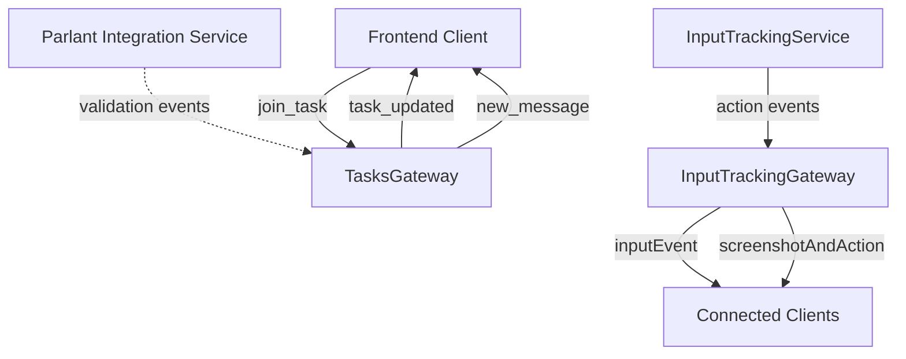

# Parlant WebSocket Architecture Analysis for AIgent Integration

## Executive Summary

This analysis examines the existing WebSocket architecture in the AIgent/Bytebot codebase and provides recommendations for integrating Parlant's real-time conversational validation capabilities. The investigation reveals a sophisticated WebSocket infrastructure with multiple gateways, comprehensive event handling, and established patterns that can be extended for Parlant integration.

## Current WebSocket Architecture Analysis

### 1. Socket.IO Implementation Overview

The AIgent codebase utilizes Socket.IO version 4.8.1 for WebSocket communications with the following architecture:

#### Frontend (bytebot-ui)
- **Primary Hook**: `useWebSocket.ts` - React hook for WebSocket connection management
- **Connection Path**: `/api/proxy/tasks` with WebSocket transport
- **Reconnection Strategy**: Automatic reconnection with 5 attempts, 1-second delay
- **Event Handlers**: `task_updated`, `new_message`, `task_created`, `task_deleted`

#### Backend Gateways
1. **TasksGateway** (`bytebot-agent` & `bytebot-agent-cc`)
   - Room-based task management (`task_${taskId}`)
   - Connection lifecycle management
   - Task update broadcasting

2. **InputTrackingGateway** (`bytebotd`)
   - Real-time input event streaming
   - Computer action broadcasting
   - Screenshot + action coordination
   - Room management for client grouping

### 2. WebSocket Event Flow Analysis



### 3. Performance Characteristics

#### Current Metrics
- **Connection Management**: Room-based grouping with automatic cleanup
- **Event Debouncing**: 250ms for click events, 500ms for typing
- **Reconnection Strategy**: Built-in resilience with exponential backoff
- **Transport Layer**: WebSocket with fallback mechanisms

#### Performance Bottlenecks Identified
1. **Screenshot Transmission**: Large base64 image data over WebSocket
2. **Event Flooding**: High-frequency input events without rate limiting
3. **No Event Prioritization**: All events treated equally regardless of importance

## Parlant Integration Architecture Design

### 1. Real-Time Validation WebSocket Events

#### Proposed Event Schema
```typescript
interface ParlantWebSocketEvents {
  // Client to Parlant validation requests
  'parlant:validate_function': (request: ParlantValidationRequest) => void;
  'parlant:conversation_update': (conversationId: string, context: any) => void;
  
  // Parlant to Client validation responses
  'parlant:validation_result': (response: ParlantValidationResponse) => void;
  'parlant:conversation_status': (status: ConversationStatus) => void;
  'parlant:intent_analysis': (analysis: IntentAnalysis) => void;
}
```

### 2. Parlant WebSocket Gateway Implementation

#### New Gateway: ParlantValidationGateway
```typescript
@WebSocketGateway({
  namespace: '/parlant',
  cors: { origin: '*', methods: ['GET', 'POST'] },
})
export class ParlantValidationGateway implements OnGatewayConnection, OnGatewayDisconnect {
  @WebSocketServer() server: Server;
  
  // Integration with existing ParlantIntegrationService
  constructor(private readonly parlantService: ParlantIntegrationService) {}
  
  @SubscribeMessage('validate_function')
  async handleFunctionValidation(
    client: Socket, 
    request: ParlantValidationRequest
  ): Promise<void> {
    // Real-time validation with WebSocket response
    const result = await this.parlantService.validateFunctionExecution(request);
    client.emit('validation_result', result);
  }
}
```

### 3. Integration Points with Existing Architecture

#### A. TasksGateway Enhancement
- **Parlant Event Wrapping**: Intercept task events for validation
- **Validation State Management**: Track conversation contexts per task
- **Approval Workflow**: Implement real-time approval/denial broadcasting

#### B. InputTrackingGateway Enhancement
- **Action Validation**: Real-time input action validation through Parlant
- **Risk Assessment**: Dynamic risk level evaluation for input events
- **Conversation Context**: Maintain conversational state for input patterns

#### C. Frontend Integration
```typescript
// Enhanced useWebSocket hook with Parlant events
export interface ParlantWebSocketHook {
  validateFunction: (request: ParlantValidationRequest) => Promise<ParlantValidationResponse>;
  subscribeToConversation: (conversationId: string) => void;
  getValidationHistory: () => ParlantAuditEntry[];
}
```

## Performance Requirements Analysis

### 1. Latency Requirements

#### Target Performance Metrics
- **Validation Response Time**: < 500ms for real-time operations
- **WebSocket Connection Time**: < 100ms for initial connection
- **Event Processing Latency**: < 50ms for high-priority events
- **Conversation Context Sync**: < 200ms for context updates

### 2. Throughput Analysis

#### Expected Event Volumes
- **Function Validations**: 10-50/minute per active session
- **Conversation Updates**: 5-20/minute per conversation
- **Input Validations**: 100-500/minute during active automation
- **Status Broadcasts**: 1-5/second during peak usage

### 3. Scalability Considerations

#### Horizontal Scaling Strategy
- **Room-Based Partitioning**: Distribute conversations across WebSocket servers
- **Redis Adapter**: Share room state across server instances
- **Load Balancing**: Sticky sessions for conversation continuity

## Integration Implementation Plan

### Phase 1: Core Infrastructure (Week 1-2)
1. **ParlantValidationGateway**: New WebSocket gateway implementation
2. **Event Schema Definition**: Comprehensive event interface design
3. **Backend Integration**: Connect with existing ParlantIntegrationService
4. **Basic Testing**: Unit tests and mock implementations

### Phase 2: Real-Time Validation (Week 3-4)
1. **Function Validation Flow**: End-to-end validation with WebSocket responses
2. **Conversation Management**: Real-time conversation state synchronization
3. **Error Handling**: Comprehensive error propagation and recovery
4. **Performance Optimization**: Caching and connection pooling

### Phase 3: Advanced Features (Week 5-6)
1. **Intent Analysis Streaming**: Real-time intent analysis updates
2. **Multi-Room Support**: Conversation rooms with participant management
3. **Audit Trail Integration**: Real-time audit event broadcasting
4. **Security Enhancements**: Authentication and authorization for WebSocket connections

### Phase 4: Production Readiness (Week 7-8)
1. **Load Testing**: WebSocket performance under high load
2. **Monitoring Integration**: Metrics and alerting for WebSocket health
3. **Documentation**: Comprehensive API documentation and examples
4. **Deployment Strategy**: Production deployment with rollback capability

## Security Architecture

### 1. Authentication Integration

#### WebSocket Authentication Strategy
```typescript
// JWT-based WebSocket authentication
@UseGuards(WsJwtGuard)
export class ParlantValidationGateway {
  @SubscribeMessage('validate_function')
  async handleValidation(
    @ConnectedSocket() client: AuthenticatedSocket,
    @MessageBody() request: ParlantValidationRequest
  ) {
    // Access user context from authenticated socket
    const userContext = client.user;
    request.context.userId = userContext.id;
    // ... validation logic
  }
}
```

### 2. Authorization Framework

#### Role-Based Event Access
- **Admin Level**: Full access to all validation events and audit trails
- **User Level**: Access to own conversation validation events
- **System Level**: Internal service-to-service communication only
- **Guest Level**: Read-only access to public validation results

### 3. Data Protection

#### Sensitive Data Handling
- **Conversation Encryption**: End-to-end encryption for sensitive conversations
- **Parameter Sanitization**: Remove sensitive function parameters from WebSocket events
- **Audit Trail Security**: Secure transmission of audit events with integrity verification

## Monitoring and Observability

### 1. WebSocket Health Metrics

#### Key Performance Indicators
```typescript
interface WebSocketMetrics {
  connectionCount: number;
  activeConversations: number;
  averageValidationTime: number;
  errorRate: number;
  throughputPerSecond: number;
  memoryUsage: number;
}
```

### 2. Parlant Integration Metrics

#### Validation Performance Tracking
- **Cache Hit Rate**: Percentage of validations served from cache
- **API Response Time**: Parlant API call latency distribution
- **Conversation Success Rate**: Percentage of successful validation conversations
- **Error Distribution**: Breakdown of validation errors by category

### 3. Real-Time Dashboards

#### Monitoring Integration Points
- **WebSocket Connection Dashboard**: Real-time connection status and health
- **Parlant Validation Dashboard**: Validation throughput and success metrics
- **Conversation Analytics**: Active conversations and participant engagement
- **Performance Alerts**: Automated alerting for SLA violations

## Risk Assessment and Mitigation

### 1. Technical Risks

#### High Priority Risks
1. **WebSocket Connection Instability**: Network issues causing frequent disconnections
   - **Mitigation**: Robust reconnection logic with exponential backoff
   - **Monitoring**: Connection stability metrics and alerting

2. **Parlant API Latency**: Slow Parlant responses affecting real-time experience
   - **Mitigation**: Aggressive caching and fallback validation logic
   - **Monitoring**: API response time tracking and SLA monitoring

3. **Memory Leaks**: WebSocket connections and conversation state not properly cleaned
   - **Mitigation**: Automatic cleanup timers and connection lifecycle management
   - **Monitoring**: Memory usage tracking and leak detection

### 2. Security Risks

#### Critical Security Considerations
1. **Unauthorized Access**: Malicious clients accessing validation events
   - **Mitigation**: Strong authentication and authorization on WebSocket connections
   - **Monitoring**: Authentication failure monitoring and rate limiting

2. **Data Exposure**: Sensitive function parameters exposed in WebSocket events
   - **Mitigation**: Parameter sanitization and conversation encryption
   - **Monitoring**: Audit trail analysis for sensitive data exposure

## Recommendations

### 1. Immediate Actions
1. **Implement ParlantValidationGateway**: Create dedicated WebSocket gateway for Parlant integration
2. **Enhance Authentication**: Strengthen WebSocket authentication with JWT and role-based access
3. **Performance Baseline**: Establish current WebSocket performance metrics for comparison

### 2. Architecture Improvements
1. **Event Prioritization**: Implement priority queuing for critical validation events
2. **Connection Pooling**: Optimize WebSocket connection management for scalability
3. **Caching Strategy**: Implement intelligent caching for frequently validated operations

### 3. Long-Term Strategy
1. **Microservice Architecture**: Consider separating Parlant WebSocket services for independent scaling
2. **Multi-Protocol Support**: Evaluate gRPC streaming as alternative for high-throughput scenarios
3. **Edge Deployment**: Consider WebSocket edge servers for global latency optimization

## Conclusion

The existing AIgent WebSocket architecture provides a solid foundation for Parlant integration with established patterns for real-time communication, room management, and event handling. The proposed integration leverages these existing patterns while introducing new capabilities for conversational validation.

Key success factors:
- **Minimal Disruption**: Integration builds on existing patterns without major architectural changes
- **Performance Focus**: Sub-500ms validation response times through efficient event handling and caching
- **Security First**: Comprehensive authentication and authorization for WebSocket connections
- **Scalability Ready**: Room-based architecture supports horizontal scaling with Redis adapter

The implementation plan provides a structured approach to delivering Parlant WebSocket integration in 8 weeks with clear milestones and risk mitigation strategies.

---

**Generated by**: Parlant Integration Research Agent #1  
**Date**: 2025-09-16  
**Version**: 1.0  
**Next Review**: Phase 1 Implementation (Week 2)