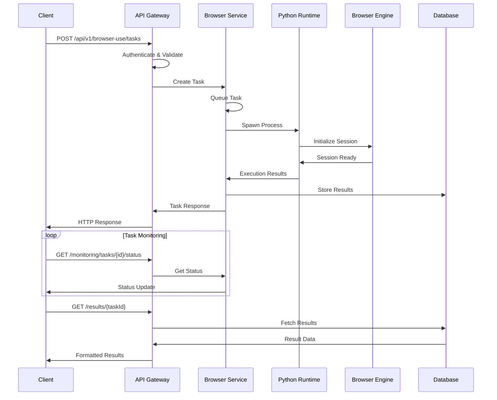

# Browser-Use API Architecture Overview

## Table of Contents

1. [System Architecture](#system-architecture)
2. [Component Design](#component-design)
3. [Data Flow](#data-flow)
4. [Security Architecture](#security-architecture)
5. [Scalability & Performance](#scalability--performance)
6. [Local-Only Architecture](#local-only-architecture)
7. [Integration Patterns](#integration-patterns)
8. [Deployment Architecture](#deployment-architecture)
9. [Monitoring & Observability](#monitoring--observability)
10. [Design Decisions](#design-decisions)

## System Architecture

### High-Level Overview

The Bytebot Browser-Use API is designed as a microservices-based system that provides enterprise-grade browser automation capabilities through a REST API interface. The architecture emphasizes local deployment, security, and scalability while maintaining simplicity in integration.

```
┌─────────────────────────────────────────────────────────────────────────────┐
│                              Client Layer                                   │
├─────────────────┬─────────────────┬─────────────────┬─────────────────────┤
│   Web Apps      │   Mobile Apps   │   CLI Tools     │   Server Apps       │
│   - React       │   - Native      │   - bytebot-cli │   - Node.js         │
│   - Vue.js      │   - Flutter     │   - Python CLI  │   - Python          │
│   - Angular     │   - React Native│   - Bash        │   - Go/Java/.NET    │
└─────────────────┴─────────────────┴─────────────────┴─────────────────────┘
                                      │
                                 HTTP/HTTPS
                                      │
┌─────────────────────────────────────────────────────────────────────────────┐
│                              API Gateway Layer                              │
├─────────────────────────────────────────────────────────────────────────────┤
│   - Rate Limiting           - Authentication         - Request Validation   │
│   - CORS Management          - Authorization         - Response Transform   │
│   - Circuit Breaker         - Audit Logging         - Error Handling       │
└─────────────────────────────────────────────────────────────────────────────┘
                                      │
┌─────────────────────────────────────────────────────────────────────────────┐
│                            Application Layer                                │
├─────────────────┬─────────────────┬─────────────────┬─────────────────────┤
│ Task Management │ Session Control │ Browser Ops     │ Data Processing     │
│ - Creation      │ - Lifecycle     │ - Navigation    │ - Extraction        │
│ - Execution     │ - Monitoring    │ - Interaction   │ - Transformation    │
│ - Monitoring    │ - Cleanup       │ - Screenshots   │ - Export            │
└─────────────────┴─────────────────┴─────────────────┴─────────────────────┘
                                      │
┌─────────────────────────────────────────────────────────────────────────────┐
│                             Service Layer                                   │
├─────────────────┬─────────────────┬─────────────────┬─────────────────────┤
│ Browser Service │ Python Runtime  │ Data Service    │ Monitoring Service  │
│ - Session Mgmt  │ - Process Mgmt  │ - Results Store │ - Health Checks     │
│ - Task Queue    │ - Script Exec   │ - Export Engine │ - Metrics Collection│
│ - Error Handling│ - Environment   │ - Format Convert│ - Performance       │
└─────────────────┴─────────────────┴─────────────────┴─────────────────────┘
                                      │
┌─────────────────────────────────────────────────────────────────────────────┐
│                            Integration Layer                                │
├─────────────────┬─────────────────┬─────────────────┬─────────────────────┤
│ Browser-Use     │ Chrome/Chromium │ Python Runtime  │ Local Storage       │
│ Framework       │ Browser Engine  │ Environment     │ System              │
│ - Agent Control │ - WebDriver     │ - Dependencies  │ - File System       │
│ - AI Integration│ - DevTools      │ - Virtual Env   │ - Database          │
│ - Automation    │ - Headless Mode │ - Package Mgmt  │ - Cache Layer       │
└─────────────────┴─────────────────┴─────────────────┴─────────────────────┘
                                      │
┌─────────────────────────────────────────────────────────────────────────────┐
│                           Infrastructure Layer                              │
├─────────────────┬─────────────────┬─────────────────┬─────────────────────┤
│ Container       │ Database        │ File System     │ Networking          │
│ Runtime         │ - PostgreSQL    │ - Screenshots   │ - Internal Only     │
│ - Docker        │ - SQLite        │ - Results       │ - No External Calls │
│ - Kubernetes    │ - Redis Cache   │ - Logs          │ - Local Network     │
└─────────────────┴─────────────────┴─────────────────┴─────────────────────┘
```

### Core Components

#### 1. API Gateway
- **Purpose**: Single entry point for all client requests
- **Responsibilities**: Authentication, rate limiting, routing, logging
- **Technology**: NestJS with Guards and Interceptors
- **Features**: JWT validation, RBAC, circuit breaker patterns

#### 2. Browser-Use Service
- **Purpose**: Core browser automation orchestration
- **Responsibilities**: Task management, session control, Python integration
- **Technology**: TypeScript/Node.js with browser-use Python framework
- **Features**: Queue management, process isolation, error recovery

#### 3. Python Runtime Environment
- **Purpose**: Execute browser-use framework operations
- **Responsibilities**: Browser control, AI agent coordination, script execution
- **Technology**: Python 3.9+ with browser-use, Anthropic Claude, Playwright
- **Features**: Isolated processes, environment management, dependency control

#### 4. Data Management Layer
- **Purpose**: Store and manage task results, session data, and metadata
- **Responsibilities**: CRUD operations, export functionality, caching
- **Technology**: PostgreSQL/SQLite with Redis caching
- **Features**: Data transformation, format conversion, archival

## Component Design

### Browser-Use Service Architecture

```typescript
// Service Layer Architecture
┌─────────────────────────────────────────────────────────────────┐
│                     BrowserUseController                       │
├─────────────────────────────────────────────────────────────────┤
│ - REST Endpoints        - Request Validation                   │
│ - Response Formatting   - Error Handling                       │
│ - Authentication        - Rate Limiting                        │
└─────────────────────────────────────────────────────────────────┘
                                  │
┌─────────────────────────────────────────────────────────────────┐
│                    BrowserUseService                           │
├─────────────────────────────────────────────────────────────────┤
│ - Task Management       - Session Lifecycle                    │
│ - Queue Processing      - Python Integration                   │
│ - Process Monitoring    - Resource Management                  │
└─────────────────────────────────────────────────────────────────┘
                                  │
┌─────────────────┬─────────────────┬─────────────────┬───────────┐
│ Task Queue      │ Session Manager │ Python Executor │ Monitor   │
│ - Priority      │ - Active Pool   │ - Process Spawn │ - Health  │
│ - Scheduling    │ - Timeout       │ - Script Gen    │ - Metrics │
│ - Retry Logic   │ - Cleanup       │ - Result Parse  │ - Alerts  │
└─────────────────┴─────────────────┴─────────────────┴───────────┘
```

### Task Processing Flow

```typescript
interface TaskProcessingFlow {
  phases: {
    1: "Request Validation & Authentication";
    2: "Task Creation & Queuing";
    3: "Resource Allocation";
    4: "Python Process Spawning";
    5: "Browser-Use Framework Execution";
    6: "Result Collection & Processing";
    7: "Data Storage & Response";
    8: "Cleanup & Resource Release";
  };
}
```

**Detailed Task Processing:**

1. **Request Validation**
   ```typescript
   async validateTaskRequest(dto: CreateBrowserTaskDto): Promise<ValidationResult> {
     // Security validation
     await this.validateUrlDomains(dto.startUrl, dto.constraints?.allowedDomains);

     // Resource validation
     await this.checkResourceAvailability();

     // Configuration validation
     await this.validateBrowserConfiguration(dto.configuration);

     return { valid: true, errors: [] };
   }
   ```

2. **Task Queuing Strategy**
   ```typescript
   private queueTask(task: IBrowserTask): void {
     const priorityOrder = { critical: 0, high: 1, medium: 2, low: 3 };
     const insertIndex = this.taskQueue.findIndex(
       t => priorityOrder[t.priority] > priorityOrder[task.priority]
     );

     if (insertIndex === -1) {
       this.taskQueue.push(task);
     } else {
       this.taskQueue.splice(insertIndex, 0, task);
     }
   }
   ```

3. **Python Process Management**
   ```typescript
   private async executePythonCommand(command: IPythonBrowserUseCommand): Promise<IPythonProcessResult> {
     const process = spawn(command.command, command.args, {
       cwd: this.config.browserUsePath,
       env: { ...process.env, PYTHONPATH: this.config.browserUsePath },
       stdio: ['pipe', 'pipe', 'pipe'],
     });

     // Process monitoring, timeout handling, cleanup
     return this.monitorProcess(process, command);
   }
   ```

### Session Management Architecture

```typescript
interface SessionLifecycle {
  creation: {
    validation: "Configuration and resource checks";
    allocation: "Browser instance spawning";
    registration: "Session tracking and monitoring";
  };

  active: {
    monitoring: "Health checks and resource usage";
    operations: "DOM interactions and data extraction";
    cleanup: "Temporary resource management";
  };

  termination: {
    graceful: "Proper browser shutdown and data saving";
    forced: "Resource cleanup and emergency shutdown";
    archival: "Session data storage and metrics";
  };
}
```

## Data Flow

### Request-Response Flow



### Data Models

```typescript
// Core Data Structures
interface IBrowserTask {
  taskId: string;
  sessionId: string;
  type: TaskType;
  instruction: string;
  params: Record<string, any>;
  status: TaskStatus;
  priority: TaskPriority;
  createdAt: Date;
  startedAt?: Date;
  completedAt?: Date;
  result?: IBrowserTaskResult;
  error?: IBrowserError;
}

interface IBrowserSession {
  sessionId: string;
  name: string;
  configuration: BrowserConfiguration;
  status: SessionStatus;
  createdAt: Date;
  lastActivity: Date;
  performance: SessionPerformance;
  tasks: string[]; // Task IDs
}

interface IBrowserTaskResult {
  success: boolean;
  data: any;
  screenshot?: string; // Base64 encoded
  logs: string[];
  metrics: {
    duration: number;
    memoryUsage?: number;
    cpuUsage?: number;
  };
}
```

### State Management

```typescript
class TaskStateManager {
  private states = new Map<string, TaskState>();

  // State transitions with validation
  async transitionState(taskId: string, newState: TaskStatus): Promise<void> {
    const current = this.states.get(taskId);

    if (!this.isValidTransition(current?.status, newState)) {
      throw new Error(`Invalid state transition: ${current?.status} -> ${newState}`);
    }

    await this.persistStateChange(taskId, newState);
    this.notifyStateChange(taskId, newState);
  }

  private isValidTransition(from: TaskStatus, to: TaskStatus): boolean {
    const transitions = {
      pending: ['running', 'cancelled'],
      running: ['completed', 'failed', 'cancelled'],
      completed: [], // Terminal state
      failed: ['pending'], // Allow retry
      cancelled: [], // Terminal state
    };

    return transitions[from]?.includes(to) ?? false;
  }
}
```

## Security Architecture

### Authentication & Authorization

```typescript
// Multi-layer Security Architecture
┌─────────────────────────────────────────────────────────────────┐
│                        Security Layers                         │
├─────────────────────────────────────────────────────────────────┤
│ 1. Network Security (TLS, Firewall, Network Isolation)         │
│ 2. Authentication (JWT, Multi-factor, Session Management)      │
│ 3. Authorization (RBAC, Resource Permissions, API Scoping)     │
│ 4. Input Validation (Schema Validation, Sanitization, Limits)  │
│ 5. Business Logic (Domain Restrictions, Rate Limiting)         │
│ 6. Data Protection (Encryption at Rest, PII Handling)          │
│ 7. Audit & Monitoring (Logging, Alerting, Compliance)          │
└─────────────────────────────────────────────────────────────────┘
```

### Role-Based Access Control

```typescript
enum UserRole {
  ADMIN = 'admin',       // Full system access
  OPERATOR = 'operator', // Task creation and management
  VIEWER = 'viewer',     // Read-only access
}

interface Permission {
  resource: string;
  actions: string[];
  conditions?: Record<string, any>;
}

const rolePermissions: Record<UserRole, Permission[]> = {
  [UserRole.ADMIN]: [
    { resource: '*', actions: ['*'] }, // Full access
  ],
  [UserRole.OPERATOR]: [
    { resource: 'tasks', actions: ['create', 'read', 'update', 'execute'] },
    { resource: 'sessions', actions: ['create', 'read', 'delete'] },
    { resource: 'results', actions: ['read', 'export'] },
  ],
  [UserRole.VIEWER]: [
    { resource: 'tasks', actions: ['read'] },
    { resource: 'sessions', actions: ['read'] },
    { resource: 'results', actions: ['read'] },
    { resource: 'monitoring', actions: ['read'] },
  ],
};
```

### Security Controls

```typescript
interface SecurityControls {
  authentication: {
    jwt: {
      algorithm: 'HS256';
      expiresIn: '1h';
      refreshToken: true;
    };
    rateLimit: {
      windowMs: 900000; // 15 minutes
      maxAttempts: 5;
      blockDuration: 1800000; // 30 minutes
    };
  };

  authorization: {
    rbac: true;
    resourceScoping: true;
    apiKeySupport: true;
  };

  inputValidation: {
    schemaValidation: true;
    sqlInjectionProtection: true;
    xssProtection: true;
    maxRequestSize: '10MB';
  };

  domainRestrictions: {
    allowedDomains: string[];
    blockMaliciousUrls: true;
    contentSecurityPolicy: true;
  };

  dataProtection: {
    encryptionAtRest: true;
    piiDetection: true;
    dataRetentionPolicies: true;
  };
}
```

## Scalability & Performance

### Horizontal Scaling Architecture

```yaml
# Kubernetes Scaling Configuration
apiVersion: autoscaling/v2
kind: HorizontalPodAutoscaler
metadata:
  name: bytebot-api-hpa
spec:
  scaleTargetRef:
    apiVersion: apps/v1
    kind: Deployment
    name: bytebot-api
  minReplicas: 2
  maxReplicas: 20
  metrics:
  - type: Resource
    resource:
      name: cpu
      target:
        type: Utilization
        averageUtilization: 70
  - type: Resource
    resource:
      name: memory
      target:
        type: Utilization
        averageUtilization: 80
  behavior:
    scaleUp:
      stabilizationWindowSeconds: 60
      policies:
      - type: Percent
        value: 100
        periodSeconds: 15
    scaleDown:
      stabilizationWindowSeconds: 300
      policies:
      - type: Percent
        value: 10
        periodSeconds: 60
```

### Performance Optimization Strategies

```typescript
interface PerformanceOptimizations {
  caching: {
    levels: ['Application Cache', 'Database Query Cache', 'CDN Cache'];
    strategies: ['LRU', 'TTL-based', 'Intelligent Prefetch'];
    implementation: 'Redis Cluster + Application Memory';
  };

  connectionPooling: {
    database: {
      min: 5;
      max: 20;
      acquireTimeoutMillis: 30000;
      idleTimeoutMillis: 600000;
    };
    browser: {
      maxConcurrentSessions: 10;
      sessionReuse: true;
      warmupSessions: 2;
    };
  };

  loadBalancing: {
    algorithm: 'Round Robin with Health Checks';
    healthCheckInterval: 30;
    failureThreshold: 3;
    recoveryTimeout: 60;
  };

  resourceManagement: {
    cpuLimits: '1000m';
    memoryLimits: '2Gi';
    browserProcessTimeout: 300;
    cleanupInterval: 60;
  };
}
```

### Capacity Planning

```typescript
interface CapacityMetrics {
  concurrent_sessions: {
    light_workload: 50;  // Simple navigation tasks
    medium_workload: 20; // Data extraction tasks
    heavy_workload: 5;   // Complex automation workflows
  };

  resource_requirements: {
    per_session: {
      cpu_cores: 0.2;
      memory_mb: 400;
      disk_io: 'Low';
    };
    per_api_instance: {
      cpu_cores: 2;
      memory_gb: 4;
      concurrent_requests: 100;
    };
  };

  scaling_triggers: {
    cpu_threshold: 70;
    memory_threshold: 80;
    queue_length: 10;
    response_time_p95: 2000; // ms
  };
}
```

## Local-Only Architecture

### Deployment Independence

```typescript
interface LocalOnlyArchitecture {
  principles: {
    no_cloud_dependencies: 'All services run locally or in private network';
    data_sovereignty: 'All data stays within organization boundaries';
    offline_capability: 'Core functionality available without internet';
    self_contained: 'All dependencies bundled or locally installable';
  };

  components: {
    runtime: 'Docker containers with all dependencies';
    database: 'PostgreSQL or SQLite for local storage';
    ai_models: 'Local LLM integration or API proxy only';
    browser_engine: 'Bundled Chromium with all drivers';
    python_environment: 'Isolated virtual environment';
  };

  networking: {
    internal_only: 'Services communicate via local network';
    no_external_calls: 'No outbound internet dependencies';
    optional_internet: 'External access only for target websites';
  };
}
```

### Compliance Features

```typescript
class ComplianceManager {
  async verifyLocalOnlyCompliance(): Promise<ComplianceReport> {
    return {
      verified: true,
      checks: {
        cloudDependencies: await this.checkCloudDependencies(),
        dataResidency: await this.verifyDataResidency(),
        networkIsolation: await this.validateNetworkIsolation(),
        encryptionCompliance: await this.verifyEncryption(),
      },
      recommendations: this.generateRecommendations(),
    };
  }

  private async checkCloudDependencies(): Promise<DependencyCheck> {
    // Scan for external API calls, cloud service dependencies
    const externalConnections = await this.scanNetworkConnections();
    return {
      passed: externalConnections.length === 0,
      dependencies: externalConnections,
    };
  }
}
```

## Integration Patterns

### API-First Design

```typescript
interface APIDesignPrinciples {
  restful: {
    resourceBased: 'URLs represent resources, not actions';
    httpMethods: 'Proper use of GET, POST, PUT, DELETE';
    statusCodes: 'Meaningful HTTP status codes';
    versioning: 'API versioning through URL path';
  };

  consistency: {
    naming: 'camelCase for JSON, kebab-case for URLs';
    responses: 'Consistent response format across endpoints';
    errorHandling: 'Standardized error response structure';
    pagination: 'Uniform pagination parameters and metadata';
  };

  documentation: {
    openapi: 'Complete OpenAPI 3.0 specification';
    examples: 'Real-world examples for all endpoints';
    sdks: 'Generated client SDKs for popular languages';
    interactiveDoc: 'Swagger UI for testing and exploration';
  };
}
```

### Client Integration Patterns

```typescript
// Event-Driven Integration
class BytebotEventClient {
  constructor(private apiClient: BytebotClient) {
    this.setupEventHandlers();
  }

  async executeTaskWithEvents(taskDefinition: TaskDefinition): Promise<TaskResult> {
    const task = await this.apiClient.tasks.create(taskDefinition);

    return new Promise((resolve, reject) => {
      const pollInterval = setInterval(async () => {
        try {
          const status = await this.apiClient.tasks.getStatus(task.taskId);

          this.emit('taskProgress', {
            taskId: task.taskId,
            status: status.status,
            progress: status.progress,
          });

          if (status.status === 'completed') {
            clearInterval(pollInterval);
            const results = await this.apiClient.tasks.getResults(task.taskId);
            resolve(results);
          } else if (status.status === 'failed') {
            clearInterval(pollInterval);
            reject(new Error(status.error?.message || 'Task failed'));
          }
        } catch (error) {
          clearInterval(pollInterval);
          reject(error);
        }
      }, 1000);
    });
  }
}

// Batch Processing Pattern
class BatchProcessor {
  async processBatch(tasks: TaskDefinition[]): Promise<BatchResult> {
    const session = await this.apiClient.sessions.create({
      name: 'Batch Processing Session',
      persistent: true,
    });

    const results = await Promise.allSettled(
      tasks.map(task => this.executeTask({ ...task, sessionId: session.sessionId }))
    );

    await this.apiClient.sessions.close(session.sessionId);

    return this.aggregateResults(results);
  }
}
```

## Deployment Architecture

### Container Architecture

```dockerfile
# Multi-stage production build
FROM node:18-alpine AS builder
WORKDIR /app
COPY package*.json ./
RUN npm ci --only=production && npm cache clean --force
COPY . .
RUN npm run build

FROM python:3.11-alpine AS python-base
RUN pip install --no-cache-dir browser-use anthropic playwright
RUN playwright install chromium

FROM node:18-alpine AS runtime
RUN apk add --no-cache chromium python3 py3-pip

# Copy from previous stages
COPY --from=builder /app/dist ./dist
COPY --from=builder /app/node_modules ./node_modules
COPY --from=python-base /usr/local/lib/python3.11/site-packages /usr/local/lib/python3.11/site-packages

# Security hardening
RUN addgroup -g 1001 -S nodejs && \
    adduser -S bytebot -u 1001 -G nodejs
USER bytebot

EXPOSE 3000
CMD ["node", "dist/main"]
```

### Service Mesh Integration

```yaml
# Istio Service Mesh Configuration
apiVersion: networking.istio.io/v1alpha3
kind: VirtualService
metadata:
  name: bytebot-api
spec:
  hosts:
  - bytebot-api
  http:
  - match:
    - uri:
        prefix: /api/v1/browser-use
    route:
    - destination:
        host: bytebot-api
        subset: v1
    timeout: 30s
    retries:
      attempts: 3
      perTryTimeout: 10s
  - match:
    - uri:
        prefix: /health
    route:
    - destination:
        host: bytebot-api
    timeout: 5s

---
apiVersion: networking.istio.io/v1alpha3
kind: DestinationRule
metadata:
  name: bytebot-api
spec:
  host: bytebot-api
  trafficPolicy:
    connectionPool:
      tcp:
        maxConnections: 100
      http:
        http1MaxPendingRequests: 10
        maxRequestsPerConnection: 2
    circuitBreaker:
      consecutiveErrors: 3
      interval: 30s
      baseEjectionTime: 30s
      maxEjectionPercent: 50
  subsets:
  - name: v1
    labels:
      version: v1
```

## Monitoring & Observability

### Observability Stack

```typescript
interface ObservabilityArchitecture {
  metrics: {
    collection: 'Prometheus with custom metrics';
    storage: 'Time-series database with retention policies';
    visualization: 'Grafana dashboards with alerting';
    exporters: 'Application and system metrics';
  };

  logging: {
    aggregation: 'Centralized logging with structured format';
    storage: 'Elasticsearch or local file storage';
    analysis: 'Kibana or similar log analysis tools';
    retention: 'Configurable retention based on log level';
  };

  tracing: {
    distributed: 'OpenTelemetry for request tracing';
    sampling: 'Intelligent sampling for performance';
    correlation: 'Request ID correlation across services';
    analysis: 'Jaeger or Zipkin for trace analysis';
  };

  alerting: {
    rules: 'Prometheus AlertManager rules';
    channels: 'Email, Slack, PagerDuty integration';
    escalation: 'Configurable escalation policies';
    suppression: 'Alert suppression and grouping';
  };
}
```

### Custom Metrics

```typescript
class MetricsCollector {
  private taskMetrics = new Map<string, TaskMetrics>();

  collectTaskMetrics(taskId: string, metrics: TaskExecutionMetrics): void {
    this.taskMetrics.set(taskId, {
      ...metrics,
      timestamp: new Date(),
      labels: {
        taskType: metrics.type,
        status: metrics.status,
        priority: metrics.priority,
      },
    });

    // Export to Prometheus
    this.prometheusRegistry.registerMetric('browser_task_duration', {
      type: 'histogram',
      value: metrics.duration,
      labels: metrics.labels,
    });
  }

  generateHealthReport(): HealthReport {
    return {
      system: this.getSystemMetrics(),
      application: this.getApplicationMetrics(),
      business: this.getBusinessMetrics(),
      timestamp: new Date(),
    };
  }
}
```

## Design Decisions

### Technology Choices

| Component | Technology | Rationale |
|-----------|------------|-----------|
| **API Framework** | NestJS | Enterprise features, TypeScript support, decorator-based architecture |
| **Browser Automation** | browser-use + Playwright | AI-enhanced automation, Python ecosystem, mature browser control |
| **Database** | PostgreSQL | ACID compliance, JSON support, robust for local deployment |
| **Caching** | Redis | High performance, data structure support, pub/sub capabilities |
| **Authentication** | JWT + RBAC | Stateless, scalable, fine-grained permissions |
| **Containerization** | Docker | Consistent environments, dependency isolation, easy deployment |
| **Orchestration** | Kubernetes | Auto-scaling, service discovery, health management |
| **Monitoring** | Prometheus + Grafana | Industry standard, powerful querying, rich visualization |

### Architectural Principles

```typescript
interface ArchitecturalPrinciples {
  separation_of_concerns: {
    description: 'Each component has a single, well-defined responsibility';
    implementation: 'Layered architecture with clear boundaries';
  };

  single_responsibility: {
    description: 'Each class/module should have one reason to change';
    implementation: 'Small, focused services and classes';
  };

  dependency_inversion: {
    description: 'Depend on abstractions, not concretions';
    implementation: 'Interface-based design with dependency injection';
  };

  open_closed: {
    description: 'Open for extension, closed for modification';
    implementation: 'Plugin architecture and strategy patterns';
  };

  fail_fast: {
    description: 'Detect and report errors as early as possible';
    implementation: 'Input validation, type checking, health checks';
  };

  graceful_degradation: {
    description: 'System continues operating when components fail';
    implementation: 'Circuit breakers, fallbacks, retry mechanisms';
  };
}
```

### Trade-offs & Considerations

```typescript
interface DesignTradeoffs {
  performance_vs_reliability: {
    decision: 'Favor reliability over raw performance';
    rationale: 'Browser automation requires stability for consistent results';
    mitigation: 'Performance optimization through caching and connection pooling';
  };

  complexity_vs_flexibility: {
    decision: 'Moderate complexity for high flexibility';
    rationale: 'Support diverse automation scenarios while maintaining usability';
    mitigation: 'Comprehensive documentation and SDK abstractions';
  };

  security_vs_usability: {
    decision: 'Strong security with streamlined developer experience';
    rationale: 'Enterprise deployment requires security; APIs need ease of use';
    mitigation: 'Security by default with optional advanced configurations';
  };

  local_vs_cloud: {
    decision: 'Local-first with optional cloud integration';
    rationale: 'Data sovereignty and compliance requirements';
    mitigation: 'Modular architecture supports both deployment models';
  };
}
```

### Future Considerations

```typescript
interface FutureArchitecturalPlans {
  scalability_enhancements: {
    distributed_computing: 'Multi-node task distribution';
    edge_deployment: 'Edge computing for reduced latency';
    serverless_integration: 'Function-based task execution';
  };

  ai_improvements: {
    local_llm_integration: 'On-premise LLM deployment';
    custom_model_training: 'Domain-specific automation models';
    intelligent_routing: 'AI-based task optimization';
  };

  platform_expansion: {
    mobile_automation: 'iOS and Android automation support';
    desktop_automation: 'Native application automation';
    api_automation: 'Integrated API testing and automation';
  };

  enterprise_features: {
    multi_tenancy: 'Tenant isolation and resource management';
    advanced_rbac: 'Fine-grained permission systems';
    compliance_automation: 'Built-in compliance reporting';
  };
}
```

---

This architecture documentation provides a comprehensive overview of the Browser-Use API system design, covering all aspects from high-level architecture to implementation details. The design emphasizes security, scalability, and local deployment while maintaining flexibility for diverse integration scenarios.