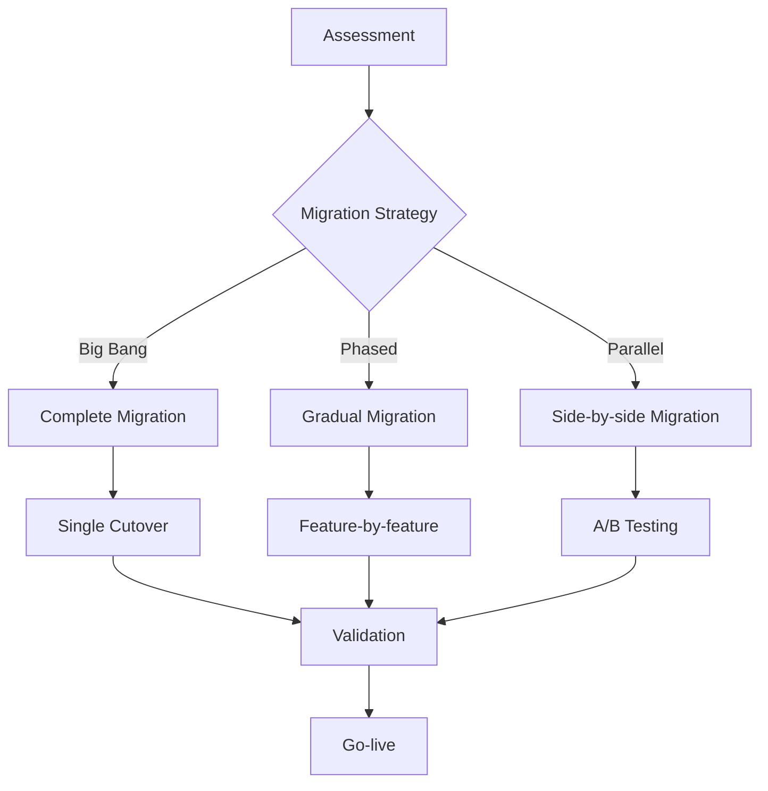

# Migration Guide to Bytebot Browser-Use API

## Table of Contents

1. [Migration Overview](#migration-overview)
2. [Assessment & Planning](#assessment--planning)
3. [Migrating from Selenium](#migrating-from-selenium)
4. [Migrating from Puppeteer](#migrating-from-puppeteer)
5. [Migrating from Playwright](#migrating-from-playwright)
6. [Migrating from Custom Solutions](#migrating-from-custom-solutions)
7. [Data Migration](#data-migration)
8. [Testing & Validation](#testing--validation)
9. [Deployment Strategy](#deployment-strategy)
10. [Post-Migration Optimization](#post-migration-optimization)

## Migration Overview

### Why Migrate to Bytebot Browser-Use API?

The Bytebot Browser-Use API offers significant advantages over traditional browser automation solutions:

| Benefit | Traditional Tools | Bytebot Browser-Use API |
|---------|-------------------|-------------------------|
| **AI Integration** | Manual scripting | AI-powered automation with natural language |
| **Deployment** | Complex setup | Local-only Docker deployment |
| **Scalability** | Limited concurrent sessions | Enterprise-grade auto-scaling |
| **Maintenance** | High script maintenance | Self-healing automation |
| **API-First** | Code-based only | REST API + multiple SDKs |
| **Monitoring** | Basic logging | Comprehensive metrics & monitoring |
| **Error Handling** | Manual error handling | Built-in retry & recovery |

### Migration Approaches



## Assessment & Planning

### 1. Current System Assessment

Use this checklist to assess your current browser automation:

```typescript
interface CurrentSystemAssessment {
  technology: {
    framework: 'selenium' | 'puppeteer' | 'playwright' | 'custom';
    version: string;
    language: string;
    infrastructure: 'on-premise' | 'cloud' | 'hybrid';
  };

  usage: {
    dailyExecutions: number;
    concurrentSessions: number;
    averageTaskDuration: number;
    peakUsageHours: string[];
  };

  complexity: {
    simpleNavigationTasks: number;
    dataExtractionTasks: number;
    formAutomationTasks: number;
    complexWorkflows: number;
  };

  integration: {
    apiIntegrations: string[];
    databases: string[];
    schedulingTools: string[];
    monitoringTools: string[];
  };

  challenges: {
    maintenanceEffort: 'low' | 'medium' | 'high';
    reliabilityIssues: string[];
    scalabilityLimits: string[];
    performanceBottlenecks: string[];
  };
}
```

### 2. Migration Planning Template

```typescript
interface MigrationPlan {
  phases: {
    phase1: {
      name: 'Assessment & Setup';
      duration: '2 weeks';
      tasks: [
        'Current system analysis',
        'Bytebot environment setup',
        'Team training',
        'Proof of concept'
      ];
    };

    phase2: {
      name: 'Core Migration';
      duration: '4-8 weeks';
      tasks: [
        'Script conversion',
        'Integration updates',
        'Testing framework setup',
        'Parallel execution'
      ];
    };

    phase3: {
      name: 'Validation & Optimization';
      duration: '2-4 weeks';
      tasks: [
        'Performance testing',
        'Reliability validation',
        'Monitoring setup',
        'Documentation update'
      ];
    };

    phase4: {
      name: 'Cutover & Support';
      duration: '1-2 weeks';
      tasks: [
        'Production cutover',
        'Legacy system decommission',
        'Team support',
        'Performance monitoring'
      ];
    };
  };

  riskMitigation: {
    backupPlans: string[];
    rollbackProcedures: string[];
    testingStrategies: string[];
  };
}
```

## Migrating from Selenium

### 1. Selenium to Bytebot API Mapping

#### Basic Operations Comparison

```python
# Selenium (Python)
from selenium import webdriver
from selenium.webdriver.common.by import By
from selenium.webdriver.support.ui import WebDriverWait
from selenium.webdriver.support import expected_conditions as EC

driver = webdriver.Chrome()
driver.get("https://example.com")

# Find element and click
element = WebDriverWait(driver, 10).until(
    EC.element_to_be_clickable((By.CLASS_NAME, "submit-button"))
)
element.click()

# Extract text
products = driver.find_elements(By.CLASS_NAME, "product-item")
for product in products:
    title = product.find_element(By.CLASS_NAME, "title").text
    price = product.find_element(By.CLASS_NAME, "price").text
    print(f"{title}: {price}")

driver.quit()
```

```javascript
// Bytebot Browser-Use API (JavaScript)
const client = new BytebotClient();
await client.login('user@example.com', 'password');

// Create session
const session = await client.sessions.create({
  name: 'Migration Test Session'
});

// Navigate and interact
await client.sessions.navigate(session.sessionId, {
  url: 'https://example.com'
});

await client.sessions.click(session.sessionId, {
  selector: '.submit-button'
});

// Extract data
const results = await client.sessions.extractData(session.sessionId, {
  rules: [
    {
      name: 'products',
      selector: '.product-item',
      multiple: true,
      fields: {
        title: { selector: '.title', attribute: 'text' },
        price: { selector: '.price', attribute: 'text' }
      }
    }
  ]
});

console.log(results.extractedData.products);

// Cleanup
await client.sessions.close(session.sessionId);
```

### 2. Advanced Selenium Features Migration

#### Page Object Model to API Tasks

```python
# Selenium Page Object Model
class LoginPage:
    def __init__(self, driver):
        self.driver = driver
        self.username_field = (By.ID, "username")
        self.password_field = (By.ID, "password")
        self.login_button = (By.CLASS_NAME, "login-btn")

    def login(self, username, password):
        self.driver.find_element(*self.username_field).send_keys(username)
        self.driver.find_element(*self.password_field).send_keys(password)
        self.driver.find_element(*self.login_button).click()

class ProductPage:
    def __init__(self, driver):
        self.driver = driver

    def get_products(self):
        products = []
        elements = self.driver.find_elements(By.CLASS_NAME, "product")
        for element in elements:
            title = element.find_element(By.CLASS_NAME, "title").text
            price = element.find_element(By.CLASS_NAME, "price").text
            products.append({"title": title, "price": price})
        return products

# Usage
driver = webdriver.Chrome()
login_page = LoginPage(driver)
product_page = ProductPage(driver)

driver.get("https://example.com/login")
login_page.login("user", "pass")
products = product_page.get_products()
```

```javascript
// Bytebot API Task-Based Approach
class BytebotAutomation {
  constructor() {
    this.client = new BytebotClient();
  }

  async loginAndExtractProducts(credentials) {
    const session = await this.client.sessions.create({
      name: 'Login and Extract Session'
    });

    try {
      // Create a comprehensive task
      const task = await this.client.tasks.create({
        name: 'Login and Product Extraction',
        type: 'workflow',
        sessionId: session.sessionId,
        steps: [
          {
            id: 'navigate_login',
            type: 'navigate',
            action: { url: 'https://example.com/login' }
          },
          {
            id: 'perform_login',
            type: 'form_fill',
            action: {
              formSelector: '#login-form',
              fields: [
                { selector: '#username', value: credentials.username },
                { selector: '#password', value: credentials.password }
              ]
            }
          },
          {
            id: 'submit_login',
            type: 'form_submit',
            action: { formSelector: '#login-form' }
          },
          {
            id: 'extract_products',
            type: 'extract',
            action: {
              rules: [
                {
                  name: 'products',
                  selector: '.product',
                  multiple: true,
                  fields: {
                    title: { selector: '.title', attribute: 'text' },
                    price: { selector: '.price', attribute: 'text' }
                  }
                }
              ]
            }
          }
        ]
      });

      // Wait for completion and get results
      const results = await this.client.tasks.waitForCompletion(task.taskId);
      return results.extractedData.products;

    } finally {
      await this.client.sessions.close(session.sessionId);
    }
  }
}
```

### 3. Selenium Grid to Bytebot Scaling

```yaml
# Selenium Grid Configuration
version: '3'
services:
  selenium-hub:
    image: selenium/hub:latest
    container_name: selenium-hub
    ports:
      - "4444:4444"

  chrome:
    image: selenium/node-chrome:latest
    shm_size: 2gb
    depends_on:
      - selenium-hub
    environment:
      - HUB_HOST=selenium-hub
      - HUB_PORT=4444
    scale: 5
```

```yaml
# Bytebot Auto-scaling Configuration
apiVersion: apps/v1
kind: Deployment
metadata:
  name: bytebot-api
spec:
  replicas: 3
  selector:
    matchLabels:
      app: bytebot-api
  template:
    spec:
      containers:
      - name: bytebot-api
        image: bytebot/api:latest
        resources:
          requests:
            memory: "512Mi"
            cpu: "250m"
          limits:
            memory: "2Gi"
            cpu: "1000m"

---
apiVersion: autoscaling/v2
kind: HorizontalPodAutoscaler
metadata:
  name: bytebot-hpa
spec:
  scaleTargetRef:
    apiVersion: apps/v1
    kind: Deployment
    name: bytebot-api
  minReplicas: 3
  maxReplicas: 20
  metrics:
  - type: Resource
    resource:
      name: cpu
      target:
        type: Utilization
        averageUtilization: 70
```

## Migrating from Puppeteer

### 1. Puppeteer to Bytebot API Conversion

#### Basic Puppeteer Script

```javascript
// Puppeteer
const puppeteer = require('puppeteer');

(async () => {
  const browser = await puppeteer.launch({ headless: true });
  const page = await browser.newPage();

  await page.goto('https://example.com');
  await page.setViewport({ width: 1920, height: 1080 });

  // Wait for selector
  await page.waitForSelector('.product-grid');

  // Click element
  await page.click('.load-more');

  // Extract data
  const products = await page.evaluate(() => {
    const items = Array.from(document.querySelectorAll('.product-item'));
    return items.map(item => ({
      title: item.querySelector('.title')?.textContent,
      price: item.querySelector('.price')?.textContent,
      image: item.querySelector('img')?.src
    }));
  });

  // Take screenshot
  await page.screenshot({ path: 'products.png', fullPage: true });

  await browser.close();
  return products;
})();
```

```javascript
// Bytebot Browser-Use API
async function migratedPuppeteerScript() {
  const client = new BytebotClient();
  await client.login('user@example.com', 'password');

  const session = await client.sessions.create({
    name: 'Migrated Puppeteer Script',
    configuration: {
      headless: true,
      viewport: { width: 1920, height: 1080 }
    }
  });

  try {
    // Navigate
    await client.sessions.navigate(session.sessionId, {
      url: 'https://example.com',
      waitForSelector: '.product-grid'
    });

    // Click element
    await client.sessions.click(session.sessionId, {
      selector: '.load-more'
    });

    // Extract data
    const results = await client.sessions.extractData(session.sessionId, {
      rules: [
        {
          name: 'products',
          selector: '.product-item',
          multiple: true,
          fields: {
            title: { selector: '.title', attribute: 'text' },
            price: { selector: '.price', attribute: 'text' },
            image: { selector: 'img', attribute: 'src' }
          }
        }
      ]
    });

    // Take screenshot
    await client.sessions.screenshot(session.sessionId, {
      fullPage: true
    });

    return results.extractedData.products;

  } finally {
    await client.sessions.close(session.sessionId);
  }
}
```

### 2. Advanced Puppeteer Features

#### Request Interception Migration

```javascript
// Puppeteer Request Interception
await page.setRequestInterception(true);
page.on('request', (request) => {
  const resourceType = request.resourceType();
  if (resourceType === 'image' || resourceType === 'stylesheet') {
    request.abort();
  } else {
    request.continue();
  }
});
```

```javascript
// Bytebot API Session Configuration
const session = await client.sessions.create({
  name: 'Optimized Session',
  configuration: {
    disableImages: true,
    disableCSS: false, // Keep CSS for proper layout
    blockResources: ['image', 'stylesheet', 'media'],

    // Advanced request filtering
    requestFilter: {
      blockedDomains: [
        'google-analytics.com',
        'googletagmanager.com',
        'facebook.com'
      ],
      allowedResourceTypes: ['document', 'script', 'xhr', 'fetch']
    }
  }
});
```

#### Page Events to API Monitoring

```javascript
// Puppeteer Event Handling
page.on('console', msg => console.log('PAGE LOG:', msg.text()));
page.on('pageerror', error => console.log('PAGE ERROR:', error.message));
page.on('response', response => {
  if (response.status() >= 400) {
    console.log('HTTP ERROR:', response.status(), response.url());
  }
});
```

```javascript
// Bytebot API Monitoring
const session = await client.sessions.create({
  name: 'Monitored Session',
  configuration: {
    enableNetworkMonitoring: true,
    enableConsoleLogging: true,
    enableErrorTracking: true
  }
});

// Get monitoring data
const logs = await client.sessions.getLogs(session.sessionId);
const networkActivity = await client.sessions.getNetworkLog(session.sessionId);
const errors = await client.sessions.getErrors(session.sessionId);
```

## Migrating from Playwright

### 1. Playwright to Bytebot Conversion

#### Multi-browser Testing Migration

```javascript
// Playwright Multi-browser
const { chromium, firefox, webkit } = require('playwright');

async function testAcrossBrowsers() {
  const browsers = [chromium, firefox, webkit];
  const results = {};

  for (const browserType of browsers) {
    const browser = await browserType.launch();
    const page = await browser.newPage();

    await page.goto('https://example.com');
    const title = await page.title();
    results[browserType.name()] = title;

    await browser.close();
  }

  return results;
}
```

```javascript
// Bytebot API Browser Configuration
async function testAcrossBrowsers() {
  const client = new BytebotClient();
  await client.login('user@example.com', 'password');

  const browserConfigs = [
    { name: 'chrome', browserType: 'chromium' },
    { name: 'firefox', browserType: 'firefox' },
    { name: 'webkit', browserType: 'webkit' }
  ];

  const results = {};

  for (const config of browserConfigs) {
    const session = await client.sessions.create({
      name: `${config.name} Test Session`,
      configuration: {
        browserType: config.browserType,
        headless: true
      }
    });

    try {
      await client.sessions.navigate(session.sessionId, {
        url: 'https://example.com'
      });

      const state = await client.sessions.getState(session.sessionId);
      results[config.name] = state.title;

    } finally {
      await client.sessions.close(session.sessionId);
    }
  }

  return results;
}
```

### 2. Playwright Test Framework Migration

#### Test Structure Migration

```javascript
// Playwright Test Framework
const { test, expect } = require('@playwright/test');

test.describe('Product Page Tests', () => {
  test('should display products correctly', async ({ page }) => {
    await page.goto('https://example.com/products');
    await page.waitForSelector('.product-grid');

    const productCount = await page.locator('.product-item').count();
    expect(productCount).toBeGreaterThan(0);

    const firstProduct = page.locator('.product-item').first();
    const title = await firstProduct.locator('.title').textContent();
    expect(title).toBeTruthy();
  });

  test('should handle product filtering', async ({ page }) => {
    await page.goto('https://example.com/products');
    await page.click('.filter-electronics');
    await page.waitForSelector('.product-item[data-category="electronics"]');

    const products = await page.locator('.product-item').all();
    for (const product of products) {
      const category = await product.getAttribute('data-category');
      expect(category).toBe('electronics');
    }
  });
});
```

```javascript
// Bytebot API Test Framework
const { describe, test, expect } = require('@jest/globals');

describe('Product Page Tests', () => {
  let client;

  beforeAll(async () => {
    client = new BytebotClient();
    await client.login('test@example.com', 'password');
  });

  test('should display products correctly', async () => {
    const session = await client.sessions.create({
      name: 'Product Display Test'
    });

    try {
      await client.sessions.navigate(session.sessionId, {
        url: 'https://example.com/products',
        waitForSelector: '.product-grid'
      });

      const results = await client.sessions.extractData(session.sessionId, {
        rules: [
          {
            name: 'products',
            selector: '.product-item',
            multiple: true,
            fields: {
              title: { selector: '.title', attribute: 'text' }
            }
          }
        ]
      });

      expect(results.extractedData.products.length).toBeGreaterThan(0);
      expect(results.extractedData.products[0].title).toBeTruthy();

    } finally {
      await client.sessions.close(session.sessionId);
    }
  });

  test('should handle product filtering', async () => {
    const task = await client.tasks.create({
      name: 'Product Filtering Test',
      type: 'testing',
      steps: [
        {
          id: 'navigate',
          type: 'navigate',
          action: { url: 'https://example.com/products' }
        },
        {
          id: 'apply_filter',
          type: 'click',
          action: { selector: '.filter-electronics' }
        },
        {
          id: 'wait_filter',
          type: 'wait',
          action: {
            selector: '.product-item[data-category="electronics"]',
            timeout: 10000
          }
        },
        {
          id: 'extract_filtered',
          type: 'extract',
          action: {
            rules: [
              {
                name: 'filtered_products',
                selector: '.product-item',
                multiple: true,
                fields: {
                  category: { selector: '', attribute: 'data-category' }
                }
              }
            ]
          }
        }
      ]
    });

    const results = await client.tasks.waitForCompletion(task.taskId);
    const products = results.extractedData.filtered_products;

    products.forEach(product => {
      expect(product.category).toBe('electronics');
    });
  });
});
```

## Migrating from Custom Solutions

### 1. API-based Custom Solutions

#### REST API Migration

```python
# Custom REST API Automation
import requests
import json

class CustomAutomation:
    def __init__(self, base_url):
        self.base_url = base_url
        self.session = requests.Session()

    def create_browser_session(self):
        response = self.session.post(f"{self.base_url}/sessions")
        return response.json()['session_id']

    def navigate(self, session_id, url):
        payload = {"session_id": session_id, "url": url}
        response = self.session.post(f"{self.base_url}/navigate", json=payload)
        return response.json()

    def extract_data(self, session_id, selectors):
        payload = {"session_id": session_id, "selectors": selectors}
        response = self.session.post(f"{self.base_url}/extract", json=payload)
        return response.json()

# Usage
automation = CustomAutomation("http://custom-api.com")
session_id = automation.create_browser_session()
automation.navigate(session_id, "https://example.com")
data = automation.extract_data(session_id, [".product-title", ".product-price"])
```

```javascript
// Bytebot API (Direct Migration)
class MigratedAutomation {
  constructor() {
    this.client = new BytebotClient();
  }

  async initialize() {
    await this.client.login('user@example.com', 'password');
  }

  async createBrowserSession(config = {}) {
    const session = await this.client.sessions.create({
      name: 'Migrated Session',
      ...config
    });
    return session.sessionId;
  }

  async navigate(sessionId, url) {
    return await this.client.sessions.navigate(sessionId, { url });
  }

  async extractData(sessionId, extractionRules) {
    return await this.client.sessions.extractData(sessionId, {
      rules: extractionRules
    });
  }
}

// Usage (Compatible API)
const automation = new MigratedAutomation();
await automation.initialize();

const sessionId = await automation.createBrowserSession();
await automation.navigate(sessionId, "https://example.com");

const data = await automation.extractData(sessionId, [
  {
    name: 'products',
    selector: '.product-item',
    multiple: true,
    fields: {
      title: { selector: '.product-title', attribute: 'text' },
      price: { selector: '.product-price', attribute: 'text' }
    }
  }
]);
```

### 2. Database-driven Custom Solutions

#### Configuration Migration

```sql
-- Custom Solution Database Schema
CREATE TABLE automation_scripts (
    id SERIAL PRIMARY KEY,
    name VARCHAR(255),
    config JSON,
    steps JSON,
    created_at TIMESTAMP
);

INSERT INTO automation_scripts (name, config, steps) VALUES (
    'Product Extraction',
    '{"headless": true, "viewport": {"width": 1920, "height": 1080}}',
    '[
        {"type": "navigate", "url": "https://example.com"},
        {"type": "extract", "selector": ".product"}
    ]'
);
```

```javascript
// Migration Script: Database to Bytebot API
class DatabaseMigration {
  constructor(dbConnection, bytebotClient) {
    this.db = dbConnection;
    this.client = bytebotClient;
  }

  async migrateAutomationScripts() {
    const scripts = await this.db.query('SELECT * FROM automation_scripts');

    for (const script of scripts) {
      const migrated = await this.convertScriptFormat(script);
      await this.createBytebotTask(migrated);
    }
  }

  async convertScriptFormat(script) {
    const config = JSON.parse(script.config);
    const steps = JSON.parse(script.steps);

    return {
      name: script.name,
      type: 'migrated_workflow',
      configuration: this.convertConfig(config),
      steps: this.convertSteps(steps)
    };
  }

  convertConfig(oldConfig) {
    return {
      headless: oldConfig.headless ?? true,
      viewport: oldConfig.viewport ?? { width: 1920, height: 1080 },
      timeout: oldConfig.timeout ?? 30000,
      // Map other configuration options
    };
  }

  convertSteps(oldSteps) {
    return oldSteps.map((step, index) => ({
      id: `step_${index + 1}`,
      name: `Migrated Step ${index + 1}`,
      type: this.mapStepType(step.type),
      action: this.mapStepAction(step),
      timeout: step.timeout ?? 30000
    }));
  }

  mapStepType(oldType) {
    const typeMap = {
      'navigate': 'navigate',
      'click': 'click',
      'type': 'type',
      'extract': 'extract',
      'wait': 'wait',
      'screenshot': 'screenshot'
    };

    return typeMap[oldType] || 'custom';
  }

  mapStepAction(step) {
    switch (step.type) {
      case 'navigate':
        return { url: step.url };

      case 'click':
        return { selector: step.selector };

      case 'type':
        return {
          selector: step.selector,
          text: step.text,
          clear: step.clear ?? true
        };

      case 'extract':
        return {
          rules: [{
            name: 'extracted_data',
            selector: step.selector,
            multiple: step.multiple ?? false,
            attribute: step.attribute ?? 'text'
          }]
        };

      default:
        return step;
    }
  }

  async createBytebotTask(taskDefinition) {
    try {
      const task = await this.client.tasks.create(taskDefinition);
      console.log(`Migrated task: ${taskDefinition.name} -> ${task.taskId}`);
    } catch (error) {
      console.error(`Failed to migrate task: ${taskDefinition.name}`, error);
    }
  }
}
```

## Data Migration

### 1. Historical Data Migration

```javascript
class DataMigrator {
  constructor(sourceDb, targetApi) {
    this.source = sourceDb;
    this.target = targetApi;
  }

  async migrateExecutionHistory() {
    const batchSize = 1000;
    let offset = 0;
    let hasMore = true;

    while (hasMore) {
      const batch = await this.source.query(`
        SELECT * FROM execution_history
        ORDER BY created_at
        LIMIT ${batchSize} OFFSET ${offset}
      `);

      if (batch.length === 0) {
        hasMore = false;
        break;
      }

      await this.processBatch(batch);
      offset += batchSize;

      console.log(`Migrated ${offset} execution records`);
    }
  }

  async processBatch(executions) {
    const migrationPromises = executions.map(async (execution) => {
      try {
        // Convert legacy execution to Bytebot format
        const converted = this.convertExecution(execution);

        // Create corresponding task in Bytebot
        await this.target.createHistoricalTask(converted);

      } catch (error) {
        console.error(`Failed to migrate execution ${execution.id}:`, error);
      }
    });

    await Promise.allSettled(migrationPromises);
  }

  convertExecution(execution) {
    return {
      // Map legacy fields to Bytebot schema
      originalId: execution.id,
      name: execution.script_name,
      status: this.mapStatus(execution.status),
      startedAt: execution.start_time,
      completedAt: execution.end_time,
      executionTimeMs: execution.duration,
      results: this.convertResults(execution.results),
      errors: this.convertErrors(execution.errors),
      metadata: {
        migrated: true,
        originalSystem: 'legacy',
        migrationDate: new Date().toISOString()
      }
    };
  }

  mapStatus(legacyStatus) {
    const statusMap = {
      'SUCCESS': 'completed',
      'FAILED': 'failed',
      'RUNNING': 'running',
      'CANCELLED': 'cancelled',
      'PENDING': 'pending'
    };

    return statusMap[legacyStatus] || 'unknown';
  }

  convertResults(legacyResults) {
    if (!legacyResults) return null;

    try {
      const parsed = JSON.parse(legacyResults);
      return {
        extractedData: parsed.data || [],
        screenshots: parsed.screenshots || [],
        metrics: {
          duration: parsed.execution_time || 0,
          stepCount: parsed.steps_executed || 0
        }
      };
    } catch (error) {
      return { rawData: legacyResults };
    }
  }
}
```

### 2. Configuration Migration

```javascript
class ConfigurationMigrator {
  async migrateUserSettings() {
    const users = await this.source.getUsers();

    for (const user of users) {
      const legacySettings = await this.source.getUserSettings(user.id);
      const bytebotSettings = this.convertUserSettings(legacySettings);

      await this.target.createUser({
        email: user.email,
        role: this.mapUserRole(user.role),
        settings: bytebotSettings
      });
    }
  }

  convertUserSettings(legacySettings) {
    return {
      defaultBrowserConfig: {
        headless: legacySettings.default_headless ?? true,
        viewport: {
          width: legacySettings.viewport_width ?? 1920,
          height: legacySettings.viewport_height ?? 1080
        },
        timeout: legacySettings.default_timeout ?? 30000
      },

      preferences: {
        enableNotifications: legacySettings.notifications ?? true,
        autoSaveResults: legacySettings.auto_save ?? true,
        defaultExportFormat: legacySettings.export_format ?? 'JSON'
      },

      quotas: {
        maxConcurrentSessions: legacySettings.max_sessions ?? 5,
        maxDailyTasks: legacySettings.daily_limit ?? 100
      }
    };
  }

  mapUserRole(legacyRole) {
    const roleMap = {
      'ADMIN': 'admin',
      'USER': 'operator',
      'READONLY': 'viewer'
    };

    return roleMap[legacyRole] || 'viewer';
  }
}
```

## Testing & Validation

### 1. Migration Testing Framework

```javascript
class MigrationTester {
  constructor(legacySystem, bytebotSystem) {
    this.legacy = legacySystem;
    this.bytebot = bytebotSystem;
    this.testResults = [];
  }

  async runParallelValidation() {
    const testCases = await this.getTestCases();

    for (const testCase of testCases) {
      await this.runParallelTest(testCase);
    }

    return this.generateReport();
  }

  async runParallelTest(testCase) {
    const startTime = Date.now();

    try {
      // Run same test on both systems
      const [legacyResult, bytebotResult] = await Promise.all([
        this.runLegacyTest(testCase),
        this.runBytebotTest(testCase)
      ]);

      // Compare results
      const comparison = this.compareResults(legacyResult, bytebotResult);

      this.testResults.push({
        testCase: testCase.name,
        status: comparison.match ? 'PASS' : 'FAIL',
        legacy: legacyResult,
        bytebot: bytebotResult,
        comparison,
        duration: Date.now() - startTime
      });

    } catch (error) {
      this.testResults.push({
        testCase: testCase.name,
        status: 'ERROR',
        error: error.message,
        duration: Date.now() - startTime
      });
    }
  }

  compareResults(legacy, bytebot) {
    const comparison = {
      dataMatch: this.compareExtractedData(legacy.data, bytebot.data),
      performanceRatio: bytebot.duration / legacy.duration,
      successMatch: legacy.success === bytebot.success,
      errorMatch: this.compareErrors(legacy.errors, bytebot.errors)
    };

    comparison.match = comparison.dataMatch &&
                     comparison.successMatch &&
                     comparison.performanceRatio <= 2.0; // Allow 2x slower initially

    return comparison;
  }

  compareExtractedData(legacyData, bytebotData) {
    if (!legacyData && !bytebotData) return true;
    if (!legacyData || !bytebotData) return false;

    // Normalize data for comparison
    const normalizedLegacy = this.normalizeData(legacyData);
    const normalizedBytebot = this.normalizeData(bytebotData);

    return JSON.stringify(normalizedLegacy) === JSON.stringify(normalizedBytebot);
  }

  normalizeData(data) {
    if (Array.isArray(data)) {
      return data.map(item => this.normalizeDataItem(item)).sort();
    }
    return this.normalizeDataItem(data);
  }

  normalizeDataItem(item) {
    if (typeof item === 'string') {
      return item.trim().toLowerCase();
    }
    if (typeof item === 'object' && item !== null) {
      const normalized = {};
      for (const [key, value] of Object.entries(item)) {
        normalized[key] = this.normalizeDataItem(value);
      }
      return normalized;
    }
    return item;
  }
}
```

### 2. Performance Comparison

```javascript
class PerformanceTester {
  async runPerformanceComparison() {
    const scenarios = [
      { name: 'Simple Navigation', complexity: 'low' },
      { name: 'Data Extraction', complexity: 'medium' },
      { name: 'Complex Workflow', complexity: 'high' }
    ];

    const results = {};

    for (const scenario of scenarios) {
      results[scenario.name] = await this.benchmarkScenario(scenario);
    }

    return this.generatePerformanceReport(results);
  }

  async benchmarkScenario(scenario) {
    const iterations = 10;
    const legacyTimes = [];
    const bytebotTimes = [];

    for (let i = 0; i < iterations; i++) {
      // Legacy system benchmark
      const legacyStart = Date.now();
      await this.runLegacyScenario(scenario);
      legacyTimes.push(Date.now() - legacyStart);

      // Bytebot system benchmark
      const bytebotStart = Date.now();
      await this.runBytebotScenario(scenario);
      bytebotTimes.push(Date.now() - bytebotStart);

      // Add delay between iterations
      await new Promise(resolve => setTimeout(resolve, 1000));
    }

    return {
      legacy: this.calculateStats(legacyTimes),
      bytebot: this.calculateStats(bytebotTimes),
      improvement: this.calculateImprovement(legacyTimes, bytebotTimes)
    };
  }

  calculateStats(times) {
    const sorted = times.sort((a, b) => a - b);
    return {
      min: sorted[0],
      max: sorted[sorted.length - 1],
      mean: times.reduce((sum, time) => sum + time, 0) / times.length,
      median: sorted[Math.floor(sorted.length / 2)],
      p95: sorted[Math.floor(sorted.length * 0.95)]
    };
  }

  calculateImprovement(legacyTimes, bytebotTimes) {
    const legacyMean = legacyTimes.reduce((sum, time) => sum + time, 0) / legacyTimes.length;
    const bytebotMean = bytebotTimes.reduce((sum, time) => sum + time, 0) / bytebotTimes.length;

    return {
      percentageChange: ((bytebotMean - legacyMean) / legacyMean) * 100,
      speedupRatio: legacyMean / bytebotMean,
      isImprovement: bytebotMean < legacyMean
    };
  }
}
```

## Deployment Strategy

### 1. Phased Deployment Plan

```javascript
class PhasedDeployment {
  constructor() {
    this.phases = [
      {
        name: 'Pilot Phase',
        duration: '2 weeks',
        scope: '10% of traffic',
        criteria: 'Low-risk, simple automations'
      },
      {
        name: 'Expansion Phase',
        duration: '4 weeks',
        scope: '50% of traffic',
        criteria: 'All non-critical automations'
      },
      {
        name: 'Full Migration',
        duration: '2 weeks',
        scope: '100% of traffic',
        criteria: 'All automations including critical ones'
      }
    ];

    this.rollbackPlan = this.createRollbackPlan();
  }

  async executePhase(phaseIndex) {
    const phase = this.phases[phaseIndex];
    console.log(`Starting ${phase.name}...`);

    try {
      // Deploy phase
      await this.deployPhase(phase);

      // Monitor phase
      const monitoringResults = await this.monitorPhase(phase);

      // Validate phase success
      const validation = await this.validatePhase(phase, monitoringResults);

      if (validation.success) {
        console.log(`${phase.name} completed successfully`);
        return { success: true, phase, validation };
      } else {
        console.log(`${phase.name} failed validation, rolling back...`);
        await this.rollbackPhase(phase);
        return { success: false, phase, validation };
      }

    } catch (error) {
      console.error(`${phase.name} failed with error:`, error);
      await this.rollbackPhase(phase);
      throw error;
    }
  }

  async deployPhase(phase) {
    // Implement traffic routing logic
    await this.updateTrafficRouting(phase.scope);

    // Deploy Bytebot components
    await this.deployBytebotServices(phase);

    // Update monitoring and alerting
    await this.updateMonitoring(phase);
  }

  async monitorPhase(phase) {
    const monitoringDuration = 24 * 60 * 60 * 1000; // 24 hours
    const checkInterval = 5 * 60 * 1000; // 5 minutes

    const startTime = Date.now();
    const results = [];

    while (Date.now() - startTime < monitoringDuration) {
      const metrics = await this.collectMetrics();
      results.push(metrics);

      // Check for critical issues
      if (this.hasCriticalIssues(metrics)) {
        throw new Error('Critical issues detected during monitoring');
      }

      await new Promise(resolve => setTimeout(resolve, checkInterval));
    }

    return results;
  }

  async validatePhase(phase, monitoringResults) {
    const validation = {
      success: true,
      metrics: {},
      issues: []
    };

    // Validate success rate
    const successRate = this.calculateSuccessRate(monitoringResults);
    validation.metrics.successRate = successRate;

    if (successRate < 95) {
      validation.success = false;
      validation.issues.push(`Success rate too low: ${successRate}%`);
    }

    // Validate performance
    const avgResponseTime = this.calculateAverageResponseTime(monitoringResults);
    validation.metrics.avgResponseTime = avgResponseTime;

    if (avgResponseTime > 5000) { // 5 seconds
      validation.success = false;
      validation.issues.push(`Response time too high: ${avgResponseTime}ms`);
    }

    // Validate error rate
    const errorRate = this.calculateErrorRate(monitoringResults);
    validation.metrics.errorRate = errorRate;

    if (errorRate > 2) {
      validation.success = false;
      validation.issues.push(`Error rate too high: ${errorRate}%`);
    }

    return validation;
  }

  createRollbackPlan() {
    return {
      triggerConditions: [
        'Success rate drops below 95%',
        'Error rate exceeds 2%',
        'Response time exceeds 5 seconds',
        'Critical system errors'
      ],

      rollbackSteps: [
        'Stop new traffic routing to Bytebot',
        'Route all traffic back to legacy system',
        'Preserve Bytebot state for analysis',
        'Send alerts to operations team',
        'Generate incident report'
      ],

      estimatedRollbackTime: '15 minutes'
    };
  }
}
```

### 2. Blue-Green Deployment

```yaml
# Blue-Green Deployment Configuration
apiVersion: v1
kind: Service
metadata:
  name: browser-automation-service
spec:
  selector:
    app: browser-automation
    version: blue  # Switch between 'blue' and 'green'
  ports:
  - port: 80
    targetPort: 3000

---
# Blue Environment (Legacy System)
apiVersion: apps/v1
kind: Deployment
metadata:
  name: legacy-automation-blue
spec:
  replicas: 5
  selector:
    matchLabels:
      app: browser-automation
      version: blue
  template:
    metadata:
      labels:
        app: browser-automation
        version: blue
    spec:
      containers:
      - name: legacy-automation
        image: legacy/automation:latest

---
# Green Environment (Bytebot System)
apiVersion: apps/v1
kind: Deployment
metadata:
  name: bytebot-automation-green
spec:
  replicas: 5
  selector:
    matchLabels:
      app: browser-automation
      version: green
  template:
    metadata:
      labels:
        app: browser-automation
        version: green
    spec:
      containers:
      - name: bytebot-api
        image: bytebot/api:latest
```

## Post-Migration Optimization

### 1. Performance Tuning

```javascript
class PostMigrationOptimizer {
  async optimizePerformance() {
    const optimizations = [
      this.optimizeBrowserConfiguration(),
      this.optimizeSessionPooling(),
      this.optimizeTaskScheduling(),
      this.optimizeCaching(),
      this.optimizeMonitoring()
    ];

    const results = await Promise.allSettled(optimizations);
    return this.generateOptimizationReport(results);
  }

  async optimizeBrowserConfiguration() {
    // Analyze current usage patterns
    const usageStats = await this.analyzeUsagePatterns();

    // Recommend optimal browser settings
    const recommendations = {
      defaultHeadless: usageStats.headlessRatio > 0.8,
      defaultViewport: this.calculateOptimalViewport(usageStats.viewports),
      defaultTimeout: this.calculateOptimalTimeout(usageStats.timeouts),
      resourceBlocking: this.analyzeResourceUsage(usageStats.resources)
    };

    // Apply optimizations
    await this.applyBrowserOptimizations(recommendations);

    return {
      category: 'Browser Configuration',
      applied: recommendations,
      estimatedImpact: '15-25% performance improvement'
    };
  }

  async optimizeSessionPooling() {
    const sessionMetrics = await this.analyzeSessionUsage();

    const poolSettings = {
      poolSize: this.calculateOptimalPoolSize(sessionMetrics),
      sessionTTL: this.calculateOptimalTTL(sessionMetrics),
      warmupSessions: this.calculateWarmupNeeds(sessionMetrics)
    };

    await this.applyPoolOptimizations(poolSettings);

    return {
      category: 'Session Pooling',
      applied: poolSettings,
      estimatedImpact: '30-40% reduction in session creation time'
    };
  }

  async optimizeTaskScheduling() {
    const taskAnalysis = await this.analyzeTaskPatterns();

    const schedulingSettings = {
      priorityWeights: this.calculatePriorityWeights(taskAnalysis),
      batchSize: this.calculateOptimalBatchSize(taskAnalysis),
      concurrencyLimits: this.calculateConcurrencyLimits(taskAnalysis)
    };

    await this.applySchedulingOptimizations(schedulingSettings);

    return {
      category: 'Task Scheduling',
      applied: schedulingSettings,
      estimatedImpact: '20-30% improvement in task throughput'
    };
  }
}
```

### 2. Monitoring and Alerting Setup

```javascript
class PostMigrationMonitoring {
  async setupComprehensiveMonitoring() {
    await Promise.all([
      this.setupPerformanceMonitoring(),
      this.setupBusinessMetrics(),
      this.setupAlertingRules(),
      this.setupDashboards(),
      this.setupReporting()
    ]);
  }

  async setupPerformanceMonitoring() {
    const metrics = [
      {
        name: 'task_execution_time',
        type: 'histogram',
        description: 'Task execution duration',
        labels: ['task_type', 'complexity', 'user_role']
      },
      {
        name: 'session_utilization',
        type: 'gauge',
        description: 'Browser session pool utilization',
        labels: ['pool_type']
      },
      {
        name: 'api_response_time',
        type: 'histogram',
        description: 'API endpoint response time',
        labels: ['endpoint', 'method', 'status']
      },
      {
        name: 'success_rate',
        type: 'gauge',
        description: 'Task success rate',
        labels: ['task_type', 'time_window']
      }
    ];

    for (const metric of metrics) {
      await this.createMetric(metric);
    }
  }

  async setupAlertingRules() {
    const alerts = [
      {
        name: 'HighErrorRate',
        condition: 'error_rate > 5',
        duration: '5m',
        severity: 'critical',
        action: 'page_oncall'
      },
      {
        name: 'SlowResponseTime',
        condition: 'avg_response_time > 2000',
        duration: '10m',
        severity: 'warning',
        action: 'notify_team'
      },
      {
        name: 'LowSuccessRate',
        condition: 'success_rate < 95',
        duration: '15m',
        severity: 'critical',
        action: 'page_oncall'
      },
      {
        name: 'HighResourceUsage',
        condition: 'cpu_usage > 80 OR memory_usage > 85',
        duration: '5m',
        severity: 'warning',
        action: 'auto_scale'
      }
    ];

    for (const alert of alerts) {
      await this.createAlert(alert);
    }
  }
}
```

### 3. Team Training and Documentation

```javascript
class PostMigrationTraining {
  async createTrainingPlan() {
    return {
      phases: [
        {
          name: 'Basic API Usage',
          duration: '1 week',
          audience: 'All team members',
          content: [
            'API fundamentals',
            'Basic task creation',
            'Session management',
            'Common troubleshooting'
          ]
        },
        {
          name: 'Advanced Features',
          duration: '2 weeks',
          audience: 'Developers and power users',
          content: [
            'Complex workflow design',
            'Performance optimization',
            'Monitoring and alerting',
            'Custom integrations'
          ]
        },
        {
          name: 'Operations and Maintenance',
          duration: '1 week',
          audience: 'Operations team',
          content: [
            'System monitoring',
            'Troubleshooting procedures',
            'Scaling operations',
            'Incident response'
          ]
        }
      ],

      resources: [
        'Interactive API documentation',
        'Video tutorials and demos',
        'Hands-on workshop materials',
        'Best practices guide',
        'Troubleshooting runbook'
      ],

      support: {
        slackChannel: '#bytebot-support',
        officeHours: 'Tuesday and Thursday 2-4 PM',
        escalationProcess: 'Standard IT helpdesk procedures'
      }
    };
  }

  async generateDocumentation() {
    const docs = {
      apiGuide: await this.generateApiGuide(),
      migrationGuide: await this.generateMigrationGuide(),
      troubleshootingGuide: await this.generateTroubleshootingGuide(),
      bestPractices: await this.generateBestPractices(),
      faq: await this.generateFAQ()
    };

    return docs;
  }
}
```

---

This comprehensive migration guide provides step-by-step instructions for migrating from various browser automation systems to the Bytebot Browser-Use API, ensuring a smooth transition with minimal disruption to existing operations.