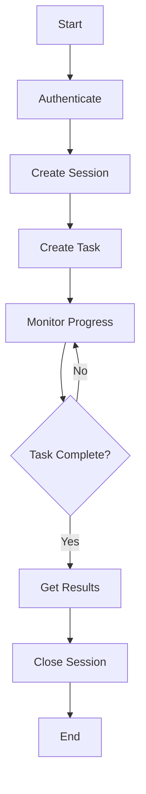

# Bytebot Browser-Use API User Guide

## Table of Contents

1. [Getting Started](#getting-started)
2. [Basic Concepts](#basic-concepts)
3. [Tutorial: Your First Automation](#tutorial-your-first-automation)
4. [Common Use Cases](#common-use-cases)
5. [Advanced Tutorials](#advanced-tutorials)
6. [Best Practices](#best-practices)
7. [Examples Gallery](#examples-gallery)
8. [Tips & Tricks](#tips--tricks)

## Getting Started

### What is the Browser-Use API?

The Bytebot Browser-Use API is a powerful tool that lets you automate web browsers programmatically. Think of it as having a virtual assistant that can:

- Navigate to websites automatically
- Fill out forms and click buttons
- Extract data from web pages
- Take screenshots of web content
- Perform complex multi-step automation workflows

### Who Should Use This Guide?

This guide is designed for:
- **Developers** building applications that need web automation
- **Data analysts** who need to extract information from websites
- **QA engineers** automating testing workflows
- **Business users** who want to automate repetitive web tasks

### Prerequisites

Before you begin, you should have:
- Basic understanding of web concepts (URLs, forms, HTML elements)
- Familiarity with REST APIs or willingness to learn
- Access to a Bytebot Browser-Use API installation
- Valid user credentials for authentication

## Basic Concepts

### Core Components

#### 1. Sessions
A **session** is like opening a browser window. Each session:
- Has its own browser instance
- Maintains cookies and state between operations
- Can be configured with specific settings (screen size, user agent, etc.)
- Should be closed when finished to free up resources

```javascript
// Think of a session like this:
const session = "Opening a new browser window";
// You can then perform multiple operations in this window
// When done, close the window to clean up
```

#### 2. Tasks
A **task** is a complete automation workflow that consists of multiple steps:
- Navigate to websites
- Interact with page elements
- Extract data
- Take screenshots

```javascript
// A task is like a recipe:
const task = {
  name: "Extract product prices",
  steps: [
    "Go to the shopping website",
    "Search for 'laptops'",
    "Extract all product names and prices",
    "Take a screenshot of the results"
  ]
};
```

#### 3. Steps
**Steps** are individual actions within a task:
- `navigate`: Go to a specific URL
- `click`: Click on buttons or links
- `type`: Enter text into form fields
- `extract`: Get data from the page
- `screenshot`: Capture images of the page

### API Workflow



## Tutorial: Your First Automation

Let's create a simple automation that visits a website and takes a screenshot.

### Step 1: Authentication

First, you need to log in to get an access token:

```bash
curl -X POST http://localhost:3000/auth/login \
  -H "Content-Type: application/json" \
  -d '{
    "email": "your-email@example.com",
    "password": "your-password"
  }'
```

**Response:**
```json
{
  "access_token": "eyJhbGciOiJIUzI1NiIsInR5cCI6IkpXVCJ9...",
  "user": {
    "id": "user_123",
    "email": "your-email@example.com",
    "role": "operator"
  }
}
```

Save the `access_token` - you'll need it for all future requests.

### Step 2: Create a Browser Session

Create a new browser session for your automation:

```bash
curl -X POST http://localhost:3000/api/v1/browser-use/sessions \
  -H "Authorization: Bearer YOUR_ACCESS_TOKEN" \
  -H "Content-Type: application/json" \
  -d '{
    "name": "My First Automation Session",
    "configuration": {
      "viewport": {
        "width": 1920,
        "height": 1080
      },
      "headless": true
    }
  }'
```

**Response:**
```json
{
  "sessionId": "session_abc123",
  "name": "My First Automation Session",
  "status": "active",
  "createdAt": "2024-01-15T10:30:00Z",
  "configuration": {
    "viewport": {"width": 1920, "height": 1080},
    "headless": true
  }
}
```

### Step 3: Navigate to a Website

Now let's navigate to a website:

```bash
curl -X POST http://localhost:3000/api/v1/browser-use/sessions/session_abc123/navigate \
  -H "Authorization: Bearer YOUR_ACCESS_TOKEN" \
  -H "Content-Type: application/json" \
  -d '{
    "url": "https://example.com",
    "waitForSelector": "h1",
    "timeout": 30000
  }'
```

### Step 4: Take a Screenshot

Capture what we see on the page:

```bash
curl -X POST http://localhost:3000/api/v1/browser-use/sessions/session_abc123/screenshot \
  -H "Authorization: Bearer YOUR_ACCESS_TOKEN" \
  -H "Content-Type: application/json" \
  -d '{
    "fullPage": true,
    "options": {
      "quality": 90,
      "format": "png"
    }
  }'
```

**Response:**
```json
{
  "screenshotId": "screenshot_xyz789",
  "sessionId": "session_abc123",
  "imageData": "data:image/png;base64,iVBORw0KGgoAAAANSUhEUgAA...",
  "metadata": {
    "width": 1920,
    "height": 1080,
    "format": "png",
    "capturedAt": "2024-01-15T10:31:00Z",
    "url": "https://example.com"
  }
}
```

### Step 5: Clean Up

Always close your session when finished:

```bash
curl -X DELETE http://localhost:3000/api/v1/browser-use/sessions/session_abc123 \
  -H "Authorization: Bearer YOUR_ACCESS_TOKEN"
```

🎉 **Congratulations!** You've just completed your first browser automation!

## Common Use Cases

### 1. Data Extraction from E-commerce Sites

**Scenario:** Extract product information from an online store.

```javascript
// Using the JavaScript client
const client = new BytebotClient();
await client.login('user@example.com', 'password');

// Create session
const session = await client.sessions.create({
  name: 'E-commerce Data Extraction',
  configuration: { headless: true }
});

// Create extraction task
const task = await client.tasks.create({
  name: 'Extract Product Data',
  type: 'data_extraction',
  startUrl: 'https://shop.example.com/laptops',
  steps: [
    {
      id: 'navigate',
      type: 'navigate',
      action: { url: 'https://shop.example.com/laptops' }
    },
    {
      id: 'extract_products',
      type: 'extract',
      action: {
        rules: [
          {
            name: 'product_titles',
            selector: '.product-title',
            attribute: 'text',
            multiple: true
          },
          {
            name: 'product_prices',
            selector: '.price',
            attribute: 'text',
            multiple: true
          },
          {
            name: 'product_images',
            selector: '.product-image img',
            attribute: 'src',
            multiple: true
          }
        ]
      }
    }
  ]
});

// Wait for completion and get results
const results = await client.tasks.waitForCompletion(task.taskId);
console.log('Extracted products:', results.extractedData);
```

### 2. Form Automation

**Scenario:** Automatically fill out and submit a contact form.

```bash
# Navigate to the contact page
curl -X POST http://localhost:3000/api/v1/browser-use/sessions/SESSION_ID/navigate \
  -H "Authorization: Bearer YOUR_TOKEN" \
  -H "Content-Type: application/json" \
  -d '{"url": "https://example.com/contact"}'

# Fill out the form
curl -X POST http://localhost:3000/api/v1/browser-use/sessions/SESSION_ID/forms/fill \
  -H "Authorization: Bearer YOUR_TOKEN" \
  -H "Content-Type: application/json" \
  -d '{
    "formSelector": "#contact-form",
    "fields": [
      {"selector": "#name", "value": "John Doe", "type": "text"},
      {"selector": "#email", "value": "john@example.com", "type": "email"},
      {"selector": "#message", "value": "Hello, this is a test message.", "type": "text"}
    ]
  }'

# Submit the form
curl -X POST http://localhost:3000/api/v1/browser-use/sessions/SESSION_ID/forms/submit \
  -H "Authorization: Bearer YOUR_TOKEN" \
  -H "Content-Type: application/json" \
  -d '{
    "formSelector": "#contact-form",
    "waitForNavigation": true
  }'
```

### 3. Website Monitoring

**Scenario:** Monitor a website for changes and take screenshots.

```python
# Python example
from bytebot_client import BytebotClient
import time

client = BytebotClient(base_url="http://localhost:3000")
client.login("user@example.com", "password")

def monitor_website(url, check_interval=300):  # Check every 5 minutes
    session = client.sessions.create(
        name="Website Monitor",
        configuration={"headless": True}
    )

    while True:
        try:
            # Navigate to the website
            client.sessions.navigate(session.session_id, url)

            # Take a screenshot
            screenshot = client.sessions.screenshot(
                session.session_id,
                {"fullPage": True}
            )

            # Save screenshot with timestamp
            timestamp = int(time.time())
            with open(f"monitor_{timestamp}.png", "wb") as f:
                f.write(base64.b64decode(screenshot.image_data))

            print(f"Screenshot saved: monitor_{timestamp}.png")

            # Wait for next check
            time.sleep(check_interval)

        except Exception as e:
            print(f"Monitoring error: {e}")
            time.sleep(60)  # Wait 1 minute before retrying

# Start monitoring
monitor_website("https://example.com/status")
```

### 4. Automated Testing

**Scenario:** Test user login functionality.

```javascript
async function testUserLogin() {
  const client = new BytebotClient();
  await client.login('admin@example.com', 'admin-password');

  const session = await client.sessions.create({
    name: 'Login Test Session'
  });

  try {
    // Navigate to login page
    await client.sessions.navigate(session.sessionId, {
      url: 'https://app.example.com/login'
    });

    // Fill login form
    await client.sessions.fillForm(session.sessionId, {
      formSelector: '#login-form',
      fields: [
        { selector: '#username', value: 'testuser', type: 'text' },
        { selector: '#password', value: 'testpass', type: 'password' }
      ]
    });

    // Submit form
    await client.sessions.submitForm(session.sessionId, {
      formSelector: '#login-form',
      waitForNavigation: true
    });

    // Verify successful login
    const state = await client.sessions.getState(session.sessionId);
    const isLoggedIn = state.currentUrl.includes('/dashboard');

    console.log('Login test result:', isLoggedIn ? 'PASSED' : 'FAILED');

    // Take screenshot for evidence
    await client.sessions.screenshot(session.sessionId, {
      fullPage: true
    });

  } finally {
    await client.sessions.close(session.sessionId);
  }
}
```

## Advanced Tutorials

### Tutorial 1: Complex Data Extraction with Pagination

This tutorial shows how to extract data from multiple pages.

```javascript
async function extractDataWithPagination() {
  const client = new BytebotClient();
  await client.login('user@example.com', 'password');

  const session = await client.sessions.create({
    name: 'Pagination Extraction',
    configuration: { headless: true }
  });

  let allData = [];
  let currentPage = 1;
  let hasNextPage = true;

  try {
    while (hasNextPage) {
      console.log(`Processing page ${currentPage}...`);

      // Navigate to current page
      await client.sessions.navigate(session.sessionId, {
        url: `https://example.com/products?page=${currentPage}`
      });

      // Extract data from current page
      const pageData = await client.sessions.extractData(session.sessionId, {
        rules: [
          {
            name: 'products',
            selector: '.product-item',
            multiple: true,
            fields: {
              title: { selector: '.title', attribute: 'text' },
              price: { selector: '.price', attribute: 'text' },
              rating: { selector: '.rating', attribute: 'data-rating' }
            }
          },
          {
            name: 'next_page_exists',
            selector: '.pagination .next:not(.disabled)',
            multiple: false
          }
        ]
      });

      // Add page data to results
      if (pageData.extractedData.products) {
        allData = allData.concat(pageData.extractedData.products);
      }

      // Check if there's a next page
      hasNextPage = pageData.extractedData.next_page_exists !== null;
      currentPage++;

      // Add delay to be respectful to the server
      await new Promise(resolve => setTimeout(resolve, 1000));
    }

    console.log(`Extraction complete. Total items: ${allData.length}`);
    return allData;

  } finally {
    await client.sessions.close(session.sessionId);
  }
}

// Usage
extractDataWithPagination().then(data => {
  console.log('All extracted data:', data);
});
```

### Tutorial 2: Handling Dynamic Content

This tutorial demonstrates how to work with JavaScript-heavy websites.

```javascript
async function handleDynamicContent() {
  const client = new BytebotClient();
  await client.login('user@example.com', 'password');

  const session = await client.sessions.create({
    name: 'Dynamic Content Session',
    configuration: {
      headless: false, // Set to false for debugging
      disableJavaScript: false // Ensure JS is enabled
    }
  });

  try {
    // Navigate to the page
    await client.sessions.navigate(session.sessionId, {
      url: 'https://spa-example.com',
      waitForSelector: '.app-loaded', // Wait for app to load
      timeout: 30000
    });

    // Wait for dynamic content to load
    await client.sessions.waitForElement(session.sessionId, {
      selector: '.dynamic-content',
      timeout: 10000
    });

    // Scroll to trigger lazy loading
    await client.sessions.scroll(session.sessionId, {
      direction: 'down',
      amount: 1000
    });

    // Wait for lazy-loaded content
    await new Promise(resolve => setTimeout(resolve, 2000));

    // Click to load more content
    await client.sessions.click(session.sessionId, {
      selector: '.load-more-btn'
    });

    // Wait for new content to appear
    await client.sessions.waitForElement(session.sessionId, {
      selector: '.new-content',
      timeout: 5000
    });

    // Extract the dynamically loaded data
    const data = await client.sessions.extractData(session.sessionId, {
      rules: [
        {
          name: 'dynamic_items',
          selector: '.dynamic-item',
          multiple: true,
          fields: {
            id: { selector: '', attribute: 'data-id' },
            title: { selector: '.item-title', attribute: 'text' },
            content: { selector: '.item-content', attribute: 'text' }
          }
        }
      ]
    });

    return data.extractedData.dynamic_items;

  } finally {
    await client.sessions.close(session.sessionId);
  }
}
```

### Tutorial 3: Multi-Step Workflow with Error Handling

This tutorial shows how to build robust automation workflows.

```javascript
class RobustAutomation {
  constructor() {
    this.client = new BytebotClient();
    this.maxRetries = 3;
    this.retryDelay = 2000;
  }

  async executeWithRetry(operation, context = {}) {
    for (let attempt = 1; attempt <= this.maxRetries; attempt++) {
      try {
        return await operation();
      } catch (error) {
        console.log(`Attempt ${attempt} failed:`, error.message);

        if (attempt === this.maxRetries) {
          throw error;
        }

        // Take screenshot for debugging
        if (context.sessionId) {
          try {
            await this.client.sessions.screenshot(context.sessionId, {
              fullPage: true
            });
          } catch (screenshotError) {
            console.log('Could not take error screenshot:', screenshotError.message);
          }
        }

        await new Promise(resolve => setTimeout(resolve, this.retryDelay));
      }
    }
  }

  async performComplexWorkflow() {
    await this.client.login('user@example.com', 'password');

    const session = await this.client.sessions.create({
      name: 'Complex Workflow Session'
    });

    try {
      // Step 1: Login to the application
      await this.executeWithRetry(async () => {
        await this.client.sessions.navigate(session.sessionId, {
          url: 'https://app.example.com/login'
        });

        await this.client.sessions.fillForm(session.sessionId, {
          formSelector: '#login-form',
          fields: [
            { selector: '#username', value: 'testuser', type: 'text' },
            { selector: '#password', value: 'password123', type: 'password' }
          ]
        });

        await this.client.sessions.submitForm(session.sessionId, {
          formSelector: '#login-form',
          waitForNavigation: true
        });

        // Verify login success
        const state = await this.client.sessions.getState(session.sessionId);
        if (!state.currentUrl.includes('/dashboard')) {
          throw new Error('Login failed - not redirected to dashboard');
        }
      }, { sessionId: session.sessionId });

      // Step 2: Navigate to data section
      await this.executeWithRetry(async () => {
        await this.client.sessions.click(session.sessionId, {
          selector: 'a[href="/data"]'
        });

        await this.client.sessions.waitForElement(session.sessionId, {
          selector: '.data-table',
          timeout: 10000
        });
      }, { sessionId: session.sessionId });

      // Step 3: Extract data
      const extractedData = await this.executeWithRetry(async () => {
        const result = await this.client.sessions.extractData(session.sessionId, {
          rules: [
            {
              name: 'data_rows',
              selector: '.data-table tbody tr',
              multiple: true,
              fields: {
                id: { selector: 'td:nth-child(1)', attribute: 'text' },
                name: { selector: 'td:nth-child(2)', attribute: 'text' },
                value: { selector: 'td:nth-child(3)', attribute: 'text' },
                status: { selector: 'td:nth-child(4) .status', attribute: 'class' }
              }
            }
          ]
        });

        if (!result.extractedData.data_rows || result.extractedData.data_rows.length === 0) {
          throw new Error('No data found in table');
        }

        return result.extractedData.data_rows;
      }, { sessionId: session.sessionId });

      // Step 4: Process and validate data
      const processedData = this.processExtractedData(extractedData);

      // Step 5: Take final screenshot
      await this.client.sessions.screenshot(session.sessionId, {
        fullPage: true
      });

      return processedData;

    } finally {
      await this.client.sessions.close(session.sessionId);
    }
  }

  processExtractedData(data) {
    return data.map(row => ({
      ...row,
      isActive: row.status.includes('active'),
      numericValue: parseFloat(row.value.replace(/[^0-9.-]/g, '')) || 0
    }));
  }
}

// Usage
const automation = new RobustAutomation();
automation.performComplexWorkflow()
  .then(data => console.log('Workflow completed:', data))
  .catch(error => console.error('Workflow failed:', error));
```

## Best Practices

### 1. Session Management

**✅ Do:**
- Always close sessions when finished
- Use meaningful session names for debugging
- Set appropriate timeouts based on your use case
- Monitor session performance and resource usage

**❌ Don't:**
- Leave sessions open indefinitely
- Create too many concurrent sessions
- Use sessions across multiple unrelated tasks

```javascript
// Good session management
const session = await client.sessions.create({
  name: 'Product Data Extraction - ' + new Date().toISOString(),
  timeout: 600000, // 10 minutes
  configuration: {
    headless: true,
    viewport: { width: 1920, height: 1080 }
  }
});

try {
  // Your automation logic here
} finally {
  // Always clean up
  await client.sessions.close(session.sessionId);
}
```

### 2. Error Handling

**✅ Do:**
- Implement retry logic for network-dependent operations
- Take screenshots when errors occur for debugging
- Log detailed error information
- Handle timeouts gracefully

```javascript
async function robustOperation(sessionId, operation) {
  const maxRetries = 3;

  for (let attempt = 1; attempt <= maxRetries; attempt++) {
    try {
      return await operation();
    } catch (error) {
      console.log(`Attempt ${attempt} failed:`, error.message);

      if (attempt === maxRetries) {
        // Take screenshot for debugging
        await client.sessions.screenshot(sessionId, {
          fullPage: true
        }).catch(() => {}); // Don't fail if screenshot fails

        throw error;
      }

      // Wait before retry
      await new Promise(resolve => setTimeout(resolve, 2000));
    }
  }
}
```

### 3. Performance Optimization

**✅ Do:**
- Use headless mode for faster execution
- Disable images when not needed
- Set reasonable timeouts
- Reuse sessions for related operations
- Implement request delays to be respectful to servers

```javascript
// Optimized session configuration
const session = await client.sessions.create({
  name: 'Fast Data Extraction',
  configuration: {
    headless: true,
    disableImages: true, // Faster loading
    disableJavaScript: false, // Only disable if you don't need JS
    viewport: { width: 1280, height: 720 } // Smaller viewport for speed
  }
});

// Add delays between requests
await new Promise(resolve => setTimeout(resolve, 1000));
```

### 4. Data Extraction Best Practices

**✅ Do:**
- Use specific selectors rather than generic ones
- Validate extracted data before using it
- Handle missing elements gracefully
- Use multiple extraction strategies for important data

```javascript
// Robust data extraction
const extractionRules = [
  {
    name: 'product_title',
    // Multiple selector strategies
    selectors: [
      'h1.product-title',
      '.product-name h1',
      '[data-testid="product-title"]',
      'h1' // Fallback
    ],
    attribute: 'text',
    required: true
  },
  {
    name: 'product_price',
    selector: '.price, .cost, [data-price]',
    attribute: 'text',
    transform: 'parsePrice', // Custom transformation
    fallback: 'N/A'
  }
];
```

### 5. Security Considerations

**✅ Do:**
- Never hard-code credentials in your scripts
- Use environment variables for sensitive data
- Validate URLs before navigation
- Be cautious with file uploads and downloads

```javascript
// Secure credential handling
const credentials = {
  username: process.env.APP_USERNAME,
  password: process.env.APP_PASSWORD
};

// URL validation
function isValidUrl(url) {
  try {
    const urlObj = new URL(url);
    return ['http:', 'https:'].includes(urlObj.protocol);
  } catch {
    return false;
  }
}

if (!isValidUrl(targetUrl)) {
  throw new Error('Invalid URL provided');
}
```

## Examples Gallery

### Example 1: Social Media Post Scheduler

```javascript
async function scheduleSocialMediaPost() {
  const client = new BytebotClient();
  await client.login(process.env.SOCIAL_EMAIL, process.env.SOCIAL_PASSWORD);

  const session = await client.sessions.create({
    name: 'Social Media Posting'
  });

  try {
    // Login to social media platform
    await client.sessions.navigate(session.sessionId, {
      url: 'https://social-platform.com/login'
    });

    await client.sessions.fillForm(session.sessionId, {
      formSelector: '#login-form',
      fields: [
        { selector: '#email', value: process.env.SOCIAL_EMAIL, type: 'email' },
        { selector: '#password', value: process.env.SOCIAL_PASSWORD, type: 'password' }
      ]
    });

    await client.sessions.submitForm(session.sessionId, {
      formSelector: '#login-form'
    });

    // Create new post
    await client.sessions.click(session.sessionId, {
      selector: '.new-post-button'
    });

    await client.sessions.type(session.sessionId, {
      selector: '.post-content',
      text: 'Check out our latest product update! #innovation #tech'
    });

    // Upload image (if needed)
    await client.sessions.uploadFile(session.sessionId, {
      selector: '.file-upload',
      filePath: '/path/to/image.jpg'
    });

    // Schedule post
    await client.sessions.click(session.sessionId, {
      selector: '.schedule-button'
    });

    // Set schedule time
    await client.sessions.type(session.sessionId, {
      selector: '.schedule-time',
      text: '2024-01-15 14:00'
    });

    await client.sessions.click(session.sessionId, {
      selector: '.confirm-schedule'
    });

    console.log('Post scheduled successfully!');

  } finally {
    await client.sessions.close(session.sessionId);
  }
}
```

### Example 2: Competitive Price Monitoring

```javascript
async function monitorCompetitorPrices() {
  const client = new BytebotClient();
  await client.login(process.env.API_EMAIL, process.env.API_PASSWORD);

  const competitors = [
    { name: 'Competitor A', url: 'https://competitor-a.com/product/123' },
    { name: 'Competitor B', url: 'https://competitor-b.com/items/456' },
    { name: 'Competitor C', url: 'https://competitor-c.com/shop/789' }
  ];

  const priceData = [];

  for (const competitor of competitors) {
    const session = await client.sessions.create({
      name: `Price Check - ${competitor.name}`
    });

    try {
      await client.sessions.navigate(session.sessionId, {
        url: competitor.url
      });

      const data = await client.sessions.extractData(session.sessionId, {
        rules: [
          {
            name: 'price',
            selector: '.price, .cost, [data-price], .product-price',
            attribute: 'text'
          },
          {
            name: 'availability',
            selector: '.stock, .availability, .in-stock',
            attribute: 'text'
          },
          {
            name: 'product_name',
            selector: 'h1, .product-title, .item-name',
            attribute: 'text'
          }
        ]
      });

      priceData.push({
        competitor: competitor.name,
        url: competitor.url,
        ...data.extractedData,
        timestamp: new Date().toISOString()
      });

      // Be respectful - add delay between requests
      await new Promise(resolve => setTimeout(resolve, 2000));

    } finally {
      await client.sessions.close(session.sessionId);
    }
  }

  // Save results to database or file
  console.log('Price monitoring results:', priceData);
  return priceData;
}

// Run monitoring every hour
setInterval(monitorCompetitorPrices, 3600000);
```

### Example 3: Automated Report Generation

```javascript
async function generateWeeklyReport() {
  const client = new BytebotClient();
  await client.login(process.env.ADMIN_EMAIL, process.env.ADMIN_PASSWORD);

  const session = await client.sessions.create({
    name: 'Weekly Report Generation'
  });

  try {
    // Login to admin dashboard
    await client.sessions.navigate(session.sessionId, {
      url: 'https://admin.example.com/dashboard'
    });

    // Navigate to reports section
    await client.sessions.click(session.sessionId, {
      selector: 'a[href="/reports"]'
    });

    // Set date range for the week
    const lastWeek = new Date();
    lastWeek.setDate(lastWeek.getDate() - 7);

    await client.sessions.type(session.sessionId, {
      selector: '#start-date',
      text: lastWeek.toISOString().split('T')[0]
    });

    await client.sessions.type(session.sessionId, {
      selector: '#end-date',
      text: new Date().toISOString().split('T')[0]
    });

    // Generate report
    await client.sessions.click(session.sessionId, {
      selector: '.generate-report'
    });

    // Wait for report to generate
    await client.sessions.waitForElement(session.sessionId, {
      selector: '.report-ready',
      timeout: 30000
    });

    // Extract key metrics
    const metrics = await client.sessions.extractData(session.sessionId, {
      rules: [
        {
          name: 'total_users',
          selector: '.metric-users .value',
          attribute: 'text'
        },
        {
          name: 'total_revenue',
          selector: '.metric-revenue .value',
          attribute: 'text'
        },
        {
          name: 'conversion_rate',
          selector: '.metric-conversion .value',
          attribute: 'text'
        }
      ]
    });

    // Take screenshot of the report
    await client.sessions.screenshot(session.sessionId, {
      fullPage: true
    });

    // Download report if available
    const downloadLink = await client.sessions.extractData(session.sessionId, {
      rules: [
        {
          name: 'download_url',
          selector: '.download-report',
          attribute: 'href'
        }
      ]
    });

    return {
      metrics: metrics.extractedData,
      downloadUrl: downloadLink.extractedData.download_url,
      reportDate: new Date().toISOString()
    };

  } finally {
    await client.sessions.close(session.sessionId);
  }
}
```

## Tips & Tricks

### 1. Debugging Techniques

**Use Non-Headless Mode for Development:**
```javascript
// For debugging, disable headless mode
const session = await client.sessions.create({
  name: 'Debug Session',
  configuration: {
    headless: false, // You can see what's happening
    viewport: { width: 1280, height: 720 }
  }
});
```

**Take Screenshots at Key Points:**
```javascript
// Take screenshots to understand what's happening
await client.sessions.screenshot(session.sessionId, {
  fullPage: true
});

// Name screenshots descriptively
const timestamp = new Date().toISOString().replace(/[:.]/g, '-');
await client.sessions.screenshot(session.sessionId, {
  filename: `debug-${timestamp}.png`
});
```

### 2. Handling Common Issues

**Waiting for Elements to Load:**
```javascript
// Instead of fixed delays, wait for specific elements
await client.sessions.waitForElement(session.sessionId, {
  selector: '.content-loaded',
  timeout: 10000
});

// Or wait for element to disappear (like loading spinners)
await client.sessions.waitForElementToDisappear(session.sessionId, {
  selector: '.loading-spinner',
  timeout: 15000
});
```

**Handling Pop-ups and Modals:**
```javascript
// Check if modal exists and close it
const modalExists = await client.sessions.checkElement(session.sessionId, {
  selector: '.modal'
});

if (modalExists) {
  await client.sessions.click(session.sessionId, {
    selector: '.modal .close-button'
  });
}
```

### 3. Advanced Selectors

**Using Multiple Fallback Selectors:**
```javascript
// Try multiple selectors until one works
const selectors = [
  '.product-price',
  '[data-testid="price"]',
  '.price-current',
  '.cost'
];

for (const selector of selectors) {
  try {
    const result = await client.sessions.extractData(session.sessionId, {
      rules: [{ name: 'price', selector, attribute: 'text' }]
    });

    if (result.extractedData.price) {
      break; // Found it!
    }
  } catch (error) {
    continue; // Try next selector
  }
}
```

**Using XPath for Complex Selections:**
```javascript
// Some sites require XPath for complex element selection
const xpathSelector = "//div[contains(@class, 'product') and contains(text(), 'Special Offer')]";

await client.sessions.click(session.sessionId, {
  selector: xpathSelector,
  selectorType: 'xpath'
});
```

### 4. Performance Tips

**Batch Operations:**
```javascript
// Instead of multiple separate requests, batch operations
const task = await client.tasks.create({
  name: 'Batch Operations',
  steps: [
    { type: 'navigate', action: { url: 'https://example.com' } },
    { type: 'click', action: { selector: '.menu-item' } },
    { type: 'extract', action: { rules: extractionRules } },
    { type: 'screenshot', action: { fullPage: true } }
  ]
});
```

**Optimize Browser Settings:**
```javascript
// For faster execution
const optimizedConfig = {
  headless: true,
  disableImages: true,
  disableCSS: false, // Keep CSS for proper layout
  disablePlugins: true,
  viewport: { width: 1280, height: 720 }, // Smaller viewport
  userAgent: 'Mozilla/5.0 (compatible; Bot/1.0)' // Identify as bot
};
```

### 5. Data Processing

**Clean Extracted Data:**
```javascript
function cleanExtractedData(data) {
  return data.map(item => ({
    ...item,
    price: item.price ? parseFloat(item.price.replace(/[^0-9.]/g, '')) : null,
    title: item.title ? item.title.trim() : '',
    availability: item.availability ? item.availability.toLowerCase().includes('stock') : false
  }));
}
```

**Validate Data Quality:**
```javascript
function validateData(data) {
  const issues = [];

  data.forEach((item, index) => {
    if (!item.title) issues.push(`Missing title at index ${index}`);
    if (!item.price || item.price <= 0) issues.push(`Invalid price at index ${index}`);
    if (!item.url) issues.push(`Missing URL at index ${index}`);
  });

  if (issues.length > 0) {
    console.warn('Data quality issues found:', issues);
  }

  return issues.length === 0;
}
```

---

This user guide provides comprehensive coverage of the Browser-Use API from basic concepts to advanced automation patterns. Each section includes practical examples and real-world use cases to help users quickly become productive with the system.