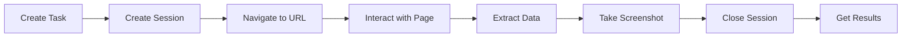

# Browser-Use API Developer Onboarding Guide

## Welcome to the Browser-Use API

This guide will get you up and running with the Browser-Use API quickly. By the end of this guide, you'll have created your first automation task and understand the core concepts for building powerful browser automation solutions.

## Table of Contents

- [Getting Started](#getting-started)
- [Core Concepts](#core-concepts)
- [Your First Task](#your-first-task)
- [Development Environment Setup](#development-environment-setup)
- [Common Use Cases](#common-use-cases)
- [Best Practices](#best-practices)
- [Next Steps](#next-steps)
- [Resources](#resources)

## Getting Started

### Prerequisites

Before you begin, ensure you have:

- **API Access**: Browser-Use API endpoint URL and authentication credentials
- **Node.js 16+** or **Python 3.8+** for the examples
- **Basic HTTP/REST knowledge**
- **Understanding of CSS selectors** (helpful for DOM interaction)

### Authentication

The Browser-Use API uses JWT Bearer token authentication. You'll need:

1. **JWT Token**: For user authentication
2. **API Key** (optional): For service-to-service authentication

```bash
# Set your environment variables
export BROWSER_USE_API_URL="https://api.bytebot.ai/v1/browser-use"
export BROWSER_USE_JWT_TOKEN="your-jwt-token-here"
```

### API Endpoints Overview

| Endpoint Category | Purpose | Examples |
|------------------|---------|----------|
| **Tasks** (`/tasks`) | Create and manage automation tasks | Create, start, stop, monitor tasks |
| **Sessions** (`/sessions`) | Browser session management | Create sessions, close sessions |
| **Screenshots** (`/screenshots`) | Capture and retrieve screenshots | Take screenshots, download images |
| **DOM Operations** (`/sessions/{id}/...`) | Browser interactions | Navigate, click, type, scroll |
| **Forms** (`/sessions/{id}/forms/...`) | Form automation | Fill forms, submit forms |
| **Data Extraction** (`/sessions/{id}/extract`) | Extract structured data | Scrape content, extract information |
| **Monitoring** (`/monitoring/...`) | Health and status checks | Service health, task status |

## Core Concepts

### 1. Tasks vs Sessions

**Tasks** are high-level automation workflows:
- Have a name, description, and specific goals
- Can include multiple steps and actions
- Track progress and results
- Can be started, stopped, and monitored

**Sessions** are individual browser instances:
- Represent a single browser window/tab
- Can be reused across multiple operations
- Have configurable browser settings
- Maintain state between operations

### 2. Browser Automation Flow



### 3. Local-Only Architecture

The Browser-Use API operates entirely on-premises:
- **No cloud dependencies** - all processing happens locally
- **Data privacy** - your data never leaves your infrastructure
- **Security compliance** - meets strict data residency requirements
- **Docker deployment** - easy containerized deployment

## Your First Task

Let's create your first browser automation task step by step.

### Step 1: Verify API Access

First, let's verify your API access works:

```bash
# Test API connectivity
curl -H "Authorization: Bearer $BROWSER_USE_JWT_TOKEN" \
     "$BROWSER_USE_API_URL/monitoring/health"
```

Expected response:
```json
{
  "serviceHealth": {
    "status": "healthy",
    "timestamp": "2024-01-01T10:00:00Z",
    "uptime": 86400,
    "version": "2.0.0"
  },
  "activeSessions": 0,
  "runningTasks": 0
}
```

### Step 2: Create Your First Task

```javascript
// first-task.js
const createFirstTask = async () => {
  const taskData = {
    name: "My First Browser Automation",
    description: "Navigate to a website and capture a screenshot",
    startUrl: "https://example.com",
    constraints: {
      maxExecutionTime: 60, // 1 minute timeout
      enableScreenshots: true
    },
    autoStart: true // Start immediately after creation
  };

  try {
    const response = await fetch(`${process.env.BROWSER_USE_API_URL}/tasks`, {
      method: 'POST',
      headers: {
        'Authorization': `Bearer ${process.env.BROWSER_USE_JWT_TOKEN}`,
        'Content-Type': 'application/json',
        'X-Request-ID': `req_${Date.now()}`
      },
      body: JSON.stringify(taskData)
    });

    if (!response.ok) {
      throw new Error(`HTTP error! status: ${response.status}`);
    }

    const task = await response.json();
    console.log('✅ Task created successfully!');
    console.log(`Task ID: ${task.id}`);
    console.log(`Status: ${task.status}`);
    
    return task;
  } catch (error) {
    console.error('❌ Error creating task:', error.message);
    throw error;
  }
};

// Run the function
createFirstTask().then(task => {
  console.log('Task details:', task);
}).catch(console.error);
```

### Step 3: Monitor Task Progress

```javascript
// monitor-task.js
const monitorTask = async (taskId) => {
  console.log(`🔍 Monitoring task: ${taskId}`);
  
  const pollInterval = 2000; // Check every 2 seconds
  let attempts = 0;
  const maxAttempts = 30; // Maximum 1 minute

  const poll = async () => {
    attempts++;
    
    try {
      const response = await fetch(
        `${process.env.BROWSER_USE_API_URL}/monitoring/tasks/${taskId}/status`,
        {
          headers: {
            'Authorization': `Bearer ${process.env.BROWSER_USE_JWT_TOKEN}`
          }
        }
      );

      const status = await response.json();
      console.log(`⏱️  Attempt ${attempts}: Status = ${status.status}, Progress = ${status.progress?.percentComplete || 0}%`);

      if (status.status === 'completed') {
        console.log('🎉 Task completed successfully!');
        return await getTaskResults(taskId);
      } else if (status.status === 'failed') {
        console.error('💥 Task failed:', status.error);
        return null;
      } else if (attempts >= maxAttempts) {
        console.error('⏰ Task monitoring timed out');
        return null;
      } else {
        // Continue polling
        setTimeout(poll, pollInterval);
      }
    } catch (error) {
      console.error('❌ Error monitoring task:', error.message);
      return null;
    }
  };

  return poll();
};

const getTaskResults = async (taskId) => {
  try {
    const response = await fetch(
      `${process.env.BROWSER_USE_API_URL}/results/${taskId}`,
      {
        headers: {
          'Authorization': `Bearer ${process.env.BROWSER_USE_JWT_TOKEN}`
        }
      }
    );

    const results = await response.json();
    console.log('📊 Task Results:');
    console.log(`- Execution Time: ${results.executionTimeMs}ms`);
    console.log(`- Screenshots: ${results.screenshots.length}`);
    console.log(`- Steps: ${results.executionSteps.length}`);
    
    return results;
  } catch (error) {
    console.error('❌ Error getting results:', error.message);
    return null;
  }
};

// Usage: node monitor-task.js <task-id>
const taskId = process.argv[2];
if (taskId) {
  monitorTask(taskId);
} else {
  console.error('Please provide a task ID: node monitor-task.js <task-id>');
}
```

### Step 4: Interactive Session Example

```javascript
// interactive-session.js
const createInteractiveSession = async () => {
  console.log('🚀 Creating interactive browser session...');

  // 1. Create a browser session
  const sessionResponse = await fetch(`${process.env.BROWSER_USE_API_URL}/sessions`, {
    method: 'POST',
    headers: {
      'Authorization': `Bearer ${process.env.BROWSER_USE_JWT_TOKEN}`,
      'Content-Type': 'application/json'
    },
    body: JSON.stringify({
      name: "Interactive Demo Session",
      profile: {
        browserType: "chromium",
        headless: true, // Set to false to see the browser in action
        windowWidth: 1920,
        windowHeight: 1080
      },
      enableScreenshots: true,
      timeoutSeconds: 300 // 5 minutes
    })
  });

  const session = await sessionResponse.json();
  console.log(`✅ Session created: ${session.id}`);

  try {
    // 2. Navigate to a website
    console.log('🌐 Navigating to example website...');
    await fetch(`${process.env.BROWSER_USE_API_URL}/sessions/${session.id}/navigate`, {
      method: 'POST',
      headers: {
        'Authorization': `Bearer ${process.env.BROWSER_USE_JWT_TOKEN}`,
        'Content-Type': 'application/json'
      },
      body: JSON.stringify({
        url: "https://httpbin.org/html",
        waitForLoad: true
      })
    });

    // 3. Take a screenshot
    console.log('📸 Taking screenshot...');
    const screenshotResponse = await fetch(`${process.env.BROWSER_USE_API_URL}/sessions/${session.id}/screenshot`, {
      method: 'POST',
      headers: {
        'Authorization': `Bearer ${process.env.BROWSER_USE_JWT_TOKEN}`,
        'Content-Type': 'application/json'
      },
      body: JSON.stringify({
        fullPage: true,
        format: "png"
      })
    });

    const screenshot = await screenshotResponse.json();
    console.log(`✅ Screenshot captured: ${screenshot.id}`);
    console.log(`📁 Screenshot URL: ${screenshot.url}`);

    // 4. Extract data from the page
    console.log('🔍 Extracting page data...');
    const extractResponse = await fetch(`${process.env.BROWSER_USE_API_URL}/sessions/${session.id}/extract`, {
      method: 'POST',
      headers: {
        'Authorization': `Bearer ${process.env.BROWSER_USE_JWT_TOKEN}`,
        'Content-Type': 'application/json'
      },
      body: JSON.stringify({
        selectors: {
          title: "h1",
          paragraphs: "p",
          links: "a"
        },
        extractMode: "structured"
      })
    });

    const extractedData = await extractResponse.json();
    console.log('📊 Extracted Data:');
    console.log(JSON.stringify(extractedData.data, null, 2));

    return {
      session,
      screenshot,
      data: extractedData
    };

  } finally {
    // 5. Clean up - close the session
    console.log('🧹 Cleaning up session...');
    await fetch(`${process.env.BROWSER_USE_API_URL}/sessions/${session.id}`, {
      method: 'DELETE',
      headers: {
        'Authorization': `Bearer ${process.env.BROWSER_USE_JWT_TOKEN}`
      }
    });
    console.log('✅ Session closed');
  }
};

// Run the interactive session demo
createInteractiveSession()
  .then(results => {
    console.log('🎉 Interactive session completed successfully!');
  })
  .catch(error => {
    console.error('❌ Error in interactive session:', error.message);
  });
```

## Development Environment Setup

### Node.js Setup

Create a new Node.js project:

```bash
# Create new project
mkdir browser-use-demo
cd browser-use-demo
npm init -y

# Install dependencies
npm install node-fetch dotenv

# Create environment file
echo "BROWSER_USE_API_URL=https://api.bytebot.ai/v1/browser-use" > .env
echo "BROWSER_USE_JWT_TOKEN=your-jwt-token-here" >> .env
```

Create a basic client utility:

```javascript
// client.js
require('dotenv').config();
const fetch = require('node-fetch');

class BrowserUseClient {
  constructor() {
    this.apiUrl = process.env.BROWSER_USE_API_URL;
    this.token = process.env.BROWSER_USE_JWT_TOKEN;
    
    if (!this.apiUrl || !this.token) {
      throw new Error('Missing API URL or JWT token in environment variables');
    }
  }

  async request(endpoint, options = {}) {
    const url = `${this.apiUrl}${endpoint}`;
    const config = {
      ...options,
      headers: {
        'Authorization': `Bearer ${this.token}`,
        'Content-Type': 'application/json',
        'X-Request-ID': `req_${Date.now()}_${Math.random().toString(36).substr(2, 9)}`,
        ...options.headers
      }
    };

    try {
      const response = await fetch(url, config);
      
      if (!response.ok) {
        const error = await response.json().catch(() => ({}));
        throw new Error(`API Error ${response.status}: ${error.error?.message || response.statusText}`);
      }

      return await response.json();
    } catch (error) {
      console.error(`Request failed: ${config.method || 'GET'} ${endpoint}`);
      throw error;
    }
  }

  // Convenience methods
  async createTask(taskData) {
    return this.request('/tasks', {
      method: 'POST',
      body: JSON.stringify(taskData)
    });
  }

  async getTask(taskId) {
    return this.request(`/tasks/${taskId}`);
  }

  async getTaskStatus(taskId) {
    return this.request(`/monitoring/tasks/${taskId}/status`);
  }

  async createSession(sessionData) {
    return this.request('/sessions', {
      method: 'POST',
      body: JSON.stringify(sessionData)
    });
  }

  async closeSession(sessionId) {
    return this.request(`/sessions/${sessionId}`, {
      method: 'DELETE'
    });
  }

  async captureScreenshot(sessionId, options = {}) {
    return this.request(`/sessions/${sessionId}/screenshot`, {
      method: 'POST',
      body: JSON.stringify(options)
    });
  }

  async navigate(sessionId, url) {
    return this.request(`/sessions/${sessionId}/navigate`, {
      method: 'POST',
      body: JSON.stringify({ url, waitForLoad: true })
    });
  }

  async extractData(sessionId, selectors) {
    return this.request(`/sessions/${sessionId}/extract`, {
      method: 'POST',
      body: JSON.stringify({ selectors, extractMode: 'structured' })
    });
  }

  async healthCheck() {
    return this.request('/monitoring/health');
  }
}

module.exports = BrowserUseClient;
```

### Python Setup

```bash
# Create virtual environment
python -m venv browser-use-env
source browser-use-env/bin/activate  # On Windows: browser-use-env\Scripts\activate

# Install dependencies
pip install requests python-dotenv

# Create environment file
echo "BROWSER_USE_API_URL=https://api.bytebot.ai/v1/browser-use" > .env
echo "BROWSER_USE_JWT_TOKEN=your-jwt-token-here" >> .env
```

Create a Python client:

```python
# client.py
import os
import requests
import time
from typing import Dict, Optional
from dotenv import load_dotenv

load_dotenv()

class BrowserUseClient:
    def __init__(self):
        self.api_url = os.getenv('BROWSER_USE_API_URL')
        self.token = os.getenv('BROWSER_USE_JWT_TOKEN')
        
        if not self.api_url or not self.token:
            raise ValueError("Missing API URL or JWT token in environment variables")
        
        self.session = requests.Session()
        self.session.headers.update({
            'Authorization': f'Bearer {self.token}',
            'Content-Type': 'application/json'
        })

    def request(self, endpoint: str, method: str = 'GET', **kwargs) -> Dict:
        url = f"{self.api_url}{endpoint}"
        
        # Add request ID for tracing
        if 'headers' not in kwargs:
            kwargs['headers'] = {}
        kwargs['headers']['X-Request-ID'] = f"req_{int(time.time())}_{os.urandom(4).hex()}"

        try:
            response = self.session.request(method, url, **kwargs)
            response.raise_for_status()
            return response.json()
        except requests.exceptions.RequestException as e:
            print(f"Request failed: {method} {endpoint}")
            raise e

    def create_task(self, task_data: Dict) -> Dict:
        return self.request('/tasks', method='POST', json=task_data)

    def get_task(self, task_id: str) -> Dict:
        return self.request(f'/tasks/{task_id}')

    def get_task_status(self, task_id: str) -> Dict:
        return self.request(f'/monitoring/tasks/{task_id}/status')

    def create_session(self, session_data: Dict) -> Dict:
        return self.request('/sessions', method='POST', json=session_data)

    def close_session(self, session_id: str) -> None:
        self.request(f'/sessions/{session_id}', method='DELETE')

    def capture_screenshot(self, session_id: str, options: Dict = None) -> Dict:
        if options is None:
            options = {}
        return self.request(f'/sessions/{session_id}/screenshot', method='POST', json=options)

    def navigate(self, session_id: str, url: str) -> Dict:
        return self.request(f'/sessions/{session_id}/navigate', 
                          method='POST', 
                          json={'url': url, 'waitForLoad': True})

    def extract_data(self, session_id: str, selectors: Dict) -> Dict:
        return self.request(f'/sessions/{session_id}/extract',
                          method='POST',
                          json={'selectors': selectors, 'extractMode': 'structured'})

    def health_check(self) -> Dict:
        return self.request('/monitoring/health')

# Example usage
if __name__ == "__main__":
    client = BrowserUseClient()
    
    # Test connectivity
    health = client.health_check()
    print(f"API Status: {health['serviceHealth']['status']}")
```

## Common Use Cases

### 1. Web Scraping

```javascript
// web-scraper.js
const BrowserUseClient = require('./client');

const scrapeProductData = async () => {
  const client = new BrowserUseClient();
  
  const urls = [
    'https://example-store.com/product/1',
    'https://example-store.com/product/2',
    'https://example-store.com/product/3'
  ];

  const results = [];

  for (const url of urls) {
    console.log(`Scraping: ${url}`);
    
    // Create session for this URL
    const session = await client.createSession({
      name: `Scraper Session - ${url}`,
      profile: { browserType: 'chromium', headless: true }
    });

    try {
      // Navigate and extract data
      await client.navigate(session.id, url);
      
      const data = await client.extractData(session.id, {
        title: '.product-title',
        price: '.price-display',
        availability: '.stock-status',
        images: 'img.product-image',
        description: '.product-description'
      });

      results.push({
        url,
        ...data.data,
        scrapedAt: new Date().toISOString()
      });

    } finally {
      await client.closeSession(session.id);
    }
  }

  return results;
};

scrapeProductData().then(results => {
  console.log('Scraped data:', JSON.stringify(results, null, 2));
});
```

### 2. Form Automation

```javascript
// form-automation.js
const formAutomation = async () => {
  const client = new BrowserUseClient();
  
  const session = await client.createSession({
    name: 'Form Automation Session',
    profile: { browserType: 'chromium', headless: false } // Visible browser
  });

  try {
    // Navigate to form page
    await client.navigate(session.id, 'https://httpbin.org/forms/post');

    // Fill the form
    await client.request(`/sessions/${session.id}/forms/fill`, {
      method: 'POST',
      body: JSON.stringify({
        formSelector: 'form',
        fields: {
          'input[name="custname"]': 'John Doe',
          'input[name="custtel"]': '+1-555-123-4567',
          'input[name="custemail"]': 'john.doe@example.com',
          'textarea[name="comments"]': 'This is an automated form submission test.'
        },
        validateFields: true
      })
    });

    console.log('✅ Form filled successfully');

    // Take screenshot before submission
    const screenshot = await client.captureScreenshot(session.id, {
      fullPage: true
    });
    console.log(`📸 Screenshot taken: ${screenshot.id}`);

    // Submit the form
    await client.request(`/sessions/${session.id}/forms/submit`, {
      method: 'POST',
      body: JSON.stringify({
        formSelector: 'form',
        waitForNavigation: true
      })
    });

    console.log('✅ Form submitted successfully');

  } finally {
    // Keep session open for a moment to see results
    setTimeout(async () => {
      await client.closeSession(session.id);
    }, 5000);
  }
};

formAutomation();
```

### 3. Testing Automation

```javascript
// test-automation.js
const testWebsite = async () => {
  const client = new BrowserUseClient();
  
  const testCases = [
    {
      name: 'Homepage Load Test',
      url: 'https://example.com',
      checks: [
        { selector: 'h1', expected: 'content' },
        { selector: 'nav', expected: 'exists' }
      ]
    },
    {
      name: 'Contact Form Test',
      url: 'https://example.com/contact',
      checks: [
        { selector: 'form', expected: 'exists' },
        { selector: 'input[type="email"]', expected: 'exists' }
      ]
    }
  ];

  const session = await client.createSession({
    name: 'Website Testing Session',
    profile: { browserType: 'chromium', headless: true },
    enableScreenshots: true
  });

  const results = [];

  try {
    for (const testCase of testCases) {
      console.log(`🧪 Running: ${testCase.name}`);
      
      // Navigate to test URL
      await client.navigate(session.id, testCase.url);
      
      // Take screenshot
      const screenshot = await client.captureScreenshot(session.id);
      
      // Extract page data for validation
      const checkSelectors = testCase.checks.reduce((acc, check) => {
        acc[check.selector] = check.selector;
        return acc;
      }, {});
      
      const pageData = await client.extractData(session.id, checkSelectors);
      
      // Validate checks
      const checkResults = testCase.checks.map(check => {
        const found = pageData.data[check.selector];
        const passed = check.expected === 'exists' ? !!found : !!found?.length;
        
        return {
          selector: check.selector,
          expected: check.expected,
          found: !!found,
          passed
        };
      });
      
      results.push({
        name: testCase.name,
        url: testCase.url,
        screenshot: screenshot.id,
        checks: checkResults,
        passed: checkResults.every(check => check.passed)
      });
      
      const status = checkResults.every(check => check.passed) ? '✅ PASSED' : '❌ FAILED';
      console.log(`${status} ${testCase.name}`);
    }

  } finally {
    await client.closeSession(session.id);
  }

  // Print test results
  console.log('\n📊 Test Results Summary:');
  results.forEach(result => {
    console.log(`${result.passed ? '✅' : '❌'} ${result.name}`);
    result.checks.forEach(check => {
      console.log(`  ${check.passed ? '✅' : '❌'} ${check.selector} (${check.expected})`);
    });
  });

  const passedTests = results.filter(r => r.passed).length;
  console.log(`\nTotal: ${passedTests}/${results.length} tests passed`);

  return results;
};

testWebsite();
```

## Best Practices

### 1. Error Handling

```javascript
// Always use try-catch blocks and handle specific error types
const robustTaskCreation = async (taskData) => {
  try {
    const task = await client.createTask(taskData);
    return task;
  } catch (error) {
    if (error.message.includes('429')) {
      console.log('Rate limited. Waiting before retry...');
      await new Promise(resolve => setTimeout(resolve, 60000));
      return robustTaskCreation(taskData); // Retry
    } else if (error.message.includes('422')) {
      console.error('Validation error:', error.message);
      // Handle validation errors
    } else {
      console.error('Unexpected error:', error.message);
      throw error;
    }
  }
};
```

### 2. Resource Management

```javascript
// Always clean up resources
const performAutomation = async () => {
  let session = null;
  
  try {
    session = await client.createSession(sessionConfig);
    // ... perform automation
    
  } finally {
    // Ensure cleanup happens even if there's an error
    if (session) {
      await client.closeSession(session.id).catch(console.error);
    }
  }
};
```

### 3. Monitoring and Logging

```javascript
// Add comprehensive logging
const monitoredOperation = async () => {
  const startTime = Date.now();
  const operationId = `op_${Date.now()}`;
  
  console.log(`[${operationId}] Starting automation operation`);
  
  try {
    const result = await performAutomation();
    const duration = Date.now() - startTime;
    console.log(`[${operationId}] Operation completed in ${duration}ms`);
    return result;
  } catch (error) {
    const duration = Date.now() - startTime;
    console.error(`[${operationId}] Operation failed after ${duration}ms:`, error.message);
    throw error;
  }
};
```

### 4. Rate Limiting

```javascript
// Implement rate limiting to avoid hitting API limits
class RateLimiter {
  constructor(requestsPerMinute = 60) {
    this.requests = [];
    this.limit = requestsPerMinute;
  }

  async wait() {
    const now = Date.now();
    const oneMinuteAgo = now - 60000;
    
    // Remove old requests
    this.requests = this.requests.filter(time => time > oneMinuteAgo);
    
    if (this.requests.length >= this.limit) {
      const oldestRequest = Math.min(...this.requests);
      const waitTime = 60000 - (now - oldestRequest);
      console.log(`Rate limit reached, waiting ${waitTime}ms`);
      await new Promise(resolve => setTimeout(resolve, waitTime));
    }
    
    this.requests.push(now);
  }
}

const rateLimiter = new RateLimiter(30); // 30 requests per minute

const makeRateLimitedRequest = async (endpoint, options) => {
  await rateLimiter.wait();
  return client.request(endpoint, options);
};
```

## Next Steps

Now that you've completed the onboarding guide, here are your next steps:

### 1. Explore Advanced Features
- **WebSocket Integration**: Real-time task monitoring
- **Batch Operations**: Process multiple URLs efficiently
- **Form Automation**: Complex form handling
- **Data Pipelines**: Extract, transform, and load workflows

### 2. Production Preparation
- Review the [Integration Guide](./INTEGRATION_GUIDE.md) for production patterns
- Implement proper error handling and retry logic
- Set up monitoring and alerting
- Plan for scaling and performance optimization

### 3. Specialized Use Cases
- **E-commerce Monitoring**: Price tracking, inventory monitoring
- **Content Management**: Content updates, publication workflows
- **Testing Automation**: Regression testing, UI validation
- **Data Collection**: Market research, competitive analysis

### 4. Integration Patterns
- **Task Queues**: For handling high-volume automation
- **Session Pools**: For efficient resource utilization  
- **Circuit Breakers**: For resilient system design
- **Caching**: For performance optimization

## Resources

### Documentation
- **[API Documentation](./API_DOCUMENTATION_COMPREHENSIVE.md)** - Complete API reference
- **[OpenAPI Specification](./OPENAPI_SPECIFICATION.yaml)** - Machine-readable API spec
- **[Integration Guide](./INTEGRATION_GUIDE.md)** - Production integration patterns
- **[Troubleshooting Guide](./TROUBLESHOOTING.md)** - Common issues and solutions

### Code Examples
- **GitHub Repository**: [Browser-Use Examples](https://github.com/bytebot/browser-use-examples)
- **SDK Libraries**: Official SDKs for popular languages
- **Template Projects**: Starter templates for common use cases

### Support Channels
- **Documentation Portal**: [https://docs.bytebot.ai/browser-use](https://docs.bytebot.ai/browser-use)
- **Status Page**: [https://status.bytebot.ai](https://status.bytebot.ai)
- **Support Email**: [browser-use-support@bytebot.ai](mailto:browser-use-support@bytebot.ai)
- **Community Forum**: [https://community.bytebot.ai](https://community.bytebot.ai)

### Development Tools
- **API Testing**: Use tools like Postman or Insomnia with the OpenAPI spec
- **SDK Packages**: Available for Node.js, Python, Java, and Go
- **Browser Extension**: Development helper for DOM selector identification

## Congratulations!

You've successfully completed the Browser-Use API onboarding guide. You now have:

- ✅ A working development environment
- ✅ Understanding of core concepts (Tasks vs Sessions)
- ✅ Experience with basic automation workflows
- ✅ Knowledge of best practices and error handling
- ✅ Resources for advanced development

You're ready to build powerful browser automation solutions with the Browser-Use API. Happy coding! 🚀

---

**Questions or need help?** Don't hesitate to reach out to our support team or check the troubleshooting guide. We're here to help you succeed with browser automation.