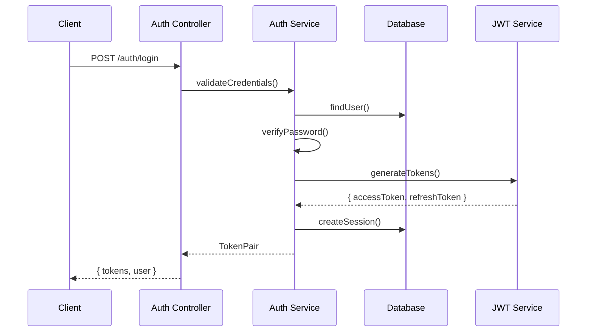

# Bytebot Agent Security Configuration Guide

## Table of Contents
1. [Overview](#overview)
2. [JWT Configuration](#jwt-configuration)
3. [Environment Variables Security](#environment-variables-security)
4. [Authentication & Authorization](#authentication--authorization)
5. [Security Headers](#security-headers)
6. [CORS Configuration](#cors-configuration)
7. [Rate Limiting](#rate-limiting)
8. [Production Deployment](#production-deployment)
9. [Security Monitoring](#security-monitoring)
10. [Incident Response](#incident-response)

## Overview

This guide provides comprehensive instructions for configuring security features in the Bytebot Agent. The agent implements enterprise-grade security controls including JWT authentication, role-based authorization, security headers, CORS policies, and rate limiting.

### Security Architecture

```
┌─────────────────┐    ┌───────────────────┐    ┌─────────────────┐
│   Client App    │───▶│  Security Layer   │───▶│  Business Logic │
└─────────────────┘    └───────────────────┘    └─────────────────┘
                              │
                              ▼
                    ┌──────────────────────┐
                    │ Security Components  │
                    │ • JWT Auth          │
                    │ • RBAC Guards       │
                    │ • Rate Limiting     │
                    │ • Security Headers  │
                    │ • Input Validation  │
                    │ • CORS Policy       │
                    └──────────────────────┘
```

## JWT Configuration

### Generating Secure JWT Secrets

**CRITICAL**: Never use default or weak JWT secrets in production.

#### Method 1: OpenSSL (Recommended)
```bash
# Generate 64-byte (512-bit) JWT secret
openssl rand -hex 64

# Generate 32-byte (256-bit) encryption key  
openssl rand -hex 32
```

#### Method 2: Node.js Crypto
```bash
# Generate JWT secret
node -e "console.log(require('crypto').randomBytes(64).toString('hex'))"

# Generate encryption key
node -e "console.log(require('crypto').randomBytes(32).toString('hex'))"
```

#### Method 3: Python (Alternative)
```bash
python3 -c "import secrets; print(secrets.token_hex(64))"
```

### JWT Security Configuration

#### Development Settings
```env
JWT_SECRET=your-super-secure-jwt-secret-key-change-this-in-production-64-chars-minimum
JWT_EXPIRES_IN=15m
JWT_REFRESH_EXPIRES_IN=7d
ENCRYPTION_KEY=your-32-byte-hex-encoded-encryption-key-change-this-in-production
```

#### Production Settings (More Secure)
```env
JWT_SECRET=REPLACE_WITH_SECURE_256_BIT_HEX_STRING_FROM_SECRET_MANAGER
JWT_EXPIRES_IN=15m
JWT_REFRESH_EXPIRES_IN=24h  # Shorter for production
ENCRYPTION_KEY=REPLACE_WITH_SECURE_256_BIT_ENCRYPTION_KEY_FROM_SECRET_MANAGER
```

### JWT Token Structure

```typescript
// Access Token Payload
interface JwtPayload {
  sub: string;        // User ID
  username: string;   // Username
  email: string;      // User email
  role: UserRole;     // User role (admin, operator, viewer)
  type: 'access';     // Token type
  sessionId: string;  // Session identifier
  iat: number;        // Issued at
  exp: number;        // Expires at
  aud: 'bytebot-api'; // Audience
  iss: 'bytebot-auth-service'; // Issuer
}

// Refresh Token Payload (Minimal)
interface RefreshTokenPayload {
  sub: string;        // User ID
  sessionId: string;  // Session identifier
  type: 'refresh';    // Token type
  iat: number;        // Issued at
  exp: number;        // Expires at
}
```

## Environment Variables Security

### Secret Management Best Practices

1. **Never commit secrets to version control**
2. **Use environment-specific secret managers**
3. **Rotate secrets regularly**
4. **Monitor for secret exposure**

### Development Environment
```bash
# Copy template and customize
cp .env.example .env

# Edit with your development values
nano .env
```

### Production Environment
```bash
# Use Kubernetes Secrets
kubectl create secret generic bytebot-secrets \
  --from-literal=jwt-secret=YOUR_SECURE_JWT_SECRET \
  --from-literal=encryption-key=YOUR_SECURE_ENCRYPTION_KEY \
  --from-literal=database-url=YOUR_PRODUCTION_DB_URL

# Or use external secret managers (recommended)
# - HashiCorp Vault
# - AWS Secrets Manager  
# - Azure Key Vault
# - Google Secret Manager
```

### Environment Variable Validation

The system validates all environment variables on startup:

```typescript
// Validation Schema (simplified)
const configSchema = Joi.object({
  NODE_ENV: Joi.string().valid('development', 'staging', 'production').required(),
  JWT_SECRET: Joi.string().min(32).required(),
  ENCRYPTION_KEY: Joi.string().length(64).hex().required(), // 32 bytes hex
  DATABASE_URL: Joi.string().uri().required(),
  // ... additional validations
});
```

## Authentication & Authorization

### Role-Based Access Control (RBAC)

#### User Roles
1. **ADMIN**: Full system access
2. **OPERATOR**: Task management and system operations
3. **VIEWER**: Read-only access

#### Permissions
```typescript
enum Permission {
  TASK_READ = 'task:read',
  TASK_WRITE = 'task:write', 
  TASK_DELETE = 'task:delete',
  SYSTEM_ADMIN = 'system:admin',
  USER_MANAGE = 'user:manage',
  METRICS_VIEW = 'metrics:view'
}
```

#### Using Guards and Decorators
```typescript
@Controller('tasks')
@UseGuards(JwtAuthGuard, RolesGuard)
export class TasksController {
  
  @Post()
  @RequirePermission(Permission.TASK_WRITE)
  async createTask() {
    // Only users with TASK_WRITE permission can access
  }
  
  @Delete(':id')
  @OperatorOrAdmin()
  async deleteTask() {
    // Only OPERATOR or ADMIN roles can access
  }
}
```

### Authentication Flow



### Session Management

- **Access tokens**: 15 minutes lifetime
- **Refresh tokens**: 7 days (development) / 24 hours (production)
- **Session tracking**: All sessions stored in database
- **Automatic cleanup**: Expired sessions removed daily

## Security Headers

### Helmet.js Integration

The system uses Helmet.js for comprehensive security headers:

```typescript
// Security Headers Configuration
const helmetOptions = {
  contentSecurityPolicy: {
    directives: {
      'default-src': ["'self'"],
      'script-src': ["'self'", "'unsafe-inline'"],
      'style-src': ["'self'", "'unsafe-inline'", 'https://fonts.googleapis.com'],
      'font-src': ["'self'", 'https://fonts.gstatic.com'],
      'img-src': ["'self'", 'data:', 'https:', 'blob:'],
      'frame-ancestors': ["'none'"],
      'upgrade-insecure-requests': []
    }
  },
  hsts: {
    maxAge: 31536000, // 1 year
    includeSubDomains: true,
    preload: true
  },
  frameguard: { action: 'deny' },
  noSniff: true,
  xssFilter: true,
  referrerPolicy: { policy: 'same-origin' }
};
```

### Environment-Specific Headers

#### Development
- **CSP**: Report-only mode
- **HSTS**: Disabled
- **Frame Options**: SAMEORIGIN

#### Production  
- **CSP**: Enforced
- **HSTS**: 1 year with preload
- **Frame Options**: DENY
- **Additional**: X-Powered-By removed

## CORS Configuration

### Development CORS
```typescript
const corsOptions = {
  origin: [
    'http://localhost:3000',
    'http://localhost:3001', 
    'http://localhost:9990'
  ],
  credentials: true,
  methods: ['GET', 'POST', 'PUT', 'DELETE', 'PATCH', 'OPTIONS'],
  allowedHeaders: [
    'Origin', 
    'X-Requested-With', 
    'Content-Type', 
    'Accept', 
    'Authorization',
    'X-API-Key'
  ]
};
```

### Production CORS
```typescript
const corsOptions = {
  origin: [
    'https://app.yourcompany.com',
    'https://admin.yourcompany.com'
  ],
  credentials: true,
  methods: ['GET', 'POST', 'PUT', 'DELETE', 'PATCH'],
  allowedHeaders: [
    'Origin', 
    'Content-Type', 
    'Accept', 
    'Authorization'
  ]
};
```

### CORS Security Events
The system logs CORS violations for security monitoring:

```typescript
// Automatic CORS violation logging
if (!isOriginAllowed(origin)) {
  this.logger.warn('CORS blocked for unauthorized origin', {
    origin,
    ip: req.ip,
    userAgent: req.get('User-Agent')
  });
  
  this.logSecurityEvent(req, 'CORS_VIOLATION', `Unauthorized origin: ${origin}`);
}
```

## Rate Limiting

### Configuration Levels

#### Global Rate Limiting
```typescript
// API-wide rate limiting
API_RATE_LIMIT_WINDOW=900000    // 15 minutes
API_RATE_LIMIT_MAX_REQUESTS=100 // 100 requests per window
```

#### Endpoint-Specific Limiting
```typescript
@UseGuards(RateLimitGuard)
@Throttle({ default: { limit: 10, ttl: 60000 } }) // 10 requests per minute
export class AuthController {
  
  @Post('login')
  @Throttle({ default: { limit: 5, ttl: 60000 } }) // 5 login attempts per minute
  async login() {
    // Login logic
  }
}
```

### Rate Limiting Strategy

1. **Authentication endpoints**: 5 requests/minute
2. **Task creation**: 10 requests/minute  
3. **General API**: 100 requests/15 minutes
4. **Static content**: 1000 requests/minute

### Rate Limit Headers
```http
X-RateLimit-Limit: 100
X-RateLimit-Remaining: 95
X-RateLimit-Reset: 1641234567
Retry-After: 300
```

## Production Deployment

### Security Checklist

#### Pre-Deployment
- [ ] Generate secure JWT secrets (64+ chars)
- [ ] Configure encryption keys (32 bytes hex)
- [ ] Set up external secret management
- [ ] Configure production database with SSL
- [ ] Set restrictive CORS origins
- [ ] Enable all security features
- [ ] Configure monitoring and alerting

#### Environment Configuration
```bash
# Production environment
NODE_ENV=production
ENABLE_AUTHENTICATION=true
ENABLE_RATE_LIMITING=true
ENABLE_CIRCUIT_BREAKER=true
LOG_LEVEL=warn
LOG_FORMAT=json
DEBUG_MODE=false
ENABLE_SWAGGER=false
```

#### Kubernetes Deployment
```yaml
# security-config.yaml
apiVersion: v1
kind: ConfigMap
metadata:
  name: bytebot-config
data:
  NODE_ENV: "production"
  ENABLE_AUTHENTICATION: "true"
  ENABLE_RATE_LIMITING: "true"
  
---
apiVersion: v1
kind: Secret
metadata:
  name: bytebot-secrets
type: Opaque
data:
  jwt-secret: <base64-encoded-jwt-secret>
  encryption-key: <base64-encoded-encryption-key>
  database-url: <base64-encoded-database-url>
```

### SSL/TLS Configuration

#### Nginx Reverse Proxy
```nginx
server {
    listen 443 ssl http2;
    server_name api.yourcompany.com;
    
    # SSL Configuration
    ssl_certificate /path/to/certificate.crt;
    ssl_certificate_key /path/to/private.key;
    ssl_protocols TLSv1.2 TLSv1.3;
    ssl_ciphers ECDHE-ECDSA-AES128-GCM-SHA256:ECDHE-RSA-AES128-GCM-SHA256;
    
    # Security Headers
    add_header X-Content-Type-Options nosniff;
    add_header X-Frame-Options DENY;
    add_header X-XSS-Protection "1; mode=block";
    
    location / {
        proxy_pass http://bytebot-agent:9991;
        proxy_set_header Host $host;
        proxy_set_header X-Real-IP $remote_addr;
        proxy_set_header X-Forwarded-For $proxy_add_x_forwarded_for;
        proxy_set_header X-Forwarded-Proto $scheme;
    }
}
```

## Security Monitoring

### Security Events

The system generates security events for:
- Failed authentication attempts
- Authorization failures
- CORS violations
- Rate limit exceeded
- Suspicious activity patterns
- Configuration changes

### Logging Format

```json
{
  "timestamp": "2025-01-15T10:30:00Z",
  "level": "warn",
  "eventId": "sec-evt-123456",
  "eventType": "AUTHENTICATION_FAILURE", 
  "userId": null,
  "ipAddress": "192.168.1.100",
  "userAgent": "Mozilla/5.0...",
  "endpoint": "/auth/login",
  "method": "POST",
  "success": false,
  "message": "Invalid credentials provided",
  "riskScore": 3,
  "metadata": {
    "operationId": "auth-login-1641234567",
    "attemptCount": 3,
    "source": "web"
  }
}
```

### Prometheus Metrics

Security-related metrics exposed:
- `auth_attempts_total{status="success|failure"}`
- `cors_violations_total{origin}`
- `rate_limit_exceeded_total{endpoint}`
- `active_sessions_total`
- `security_events_total{type}`

## Incident Response

### Security Incident Playbook

#### 1. Detection
- Monitor security event logs
- Set up alerts for:
  - Multiple failed login attempts
  - CORS violations from unknown origins
  - Rate limit violations
  - Unusual access patterns

#### 2. Response Actions
```bash
# Immediate Response
# Revoke all user sessions
kubectl exec -it bytebot-agent-pod -- npm run revoke-all-sessions

# Block suspicious IP
kubectl patch configmap security-config --patch '{"data":{"blocked_ips":"192.168.1.100,10.0.0.5"}}'

# Rotate JWT secrets (emergency)
kubectl create secret generic bytebot-secrets-new \
  --from-literal=jwt-secret=$(openssl rand -hex 64) \
  --dry-run=client -o yaml | kubectl apply -f -
```

#### 3. Investigation
- Review security event logs
- Analyze access patterns
- Check for data exposure
- Identify attack vectors

#### 4. Recovery
- Patch vulnerabilities
- Update security configurations
- Communicate with stakeholders
- Document lessons learned

### Security Contacts

**Security Team**: security@yourcompany.com  
**On-Call Engineer**: +1-555-SECURITY  
**Incident Commander**: incident-command@yourcompany.com

---

## Additional Resources

- [JWT Security Best Practices](https://auth0.com/blog/a-look-at-the-latest-draft-for-jwt-bcp/)
- [OWASP Security Headers](https://owasp.org/www-project-secure-headers/)
- [Node.js Security Checklist](https://nodejs.org/en/docs/guides/security/)
- [NestJS Security Documentation](https://docs.nestjs.com/security/authentication)