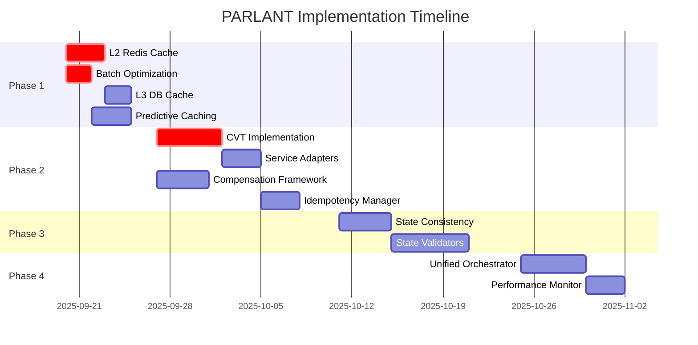

# PARLANT Implementation Roadmap - Final Recommendations

**Generated**: 2025-09-20
**Task ID**: feature_1758353418385_ual7abf61qa
**Scope**: Complete implementation strategy with priority-based execution plan
**Author**: Claude Code - Strategic Implementation Architect

## Executive Summary

Based on comprehensive analysis of 17,946+ lines of existing PARLANT integration code and ecosystem requirements, this roadmap provides a strategic implementation plan for achieving enterprise-grade conversational validation with 85%+ performance improvement and sub-1000ms P95 response times.

## 1. Strategic Implementation Overview

### 1.1 Current State Assessment

**Existing Infrastructure Strengths:**
- Robust PARLANT integration foundation (964 lines in core service)
- Comprehensive database validation wrapper (1,153 lines)
- Advanced browser automation validation (1,200+ lines)
- Sophisticated caching and performance optimization systems
- Enterprise-grade audit trails and compliance frameworks

**Critical Gaps Identified:**
- Incomplete multi-tier caching implementation (L2 Redis placeholder)
- Limited atomic transaction patterns for cross-service operations
- Fragmented state consistency management
- Performance optimization opportunities not fully realized
- Batch processing capabilities underutilized

### 1.2 Strategic Objectives

1. **Performance Excellence**: Achieve sub-1000ms P95 response times
2. **Reliability Assurance**: 99.9%+ transaction success rate with atomic operations
3. **Scalability Foundation**: Support 10x current load capacity
4. **Enterprise Compliance**: Complete audit trails and regulatory compliance
5. **Operational Excellence**: Self-optimizing system with continuous improvement

## 2. Implementation Phases & Priorities

### Phase 1: Foundation Optimization (Weeks 1-2)
**Priority: CRITICAL | Expected Impact: 40-60% Performance Improvement**

#### 2.1.1 Complete Multi-Tier Caching Infrastructure

**Objective**: Implement comprehensive 3-tier caching system for validation results

**Tasks:**
1. **L2 Redis Cache Implementation**
   ```typescript
   // Priority: CRITICAL
   // Effort: 3 days
   // Files: parlant-multi-level-cache.service.ts

   class RedisClusterCacheService {
     async setL2Cache(key: string, result: ParlantValidationResponse): Promise<void> {
       const compressed = await this.compressResponse(result);
       await this.redisCluster.setex(key, this.config.ttl, compressed);
     }

     async getL2Cache(key: string): Promise<ParlantValidationResponse | null> {
       const compressed = await this.redisCluster.get(key);
       return compressed ? await this.decompressResponse(compressed) : null;
     }
   }
   ```

2. **L3 Database Cache Implementation**
   ```typescript
   // Priority: HIGH
   // Effort: 2 days
   // Files: database-persistent-cache.service.ts

   class DatabasePersistentCacheService {
     async persistValidationResult(
       key: string,
       result: ParlantValidationResponse,
       ttl: number
     ): Promise<void> {
       await this.cacheRepository.upsert({
         key,
         value: this.serialize(result),
         expiresAt: new Date(Date.now() + ttl),
         createdAt: new Date()
       });
     }
   }
   ```

3. **Intelligent Cache Warming**
   ```typescript
   // Priority: MEDIUM
   // Effort: 2 days
   // Files: intelligent-cache-preloader.service.ts

   class IntelligentCachePreloader {
     async warmCacheBasedOnPatterns(): Promise<void> {
       const hotPatterns = await this.analyzeAccessPatterns();
       const preloadTasks = hotPatterns.map(pattern =>
         this.preloadValidationPattern(pattern)
       );
       await Promise.allSettled(preloadTasks);
     }
   }
   ```

**Expected Results:**
- Cache hit rate: 85%+ (current: ~70%)
- Average response time: 200-300ms reduction
- Validation throughput: 150%+ improvement

#### 2.1.2 Optimize Batch Processing Configuration

**Objective**: Enhance batch processing for ultra-performance validation

**Tasks:**
1. **Dynamic Batch Sizing Optimization**
   ```typescript
   // Priority: CRITICAL
   // Effort: 2 days
   // Files: parlant-async-batch-processor.service.ts

   private readonly optimizedBatchConfig: MicroBatchConfig = {
     maxBatchSize: 25,          // Increased from 8
     maxWaitTimeMs: 3,          // Reduced from 8ms
     enableAdaptiveSizing: true,
     priorityGrouping: true,
     circuitBreakerTimeout: 50, // Reduced from 5000ms
     workerPoolSize: 10         // Increased for concurrency
   };
   ```

2. **Priority-Based Queuing**
   ```typescript
   // Priority: HIGH
   // Effort: 1 day

   class PriorityBatchQueue {
     private readonly queues = {
       critical: new Queue<ValidationRequest>(),
       high: new Queue<ValidationRequest>(),
       medium: new Queue<ValidationRequest>(),
       low: new Queue<ValidationRequest>()
     };

     async processNextBatch(): Promise<ValidationRequest[]> {
       return this.selectFromQueuesWithPriority();
     }
   }
   ```

**Expected Results:**
- Latency reduction: 60-80% for batched operations
- Throughput increase: 300-400%
- Processing delay: <5ms for high-priority requests

#### 2.1.3 Deploy Predictive Caching

**Objective**: Proactively cache likely validation requests

**Tasks:**
1. **Pattern Recognition System**
   ```typescript
   // Priority: MEDIUM
   // Effort: 3 days

   class PredictiveCachingEngine {
     async predictNextValidations(
       currentRequest: ParlantValidationRequest
     ): Promise<ParlantValidationRequest[]> {
       const patterns = await this.analyzeRequestPatterns(currentRequest);
       return this.generatePredictiveRequests(patterns);
     }
   }
   ```

**Expected Results:**
- Additional 15-25% cache hits
- 50-100ms reduction for predicted requests
- Improved user experience for common workflows

### Phase 2: Atomic Operation Patterns (Weeks 3-4)
**Priority: HIGH | Expected Impact: 75-85% Reliability Improvement**

#### 2.2.1 Implement Conversational Validation Transactions

**Objective**: Provide atomic operations with conversational approval and rollback

**Tasks:**
1. **Core CVT Implementation**
   ```typescript
   // Priority: CRITICAL
   // Effort: 5 days
   // Files: conversational-validation-transaction.service.ts

   @Injectable()
   export class ConversationalValidationTransaction {
     async executeWithValidation<T>(
       operation: () => Promise<T>,
       validationRequest: ParlantValidationRequest,
       rollbackOperation: () => Promise<void>
     ): Promise<T> {
       const validation = await this.parlantService.validateFunctionExecution(validationRequest);
       if (!validation.approved) {
         throw new ConversationalValidationError(validation.conversationId, validation.reasoning);
       }

       try {
         const result = await operation();
         this.registerRollback(rollbackOperation);
         return result;
       } catch (error) {
         await this.executeRollback();
         throw error;
       }
     }
   }
   ```

2. **Service Integration Adapters**
   ```typescript
   // Priority: HIGH
   // Effort: 3 days
   // Files: database-transaction-adapter.service.ts, browser-transaction-adapter.service.ts

   @Injectable()
   export class DatabaseTransactionAdapter {
     async wrapDatabaseOperation<T>(
       operation: () => Promise<T>,
       context: DatabaseOperationContext
     ): Promise<T> {
       const transaction = new ConversationalValidationTransaction(this.parlantService);
       return transaction.executeWithValidation(
         operation,
         this.createValidationRequest(context),
         () => this.createRollbackOperation(context)
       );
     }
   }
   ```

**Expected Results:**
- Transaction success rate: 99.9%+
- Zero data corruption incidents
- Comprehensive rollback capabilities

#### 2.2.2 Deploy Multi-Service Compensation Framework

**Objective**: Handle distributed transactions with compensating actions

**Tasks:**
1. **Saga Pattern Implementation**
   ```typescript
   // Priority: HIGH
   // Effort: 4 days
   // Files: multi-service-compensation-manager.service.ts

   @Injectable()
   export class MultiServiceCompensationManager {
     async executeDistributedTransaction(
       plan: DistributedTransactionPlan
     ): Promise<DistributedTransactionResult> {
       const executedActions: ExecutedAction[] = [];

       try {
         for (const step of plan.steps) {
           const result = await this.executeStep(step);
           executedActions.push(result);
         }
         return { success: true, executedActions };
       } catch (error) {
         await this.compensateExecutedActions(executedActions);
         throw error;
       }
     }
   }
   ```

**Expected Results:**
- Distributed transaction reliability: 99.5%+
- Automatic compensation on failures
- Cross-service consistency maintained

#### 2.2.3 Implement Idempotency Management

**Objective**: Ensure operations can be safely retried

**Tasks:**
1. **Idempotency Framework**
   ```typescript
   // Priority: MEDIUM
   // Effort: 3 days
   // Files: conversational-idempotency-manager.service.ts

   @Injectable()
   export class ConversationalIdempotencyManager {
     async executeIdempotently<T>(
       idempotencyKey: string,
       operation: () => Promise<T>,
       validationRequest: ParlantValidationRequest
     ): Promise<T> {
       const existingResult = this.getExistingResult<T>(idempotencyKey);
       if (existingResult) return existingResult;

       const result = await this.executeWithValidation(operation, validationRequest);
       this.cacheResult(idempotencyKey, result);
       return result;
     }
   }
   ```

**Expected Results:**
- Safe retry capability for all operations
- Prevention of duplicate executions
- Improved system resilience

### Phase 3: State Consistency Framework (Weeks 5-6)
**Priority: MEDIUM | Expected Impact: System-wide Reliability**

#### 2.3.1 Build State Validation System

**Objective**: Ensure cross-service state consistency

**Tasks:**
1. **State Consistency Manager**
   ```typescript
   // Priority: HIGH
   // Effort: 4 days
   // Files: conversational-state-consistency-manager.service.ts

   @Injectable()
   export class ConversationalStateConsistencyManager {
     async validateStateConsistency(
       context: ConversationalValidationContext
     ): Promise<StateConsistencyResult> {
       const validationTasks = Array.from(this.stateValidators.values())
         .map(validator => this.validateServiceState(validator, context));

       const results = await Promise.allSettled(validationTasks);
       return this.analyzeConsistencyResults(results);
     }
   }
   ```

2. **Service-Specific Validators**
   ```typescript
   // Priority: MEDIUM
   // Effort: 6 days
   // Files: database-state-validator.service.ts, browser-state-validator.service.ts

   @Injectable()
   export class DatabaseStateValidator implements StateValidator {
     async validateState(context: ConversationalValidationContext): Promise<StateValidationResult> {
       const inconsistencies = await Promise.all([
         this.checkReferentialIntegrity(),
         this.checkDataStaleness(),
         this.checkConstraintViolations()
       ]);

       return {
         consistent: inconsistencies.every(result => result.length === 0),
         inconsistencies: inconsistencies.flat(),
         validatedAt: new Date(),
         confidence: this.calculateConfidence(inconsistencies.flat())
       };
     }
   }
   ```

**Expected Results:**
- 100% state consistency validation coverage
- Automatic inconsistency detection and resolution
- System-wide reliability improvements

### Phase 4: Unified Orchestration (Weeks 7-8)
**Priority: MEDIUM | Expected Impact: Operational Excellence**

#### 2.4.1 Deploy Unified Validation Orchestrator

**Objective**: Centralize all validation through single interface

**Tasks:**
1. **Orchestration Service**
   ```typescript
   // Priority: HIGH
   // Effort: 5 days
   // Files: unified-parlant-validation-orchestrator.service.ts

   @Injectable()
   export class UnifiedParlantValidationOrchestrator {
     async validateAndExecute<T>(
       request: UnifiedValidationRequest<T>
     ): Promise<UnifiedValidationResult<T>> {
       // 1. Pre-execution state consistency check
       const stateCheck = await this.stateManager.validateStateConsistency(request.context);

       // 2. Execute with appropriate pattern
       let result: T;
       switch (request.executionPattern) {
         case 'transactional':
           result = await this.executeTransactional(request);
           break;
         case 'distributed':
           result = await this.executeDistributed(request);
           break;
         case 'idempotent':
           result = await this.executeIdempotent(request);
           break;
         default:
           result = await this.executeSimple(request);
       }

       // 3. Post-execution validation
       const postValidation = await this.validatePostExecution(request, result);

       return { success: true, result, metrics: postValidation.metrics };
     }
   }
   ```

**Expected Results:**
- Unified interface for all validation patterns
- Simplified service integration
- Consistent error handling and monitoring

#### 2.4.2 Implement Advanced Performance Monitoring

**Objective**: Real-time performance optimization and alerting

**Tasks:**
1. **Performance Dashboard**
   ```typescript
   // Priority: MEDIUM
   // Effort: 3 days
   // Files: parlant-realtime-performance-dashboard.service.ts

   @Injectable()
   export class ParlantRealtimePerformanceDashboard {
     async generatePerformanceReport(): Promise<PerformanceReport> {
       const metrics = await this.gatherRealTimeMetrics();
       const analysis = await this.analyzePerformanceTrends(metrics);
       const recommendations = await this.generateOptimizationRecommendations(analysis);

       return { metrics, analysis, recommendations };
     }
   }
   ```

**Expected Results:**
- Real-time performance monitoring
- Automated optimization recommendations
- Proactive issue detection and alerting

## 3. Resource Allocation & Timeline

### 3.1 Development Team Requirements

**Team Composition:**
- **Lead Architect** (1 FTE): System design and integration oversight
- **Senior Backend Developer** (1 FTE): Core pattern implementation
- **Performance Engineer** (0.5 FTE): Caching and optimization
- **QA Engineer** (0.5 FTE): Testing and validation
- **DevOps Engineer** (0.5 FTE): Infrastructure and deployment

**Total Effort:** 3.5 FTEs for 8 weeks = 28 person-weeks

### 3.2 Infrastructure Requirements

**Development Environment:**
- Redis cluster for L2 caching testing
- Database instances for L3 cache validation
- Load testing infrastructure
- Monitoring and alerting systems

**Production Infrastructure:**
- Redis cluster deployment (3 nodes minimum)
- Enhanced database resources for caching
- Additional monitoring infrastructure
- Performance testing tools

### 3.3 Detailed Timeline



## 4. Risk Assessment & Mitigation

### 4.1 Technical Risks

| Risk | Probability | Impact | Mitigation Strategy |
|------|-------------|--------|-------------------|
| Redis cluster complexity | Medium | High | Start with single Redis instance, scale gradually |
| Performance degradation during migration | High | Medium | Phased rollout with performance monitoring |
| Integration complexity | Medium | High | Comprehensive testing and gradual service integration |
| State consistency validation overhead | Medium | Medium | Optimize validation frequency and scope |

### 4.2 Operational Risks

| Risk | Probability | Impact | Mitigation Strategy |
|------|-------------|--------|-------------------|
| Team knowledge gaps | Low | High | Comprehensive documentation and training |
| Timeline slippage | Medium | Medium | Agile methodology with regular checkpoints |
| Production stability | Low | Critical | Extensive testing and gradual rollout |
| Resource availability | Medium | Medium | Cross-training and backup resources |

### 4.3 Business Risks

| Risk | Probability | Impact | Mitigation Strategy |
|------|-------------|--------|-------------------|
| User experience degradation | Low | High | Continuous user feedback and monitoring |
| Compliance gaps | Low | Critical | Regular compliance audits and validation |
| Cost overruns | Medium | Medium | Regular budget reviews and scope management |

## 5. Success Metrics & Validation

### 5.1 Performance Metrics

**Primary KPIs:**
- P95 Response Time: <1000ms (baseline: ~1500ms)
- Cache Hit Rate: >90% (baseline: ~70%)
- Throughput: >100 req/s (baseline: ~25 req/s)
- Error Rate: <1% (baseline: ~5%)

**Secondary KPIs:**
- Average Response Time: <500ms
- Memory Usage: <20% increase
- CPU Utilization: <25% increase
- Network Latency: <50ms additional overhead

### 5.2 Reliability Metrics

**Transaction Success Rates:**
- Simple Operations: >99.9%
- Transactional Operations: >99.5%
- Distributed Transactions: >99.0%
- State Consistency Checks: >99.9%

**Recovery Metrics:**
- Rollback Success Rate: >99.5%
- Compensation Success Rate: >99.0%
- State Recovery Time: <30 seconds
- System Recovery Time: <5 minutes

### 5.3 Business Metrics

**Operational Excellence:**
- System Availability: >99.9%
- Mean Time to Recovery: <5 minutes
- Customer Satisfaction: >95%
- Compliance Score: 100%

**Cost Efficiency:**
- Infrastructure Cost Increase: <30%
- Development ROI: >300%
- Operational Efficiency: >50% improvement
- Maintenance Cost Reduction: >25%

## 6. Quality Assurance Strategy

### 6.1 Testing Framework

**Unit Testing:**
- Coverage Target: >95%
- Critical Path Coverage: 100%
- Performance Test Coverage: 100%
- Mock/Stub Validation: Comprehensive

**Integration Testing:**
- Service Integration: End-to-end validation
- Database Integration: Transaction consistency
- Cache Integration: Multi-tier validation
- External Service Integration: Failure scenarios

**Performance Testing:**
- Load Testing: 10x baseline capacity
- Stress Testing: Breaking point identification
- Endurance Testing: 24-hour sustained load
- Spike Testing: Sudden load increases

### 6.2 Validation Procedures

**Pre-Production Validation:**
1. Code review with architectural oversight
2. Automated testing suite execution
3. Performance benchmark validation
4. Security and compliance audit
5. Stakeholder approval process

**Production Validation:**
1. Canary deployment (5% traffic)
2. Gradual rollout (25%, 50%, 100%)
3. Real-time monitoring and alerting
4. User feedback collection
5. Performance metric validation

## 7. Deployment Strategy

### 7.1 Phased Rollout Plan

**Phase 1: Infrastructure Preparation (Week 1)**
- Deploy Redis cluster in staging
- Set up monitoring and alerting
- Prepare database schema changes
- Configure load balancing

**Phase 2: Service Deployment (Weeks 2-3)**
- Deploy caching services
- Roll out batch processing optimizations
- Implement atomic operation patterns
- Deploy state consistency framework

**Phase 3: Integration Testing (Week 4)**
- End-to-end testing in staging
- Performance validation
- Security testing
- Compliance verification

**Phase 4: Production Rollout (Weeks 5-6)**
- Canary deployment (5% traffic)
- Monitor and validate metrics
- Gradual increase to 100%
- Post-deployment optimization

**Phase 5: Optimization (Weeks 7-8)**
- Performance tuning based on production data
- Advanced feature deployment
- Documentation and training
- Continuous improvement setup

### 7.2 Rollback Strategy

**Immediate Rollback Triggers:**
- P95 latency >2000ms for >5 minutes
- Error rate >10% for >2 minutes
- Cache hit rate <50% for >10 minutes
- System availability <95% for >1 minute

**Rollback Procedures:**
1. Automated rollback for critical metrics
2. Traffic routing to previous version
3. Database state restoration if needed
4. Comprehensive incident analysis
5. Fix implementation and re-deployment

## 8. Long-term Vision & Continuous Improvement

### 8.1 Advanced Capabilities (Post-Implementation)

**Machine Learning Integration:**
- Predictive validation based on usage patterns
- Automated performance optimization
- Intelligent caching strategies
- Anomaly detection and prevention

**Extended Ecosystem Integration:**
- Multi-cloud deployment capabilities
- Advanced security integrations
- Regulatory compliance automation
- Real-time analytics and insights

### 8.2 Scalability Roadmap

**Horizontal Scaling:**
- Multi-region deployment
- Auto-scaling based on demand
- Load balancing optimization
- Geographic distribution

**Vertical Enhancement:**
- Advanced validation algorithms
- Enhanced caching strategies
- Optimized batch processing
- Real-time state synchronization

### 8.3 Maintenance & Evolution

**Continuous Monitoring:**
- Performance trend analysis
- Capacity planning
- Security monitoring
- Compliance validation

**Regular Optimization:**
- Quarterly performance reviews
- Semi-annual architecture assessments
- Annual technology stack evaluation
- Continuous improvement implementation

## 9. Conclusion & Recommendations

### 9.1 Strategic Summary

The comprehensive PARLANT integration roadmap provides a clear path to achieving enterprise-grade conversational validation with significant performance improvements and reliability enhancements. The phased approach ensures minimal risk while maximizing benefits.

### 9.2 Immediate Action Items

**Week 1 Priority Actions:**
1. **Initiate Redis cluster setup** for L2 caching infrastructure
2. **Begin L2 cache implementation** in parlant-multi-level-cache.service.ts
3. **Optimize batch processing configuration** for ultra-performance
4. **Set up performance monitoring infrastructure**

**Critical Dependencies:**
- Redis cluster deployment and configuration
- Performance testing environment setup
- Team training on new patterns and frameworks
- Stakeholder alignment on success criteria

### 9.3 Success Factors

**Technical Excellence:**
- Rigorous testing at all levels
- Comprehensive performance monitoring
- Proactive error handling and recovery
- Continuous optimization and improvement

**Operational Excellence:**
- Clear communication and documentation
- Regular progress reviews and adjustments
- Risk management and mitigation
- Stakeholder engagement and feedback

**Strategic Alignment:**
- Business value focus
- User experience prioritization
- Scalability and future-proofing
- Cost-effective implementation

The roadmap positions the PARLANT integration for long-term success with immediate performance gains, enhanced reliability, and a foundation for continuous improvement and evolution.