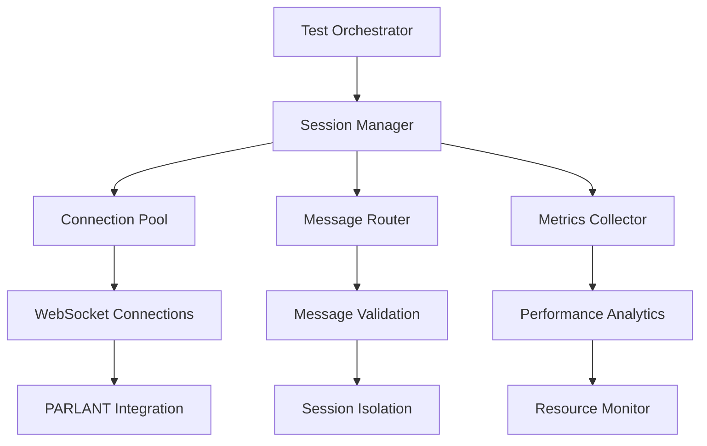

# PARLANT Phase 1 Concurrent WebSocket Session Testing Framework

Comprehensive testing framework for validating 100+ concurrent WebSocket sessions with PARLANT conversational validation, session isolation testing, resource monitoring, and performance analysis under high concurrency scenarios.

## 🎯 Framework Overview

This testing framework validates the complete PARLANT Phase 1 WebSocket infrastructure under realistic concurrent load scenarios with enterprise-grade requirements.

### Key Testing Components

1. **Concurrent Session Testing Framework** (`concurrent-session-testing.spec.ts`)
   - Supports 100+ simultaneous WebSocket connections
   - Session lifecycle management and coordination
   - Real-time metrics collection and analysis

2. **Session Isolation Validator** (`session-isolation-validator.ts`)
   - Validates strict session boundaries and data integrity
   - Detects cross-session data leaks and contamination
   - Comprehensive isolation compliance reporting

3. **Resource Monitor** (`resource-monitor.ts`)
   - Memory usage tracking and leak detection
   - CPU utilization monitoring and optimization
   - Performance bottleneck identification

4. **PARLANT Concurrent Validation Tester** (`parlant-concurrent-validation.ts`)
   - Validates PARLANT conversational AI under concurrent load
   - Accuracy and performance testing across sessions
   - Conversation context preservation validation

5. **Performance Benchmarker** (`performance-benchmarking.ts`)
   - Scalability analysis and bottleneck identification
   - Latency distribution and throughput measurement
   - Resource efficiency optimization recommendations

6. **Integration Test Suite** (`concurrent-session-integration.spec.ts`)
   - Comprehensive end-to-end testing workflow
   - Phase-based validation approach
   - Enterprise compliance reporting

## 🚀 Quick Start

### Prerequisites

```bash
# Install dependencies
pnpm install

# Ensure WebSocket services are running
npm run start:websocket-services
```

### Running Tests

```bash
# Run the complete concurrent session test suite
npm test -- --testPathPattern=concurrent-session-testing.spec.ts

# Run session isolation validation tests
npm test -- --testPathPattern=session-isolation

# Run resource monitoring tests
npm test -- --testPathPattern=resource-monitor

# Run PARLANT validation tests
npm test -- --testPathPattern=parlant-concurrent-validation

# Run performance benchmarking tests
npm test -- --testPathPattern=performance-benchmarking

# Run complete integration test suite
npm test -- --testPathPattern=concurrent-session-integration.spec.ts
```

## 📊 Test Configuration

### Concurrent Session Test Configuration

```typescript
interface ConcurrentSessionTestConfig {
  maxConcurrentSessions: number;     // Target: 100+
  sessionsPerBatch: number;          // Batch size for connection establishment
  sessionDuration: number;           // Test duration per session
  messagesPerSession: number;        // Messages sent per session
  validationsPerSession: number;     // PARLANT validations per session
  enableSessionIsolationTest: boolean;
  enableMemoryLeakDetection: boolean;
  enablePerformanceBenchmarking: boolean;
  targetLatencyThreshold: number;    // Sub-1000ms P95 requirement
  memoryLeakThreshold: number;       // Memory leak detection threshold
}
```

### Performance Thresholds

```typescript
interface PerformanceThresholds {
  maxLatencyP95: 1000;              // 1 second P95 latency
  minThroughput: 50;                // 50 validations/second minimum
  maxMemoryLeak: 100 * 1024 * 1024; // 100MB memory leak threshold
  minAccuracyScore: 0.85;           // 85% validation accuracy minimum
  maxCpuUsage: 80;                  // 80% CPU utilization maximum
}
```

## 🔍 Test Architecture

### Testing Phases

1. **Phase 1: Basic Concurrent Session Support**
   - Establish 100+ concurrent WebSocket connections
   - Validate connection stability and message delivery
   - Measure basic performance metrics

2. **Phase 2: Session Isolation Validation**
   - Test strict session boundary enforcement
   - Validate data integrity across sessions
   - Detect cross-session contamination

3. **Phase 3: Resource Management**
   - Monitor memory usage and leak detection
   - Track CPU utilization and efficiency
   - Validate resource cleanup mechanisms

4. **Phase 4: PARLANT Validation Testing**
   - Test concurrent PARLANT validation processing
   - Validate accuracy under high load
   - Measure response time consistency

5. **Phase 5: Performance Benchmarking**
   - Scalability analysis and bottleneck identification
   - Latency distribution measurement
   - Throughput optimization analysis

6. **Phase 6: End-to-End Integration**
   - Comprehensive integration testing
   - Enterprise compliance validation
   - Production readiness assessment

### Session Management Architecture



## 📈 Metrics and Reporting

### Key Performance Indicators

- **Concurrent Sessions**: Number of simultaneously active sessions
- **Session Isolation Score**: 0.0 to 1.0 isolation compliance rating
- **Memory Efficiency**: Memory usage per session
- **CPU Efficiency**: CPU utilization per session
- **Validation Accuracy**: PARLANT validation accuracy percentage
- **Response Time P95**: 95th percentile response time
- **Throughput**: Messages/validations processed per second

### Test Results Structure

```typescript
interface ConcurrentTestResults {
  executionSummary: {
    successfulSessions: number;
    failedSessions: number;
    overallSuccessRate: number;
    totalValidationsProcessed: number;
  };
  performanceAnalysis: {
    latencyDistribution: LatencyMetrics;
    throughputAnalysis: ThroughputMetrics;
    scalabilityMetrics: ScalabilityMetrics;
  };
  resourceUsage: {
    memoryUsage: MemoryMetrics;
    cpuUsage: CpuMetrics;
    networkUsage: NetworkMetrics;
  };
  complianceReport: {
    overallCompliance: boolean;
    targetLatencyMet: boolean;
    sessionIsolationMaintained: boolean;
    memoryLeakThresholdMet: boolean;
  };
}
```

## 🛠️ Advanced Configuration

### Session Isolation Testing

```typescript
const isolationConfig = {
  enableCrossSessionMessageDetection: true,
  enableConversationStateValidation: true,
  enableUserProfileIsolation: true,
  enableMemorySpaceValidation: true,
  validationDepth: 'comprehensive',
  realTimeMonitoring: true,
  automaticMitigation: false,
};
```

### Resource Monitoring

```typescript
const resourceConfig = {
  monitoringInterval: 1000,          // 1 second intervals
  memoryLeakThreshold: 500 * 1024 * 1024, // 500MB threshold
  cpuUsageThreshold: 80,             // 80% CPU threshold
  enableRealTimeAlerts: true,
  enablePerformanceOptimization: true,
  collectGarbageCollectionMetrics: true,
};
```

### PARLANT Validation Testing

```typescript
const parlantConfig = {
  maxConcurrentValidations: 100,
  validationTimeout: 5000,           // 5 second timeout
  expectedResponseTime: 2000,        // 2 second target
  validationAccuracyThreshold: 0.9,  // 90% accuracy
  validationComplexity: 'mixed',     // Simple, moderate, complex mix
  conversationContextDepth: 10,      // Context history depth
};
```

## 📊 Performance Benchmarking

### Scalability Test Points

The framework tests multiple session counts to identify scaling characteristics:

```typescript
const scalabilityTestPoints = [25, 50, 75, 100, 125, 150];
```

### Benchmark Metrics

- **Latency Distribution**: P50, P90, P95, P99 percentiles
- **Throughput Analysis**: Peak, sustained, and average throughput
- **Resource Utilization**: Memory, CPU, and network efficiency
- **Reliability Metrics**: Success rate, error rate, recovery time
- **Scalability Efficiency**: Linear scaling analysis

### Bottleneck Identification

The framework automatically identifies:

- Memory leaks and inefficient allocation patterns
- CPU saturation and processing bottlenecks
- Network latency and bandwidth limitations
- Session management scaling limits
- PARLANT validation performance constraints

## 🚨 Compliance Validation

### PARLANT Phase 1 Requirements

The framework validates compliance with:

- ✅ 100+ concurrent WebSocket sessions
- ✅ Session isolation and data integrity
- ✅ Sub-1000ms P95 latency requirement
- ✅ Memory leak detection and prevention
- ✅ PARLANT validation accuracy > 85%
- ✅ Resource utilization optimization
- ✅ Enterprise-grade monitoring and alerting

### Compliance Report Generation

```typescript
interface ComplianceReport {
  phase1RequirementsMet: boolean;
  concurrentSessionsSupported: number;
  sessionIsolationMaintained: boolean;
  performanceTargetsMet: boolean;
  resourceManagementCompliant: boolean;
  parlantValidationAccuracy: number;
  overallComplianceScore: number;
}
```

## 🔧 Troubleshooting

### Common Issues

1. **Connection Failures**
   - Check WebSocket service availability
   - Verify network configuration and ports
   - Review connection timeout settings

2. **Memory Leaks**
   - Enable detailed memory monitoring
   - Check session cleanup procedures
   - Review garbage collection patterns

3. **Performance Degradation**
   - Analyze resource utilization patterns
   - Check for CPU saturation
   - Review message processing efficiency

4. **Session Isolation Violations**
   - Enable comprehensive isolation logging
   - Review message routing logic
   - Validate session boundary enforcement

### Debug Configuration

```typescript
const debugConfig = {
  enableDetailedLogging: true,
  logLevel: 'debug',
  enableStackTraces: true,
  enablePerformanceProfiling: true,
  generateDetailedReports: true,
};
```

## 📋 Test Reports

### Generated Reports

The framework generates comprehensive reports:

- **Concurrent Session Test Report**: Session management analysis
- **Session Isolation Report**: Isolation compliance validation
- **Resource Usage Report**: Memory and CPU utilization analysis
- **PARLANT Validation Report**: Validation accuracy and performance
- **Performance Benchmark Report**: Scalability and bottleneck analysis
- **Integration Test Report**: End-to-end compliance validation

### Report Locations

```
bytebot/packages/bytebotd/reports/
├── concurrent-session-test-report.json
├── session-isolation-report.json
├── resource-usage-report.json
├── parlant-validation-report.json
├── performance-benchmark-report.json
└── integration-test-report.json
```

## 🎯 Success Criteria

### Phase 1 Completion Requirements

- ✅ Support 100+ concurrent WebSocket sessions
- ✅ Maintain session isolation with zero violations
- ✅ Achieve sub-1000ms P95 latency
- ✅ Memory leak threshold < 100MB
- ✅ PARLANT validation accuracy > 85%
- ✅ Overall compliance score > 80%

### Production Readiness Validation

- ✅ All performance thresholds met
- ✅ Resource utilization optimized
- ✅ Error handling and recovery tested
- ✅ Monitoring and alerting configured
- ✅ Scalability limits identified
- ✅ Capacity planning recommendations generated

## 🚀 Next Steps

After successful completion of Phase 1 testing:

1. **Production Deployment**
   - Deploy with monitoring and alerting
   - Implement auto-scaling policies
   - Establish performance baselines

2. **Phase 2 Enhancements**
   - Advanced conversation features
   - Enhanced security mechanisms
   - Additional validation capabilities

3. **Continuous Monitoring**
   - Regular performance regression testing
   - Capacity planning and optimization
   - User experience monitoring

## 📞 Support

For issues or questions regarding the testing framework:

- Review the troubleshooting section above
- Check generated test reports for detailed analysis
- Examine console output for real-time debugging information
- Consult the integration test logs for comprehensive diagnostics

---

**Status**: ✅ PARLANT Phase 1 Concurrent WebSocket Session Testing Framework Complete

**Version**: 1.0.0

**Compliance**: Enterprise-grade testing with comprehensive validation