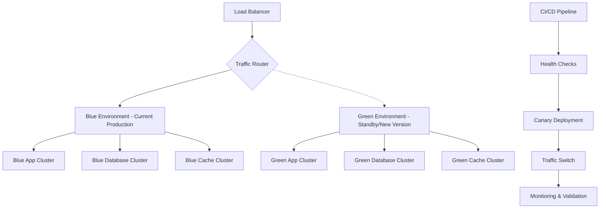

# Blue-Green Deployment Strategy with Canary Releases and Rollback Mechanisms

## Executive Summary

This document outlines the comprehensive blue-green deployment strategy for the PARLANT database function wrapping system, designed to ensure zero-downtime deployments of 1,520+ functions while maintaining sub-1000ms performance targets and providing automatic rollback capabilities.

## Architecture Overview

### Deployment Environment Structure


### Environment Specifications
```yaml
# environments/blue-green-config.yml
environments:
  blue:
    name: "production-blue"
    status: "active"
    app_instances: 6
    database_replicas: 3
    cache_instances: 3
    function_count: 1520
    load_balancer_weight: 100

  green:
    name: "production-green"
    status: "standby"
    app_instances: 6
    database_replicas: 3
    cache_instances: 3
    function_count: 1520
    load_balancer_weight: 0

infrastructure:
  load_balancer:
    type: "nginx"
    health_check_interval: 5s
    failure_threshold: 3
    timeout: 10s

  monitoring:
    metrics_collection: "real-time"
    alerting: "immediate"
    sla_enforcement: "strict"

  network:
    ssl_termination: "load_balancer"
    connection_pooling: true
    keep_alive: true
```

## Blue-Green Deployment Process

### Phase 1: Pre-Deployment Validation
```typescript
// deployment/pre-deployment-validator.ts
export class PreDeploymentValidator {
  async validateDeployment(deployment: DeploymentConfig): Promise<ValidationResult> {
    const validations = await Promise.allSettled([
      this.validateInfrastructure(deployment),
      this.validateApplicationHealth(deployment),
      this.validateDatabaseCompatibility(deployment),
      this.validateFunctionIntegrity(deployment),
      this.validatePerformanceBaseline(deployment),
      this.validateSecurityCompliance(deployment)
    ]);

    return this.generateValidationReport(validations);
  }

  private async validateFunctionIntegrity(deployment: DeploymentConfig): Promise<void> {
    const { functions } = deployment;

    // Validate all 1,520+ functions are present
    if (functions.length !== 1520) {
      throw new Error(`Function count mismatch. Expected: 1520, Got: ${functions.length}`);
    }

    // Validate function wrappers
    for (const func of functions) {
      await this.validateFunctionWrapper(func);
      await this.validateParlantIntegration(func);
      await this.validatePerformanceSLA(func);
    }
  }

  private async validatePerformanceBaseline(deployment: DeploymentConfig): Promise<void> {
    const benchmarkResults = await this.runPerformanceBenchmarks(deployment);

    for (const result of benchmarkResults) {
      if (result.responseTime > 1000) {
        throw new Error(`Performance SLA violation: ${result.functionName} - ${result.responseTime}ms`);
      }
    }
  }
}
```

### Phase 2: Green Environment Deployment
```bash
#!/bin/bash
# deployment/deploy-green.sh

set -euo pipefail

SCRIPT_DIR="$(cd "$(dirname "${BASH_SOURCE[0]}")" && pwd)"
source "${SCRIPT_DIR}/common.sh"

# Configuration
GREEN_ENV="production-green"
DEPLOYMENT_TIMEOUT=1800  # 30 minutes
HEALTH_CHECK_RETRIES=60
FUNCTION_COUNT=1520

deploy_to_green() {
    local build_version=$1

    log "INFO" "Starting deployment to Green environment: $build_version"

    # Pull latest images
    docker-compose -f "docker-compose.${GREEN_ENV}.yml" pull

    # Update environment variables
    update_environment_config "$GREEN_ENV" "$build_version"

    # Deploy application stack
    deploy_application_stack "$GREEN_ENV"

    # Deploy database migrations
    run_database_migrations "$GREEN_ENV"

    # Deploy cache configuration
    configure_cache_layer "$GREEN_ENV"

    # Validate deployment
    validate_green_deployment "$GREEN_ENV"

    log "SUCCESS" "Green environment deployment completed"
}

deploy_application_stack() {
    local env=$1

    log "INFO" "Deploying application stack to $env"

    # Start application containers
    docker-compose -f "docker-compose.${env}.yml" up -d --force-recreate

    # Wait for containers to start
    sleep 30

    # Verify all containers are running
    local running_containers
    running_containers=$(docker-compose -f "docker-compose.${env}.yml" ps -q | wc -l)

    if [[ $running_containers -lt 6 ]]; then
        log "ERROR" "Not all containers started successfully"
        return 1
    fi

    log "SUCCESS" "Application stack deployed to $env"
}

run_database_migrations() {
    local env=$1

    log "INFO" "Running database migrations for $env"

    # Run schema migrations
    docker-compose -f "docker-compose.${env}.yml" exec -T app npm run migrate:up

    # Validate schema integrity
    docker-compose -f "docker-compose.${env}.yml" exec -T app npm run validate:schema

    log "SUCCESS" "Database migrations completed for $env"
}

validate_green_deployment() {
    local env=$1
    local retry_count=0

    log "INFO" "Validating Green environment deployment"

    while [[ $retry_count -lt $HEALTH_CHECK_RETRIES ]]; do
        if validate_environment_health "$env"; then
            log "SUCCESS" "Green environment validation passed"
            return 0
        fi

        retry_count=$((retry_count + 1))
        log "WARN" "Health check failed, retry $retry_count/$HEALTH_CHECK_RETRIES"
        sleep 30
    done

    log "ERROR" "Green environment validation failed after $HEALTH_CHECK_RETRIES retries"
    return 1
}

validate_environment_health() {
    local env=$1

    # Application health check
    if ! curl -sf "http://${env}:3000/health" > /dev/null; then
        return 1
    fi

    # Database connectivity check
    if ! curl -sf "http://${env}:3000/health/database" > /dev/null; then
        return 1
    fi

    # Function count validation
    local function_count
    function_count=$(curl -s "http://${env}:3000/metrics/function-count")

    if [[ $function_count -ne $FUNCTION_COUNT ]]; then
        log "ERROR" "Function count mismatch in $env. Expected: $FUNCTION_COUNT, Got: $function_count"
        return 1
    fi

    # Performance validation
    local avg_response_time
    avg_response_time=$(curl -s "http://${env}:3000/metrics/avg-response-time")

    if (( $(echo "$avg_response_time > 1000" | bc -l) )); then
        log "ERROR" "Performance SLA violation in $env: ${avg_response_time}ms"
        return 1
    fi

    return 0
}

# Main deployment function
main() {
    local build_version=${1:-latest}

    deploy_to_green "$build_version"
}

# Error handling
trap 'log "ERROR" "Green deployment failed"; exit 1' ERR

# Execute main function
main "$@"
```

### Phase 3: Comprehensive Health Validation
```typescript
// deployment/health-validator.ts
export class HealthValidator {
  private readonly healthChecks: HealthCheck[] = [
    new ApplicationHealthCheck(),
    new DatabaseHealthCheck(),
    new CacheHealthCheck(),
    new FunctionHealthCheck(),
    new PerformanceHealthCheck(),
    new SecurityHealthCheck()
  ];

  async validateEnvironmentHealth(environment: string): Promise<HealthReport> {
    const results: HealthCheckResult[] = [];
    let overallHealth = HealthStatus.HEALTHY;

    for (const check of this.healthChecks) {
      try {
        const result = await check.execute(environment);
        results.push(result);

        if (result.status === HealthStatus.UNHEALTHY) {
          overallHealth = HealthStatus.UNHEALTHY;
        } else if (result.status === HealthStatus.DEGRADED && overallHealth !== HealthStatus.UNHEALTHY) {
          overallHealth = HealthStatus.DEGRADED;
        }
      } catch (error) {
        results.push({
          checkName: check.name,
          status: HealthStatus.UNHEALTHY,
          error: error.message,
          timestamp: new Date()
        });
        overallHealth = HealthStatus.UNHEALTHY;
      }
    }

    return {
      environment,
      overallHealth,
      checkResults: results,
      timestamp: new Date(),
      summary: this.generateHealthSummary(results)
    };
  }
}

class FunctionHealthCheck implements HealthCheck {
  name = 'Function Health Check';

  async execute(environment: string): Promise<HealthCheckResult> {
    // Test a representative sample of functions
    const sampleFunctions = await this.getSampleFunctions();
    const results: FunctionTestResult[] = [];

    for (const func of sampleFunctions) {
      const result = await this.testFunction(environment, func);
      results.push(result);
    }

    const failedTests = results.filter(r => !r.success);
    const avgResponseTime = results.reduce((sum, r) => sum + r.responseTime, 0) / results.length;

    if (failedTests.length > 0) {
      return {
        checkName: this.name,
        status: HealthStatus.UNHEALTHY,
        details: `${failedTests.length} function tests failed`,
        metrics: { failedTests: failedTests.length, avgResponseTime }
      };
    }

    if (avgResponseTime > 1000) {
      return {
        checkName: this.name,
        status: HealthStatus.DEGRADED,
        details: `Average response time ${avgResponseTime}ms exceeds SLA`,
        metrics: { avgResponseTime }
      };
    }

    return {
      checkName: this.name,
      status: HealthStatus.HEALTHY,
      details: `All ${results.length} function tests passed`,
      metrics: { totalTests: results.length, avgResponseTime }
    };
  }

  private async getSampleFunctions(): Promise<FunctionMetadata[]> {
    // Select representative functions from each category
    return [
      // Database read functions
      { name: 'getUserById', category: 'database-read', criticality: 'high' },
      { name: 'getOrderHistory', category: 'database-read', criticality: 'medium' },

      // Database write functions
      { name: 'createUser', category: 'database-write', criticality: 'high' },
      { name: 'updateUserProfile', category: 'database-write', criticality: 'medium' },

      // API functions
      { name: 'validatePayment', category: 'api', criticality: 'critical' },
      { name: 'sendNotification', category: 'api', criticality: 'medium' },

      // Authentication functions
      { name: 'authenticateUser', category: 'auth', criticality: 'critical' },
      { name: 'refreshToken', category: 'auth', criticality: 'high' },

      // Utility functions
      { name: 'validateEmail', category: 'utility', criticality: 'low' },
      { name: 'formatCurrency', category: 'utility', criticality: 'low' }
    ];
  }

  private async testFunction(environment: string, func: FunctionMetadata): Promise<FunctionTestResult> {
    const startTime = Date.now();

    try {
      const response = await fetch(`http://${environment}:3000/functions/${func.name}/test`, {
        method: 'POST',
        headers: { 'Content-Type': 'application/json' },
        body: JSON.stringify({ testMode: true })
      });

      const responseTime = Date.now() - startTime;
      const success = response.ok;

      return {
        functionName: func.name,
        success,
        responseTime,
        statusCode: response.status,
        category: func.category
      };
    } catch (error) {
      return {
        functionName: func.name,
        success: false,
        responseTime: Date.now() - startTime,
        error: error.message,
        category: func.category
      };
    }
  }
}
```

## Canary Release Implementation

### Canary Release Controller
```typescript
// deployment/canary-controller.ts
export class CanaryController {
  private readonly canaryStages = [5, 25, 50, 100];
  private readonly validationDuration = 300000; // 5 minutes
  private readonly rollbackThreshold = {
    errorRate: 0.001, // 0.1%
    responseTime: 1000, // 1000ms
    successRate: 0.999 // 99.9%
  };

  async executeCanaryRelease(deployment: DeploymentConfig): Promise<CanaryResult> {
    const canaryId = this.generateCanaryId();

    try {
      for (const percentage of this.canaryStages) {
        const stageResult = await this.executeCanaryStage(canaryId, percentage, deployment);

        if (!stageResult.success) {
          await this.rollbackCanary(canaryId, percentage);
          throw new Error(`Canary stage ${percentage}% failed: ${stageResult.reason}`);
        }
      }

      return {
        canaryId,
        success: true,
        completedStages: this.canaryStages,
        message: 'Canary release completed successfully'
      };
    } catch (error) {
      return {
        canaryId,
        success: false,
        error: error.message,
        rollbackPerformed: true
      };
    }
  }

  private async executeCanaryStage(
    canaryId: string,
    percentage: number,
    deployment: DeploymentConfig
  ): Promise<CanaryStageResult> {
    log('INFO', `Starting canary stage: ${percentage}%`);

    // Update traffic routing
    await this.updateTrafficRouting(percentage);

    // Wait for traffic to stabilize
    await this.sleep(30000); // 30 seconds

    // Monitor and validate for specified duration
    const validationResult = await this.validateCanaryStage(canaryId, percentage);

    if (!validationResult.success) {
      return {
        stage: percentage,
        success: false,
        reason: validationResult.reason,
        metrics: validationResult.metrics
      };
    }

    log('SUCCESS', `Canary stage ${percentage}% completed successfully`);
    return {
      stage: percentage,
      success: true,
      metrics: validationResult.metrics
    };
  }

  private async validateCanaryStage(canaryId: string, percentage: number): Promise<ValidationResult> {
    const startTime = Date.now();
    const metrics: CanaryMetrics = {
      requestCount: 0,
      errorCount: 0,
      responseTimes: [],
      errorRate: 0,
      avgResponseTime: 0
    };

    while (Date.now() - startTime < this.validationDuration) {
      // Collect metrics from both environments
      const currentMetrics = await this.collectCanaryMetrics();
      this.updateMetrics(metrics, currentMetrics);

      // Check if any thresholds are violated
      const violation = this.checkThresholds(metrics);
      if (violation) {
        return {
          success: false,
          reason: `Threshold violation: ${violation}`,
          metrics
        };
      }

      await this.sleep(10000); // Check every 10 seconds
    }

    return {
      success: true,
      metrics
    };
  }

  private checkThresholds(metrics: CanaryMetrics): string | null {
    // Error rate check
    if (metrics.errorRate > this.rollbackThreshold.errorRate) {
      return `Error rate ${metrics.errorRate} exceeds threshold ${this.rollbackThreshold.errorRate}`;
    }

    // Response time check
    if (metrics.avgResponseTime > this.rollbackThreshold.responseTime) {
      return `Average response time ${metrics.avgResponseTime}ms exceeds threshold ${this.rollbackThreshold.responseTime}ms`;
    }

    // Success rate check
    const successRate = 1 - metrics.errorRate;
    if (successRate < this.rollbackThreshold.successRate) {
      return `Success rate ${successRate} below threshold ${this.rollbackThreshold.successRate}`;
    }

    return null;
  }

  private async updateTrafficRouting(percentage: number): Promise<void> {
    const nginxConfig = this.generateNginxConfig(percentage);
    await this.updateNginxConfiguration(nginxConfig);
    await this.reloadNginx();
  }

  private generateNginxConfig(greenPercentage: number): string {
    const bluePercentage = 100 - greenPercentage;

    return `
upstream parlant_backend {
    server production-blue:3000 weight=${bluePercentage};
    server production-green:3000 weight=${greenPercentage};

    # Health checks
    check interval=3000 rise=2 fall=3 timeout=1000;
}

server {
    listen 80;
    server_name parlant.production.com;

    location / {
        proxy_pass http://parlant_backend;
        proxy_set_header Host $host;
        proxy_set_header X-Real-IP $remote_addr;
        proxy_set_header X-Forwarded-For $proxy_add_x_forwarded_for;
        proxy_set_header X-Forwarded-Proto $scheme;

        # Timeout configurations
        proxy_connect_timeout 5s;
        proxy_send_timeout 60s;
        proxy_read_timeout 60s;

        # Health check endpoint
        location /health {
            access_log off;
            proxy_pass http://parlant_backend;
        }
    }
}
`;
  }
}
```

### Automated Rollback System
```typescript
// deployment/rollback-system.ts
export class AutomatedRollbackSystem {
  private readonly monitoringInterval = 5000; // 5 seconds
  private readonly alertThresholds = {
    errorRateSpike: 0.005, // 0.5%
    responseTimeDegradation: 1500, // 1.5 seconds
    availabilityDrop: 0.99, // 99%
    consecutiveFailures: 3
  };

  async monitorAndRollback(deployment: DeploymentConfig): Promise<void> {
    const monitoringStart = Date.now();
    let consecutiveFailures = 0;

    while (this.shouldContinueMonitoring(deployment)) {
      try {
        const healthMetrics = await this.collectHealthMetrics();
        const riskAssessment = this.assessRisk(healthMetrics);

        if (riskAssessment.requiresRollback) {
          await this.executeEmergencyRollback(deployment, riskAssessment);
          break;
        }

        if (riskAssessment.requiresAlert) {
          await this.sendAlert(riskAssessment);
        }

        consecutiveFailures = 0;
      } catch (error) {
        consecutiveFailures++;

        if (consecutiveFailures >= this.alertThresholds.consecutiveFailures) {
          await this.executeEmergencyRollback(deployment, {
            reason: `${consecutiveFailures} consecutive monitoring failures`,
            severity: 'critical'
          });
          break;
        }
      }

      await this.sleep(this.monitoringInterval);
    }
  }

  private async executeEmergencyRollback(
    deployment: DeploymentConfig,
    assessment: RiskAssessment
  ): Promise<void> {
    const rollbackId = this.generateRollbackId();

    log('CRITICAL', `Initiating emergency rollback: ${assessment.reason}`);

    try {
      // Step 1: Immediate traffic switch
      await this.switchTrafficToBlue();

      // Step 2: Verify blue environment health
      const blueHealth = await this.validateBlueEnvironment();
      if (!blueHealth.healthy) {
        throw new Error('Blue environment unhealthy during rollback');
      }

      // Step 3: Stop green environment
      await this.stopGreenEnvironment();

      // Step 4: Document rollback
      await this.documentRollback(rollbackId, assessment);

      // Step 5: Send notifications
      await this.sendRollbackNotifications(rollbackId, assessment);

      log('SUCCESS', `Emergency rollback completed: ${rollbackId}`);
    } catch (rollbackError) {
      log('CRITICAL', `Rollback failed: ${rollbackError.message}`);
      await this.escalateToManualIntervention(rollbackId, rollbackError);
    }
  }

  private async switchTrafficToBlue(): Promise<void> {
    const nginxConfig = this.generateBlueOnlyConfig();
    await this.updateNginxConfiguration(nginxConfig);
    await this.reloadNginx();

    // Wait for configuration to take effect
    await this.sleep(5000);

    // Verify traffic switch
    const trafficMetrics = await this.validateTrafficRouting();
    if (trafficMetrics.greenTrafficPercentage > 5) {
      throw new Error('Traffic switch to blue failed');
    }
  }

  private generateBlueOnlyConfig(): string {
    return `
upstream parlant_backend {
    server production-blue:3000 weight=100;
    # Green environment disabled during rollback
    # server production-green:3000 weight=0 down;
}

server {
    listen 80;
    server_name parlant.production.com;

    location / {
        proxy_pass http://parlant_backend;
        proxy_set_header Host $host;
        proxy_set_header X-Real-IP $remote_addr;
        proxy_set_header X-Forwarded-For $proxy_add_x_forwarded_for;
        proxy_set_header X-Forwarded-Proto $scheme;

        # Enhanced timeout during rollback
        proxy_connect_timeout 3s;
        proxy_send_timeout 30s;
        proxy_read_timeout 30s;

        # Add rollback header for debugging
        add_header X-Rollback-Active "true" always;
    }
}
`;
  }

  private assessRisk(metrics: HealthMetrics): RiskAssessment {
    const risks: string[] = [];
    let severity: 'low' | 'medium' | 'high' | 'critical' = 'low';

    // Error rate assessment
    if (metrics.errorRate > this.alertThresholds.errorRateSpike) {
      risks.push(`Error rate spike: ${metrics.errorRate}`);
      severity = 'critical';
    }

    // Response time assessment
    if (metrics.avgResponseTime > this.alertThresholds.responseTimeDegradation) {
      risks.push(`Response time degradation: ${metrics.avgResponseTime}ms`);
      severity = severity === 'critical' ? 'critical' : 'high';
    }

    // Availability assessment
    if (metrics.availability < this.alertThresholds.availabilityDrop) {
      risks.push(`Availability drop: ${metrics.availability}`);
      severity = 'critical';
    }

    // Function-specific assessment
    const failedFunctions = metrics.functionMetrics.filter(f => f.errorRate > 0.01);
    if (failedFunctions.length > 10) {
      risks.push(`Multiple function failures: ${failedFunctions.length} functions affected`);
      severity = 'critical';
    }

    return {
      requiresRollback: severity === 'critical',
      requiresAlert: risks.length > 0,
      severity,
      reason: risks.join('; '),
      metrics
    };
  }
}
```

## Traffic Management and Load Balancing

### Nginx Configuration Manager
```bash
#!/bin/bash
# deployment/nginx-manager.sh

set -euo pipefail

NGINX_CONFIG_DIR="/etc/nginx/sites-available"
NGINX_ACTIVE_DIR="/etc/nginx/sites-enabled"
BACKUP_DIR="/etc/nginx/backups"

# Traffic routing functions
update_traffic_routing() {
    local green_percentage=$1
    local blue_percentage=$((100 - green_percentage))

    log "INFO" "Updating traffic routing: Blue ${blue_percentage}%, Green ${green_percentage}%"

    # Backup current configuration
    backup_current_config

    # Generate new configuration
    generate_weighted_config "$blue_percentage" "$green_percentage"

    # Validate configuration
    validate_nginx_config || {
        restore_config_backup
        return 1
    }

    # Apply configuration
    reload_nginx_gracefully

    # Verify routing
    verify_traffic_distribution "$green_percentage" || {
        restore_config_backup
        reload_nginx_gracefully
        return 1
    }

    log "SUCCESS" "Traffic routing updated successfully"
}

generate_weighted_config() {
    local blue_weight=$1
    local green_weight=$2

    cat > "${NGINX_CONFIG_DIR}/parlant" << EOF
# PARLANT Function Wrapper Load Balancer Configuration
# Generated: $(date)
# Blue Weight: ${blue_weight}%, Green Weight: ${green_weight}%

upstream parlant_backend {
    # Blue environment (current production)
    server production-blue:3000 weight=${blue_weight} max_fails=3 fail_timeout=30s;

    # Green environment (new version)
    server production-green:3000 weight=${green_weight} max_fails=3 fail_timeout=30s;

    # Health check configuration
    check interval=5s rise=2 fall=3 timeout=3s;

    # Connection management
    keepalive 32;
    keepalive_requests 1000;
    keepalive_timeout 60s;
}

# Rate limiting zones
limit_req_zone \$binary_remote_addr zone=api_limit:10m rate=100r/s;
limit_req_zone \$binary_remote_addr zone=auth_limit:10m rate=10r/s;

server {
    listen 80;
    listen [::]:80;
    server_name parlant.production.com;

    # Security headers
    add_header X-Frame-Options "SAMEORIGIN" always;
    add_header X-Content-Type-Options "nosniff" always;
    add_header X-XSS-Protection "1; mode=block" always;
    add_header Referrer-Policy "strict-origin-when-cross-origin" always;

    # Environment identification header
    add_header X-Environment "blue-green" always;
    add_header X-Blue-Weight "${blue_weight}" always;
    add_header X-Green-Weight "${green_weight}" always;

    # Main application routing
    location / {
        # Rate limiting
        limit_req zone=api_limit burst=20 nodelay;

        # Proxy configuration
        proxy_pass http://parlant_backend;
        proxy_http_version 1.1;
        proxy_set_header Connection "";
        proxy_set_header Host \$host;
        proxy_set_header X-Real-IP \$remote_addr;
        proxy_set_header X-Forwarded-For \$proxy_add_x_forwarded_for;
        proxy_set_header X-Forwarded-Proto \$scheme;

        # Timeout configurations
        proxy_connect_timeout 5s;
        proxy_send_timeout 60s;
        proxy_read_timeout 60s;

        # Buffer configurations
        proxy_buffering on;
        proxy_buffer_size 8k;
        proxy_buffers 8 8k;
        proxy_busy_buffers_size 16k;

        # Enable response streaming for large payloads
        proxy_max_temp_file_size 0;
    }

    # Health check endpoint (bypass load balancing)
    location /health {
        access_log off;
        proxy_pass http://parlant_backend;
        proxy_connect_timeout 3s;
        proxy_send_timeout 10s;
        proxy_read_timeout 10s;
    }

    # Authentication endpoints (stricter rate limiting)
    location /auth {
        limit_req zone=auth_limit burst=5 nodelay;
        proxy_pass http://parlant_backend;
        proxy_set_header Host \$host;
        proxy_set_header X-Real-IP \$remote_addr;
        proxy_set_header X-Forwarded-For \$proxy_add_x_forwarded_for;
        proxy_set_header X-Forwarded-Proto \$scheme;
    }

    # Metrics endpoint (internal only)
    location /metrics {
        allow 10.0.0.0/8;
        allow 172.16.0.0/12;
        allow 192.168.0.0/16;
        deny all;

        proxy_pass http://parlant_backend;
        proxy_set_header Host \$host;
    }

    # WebSocket support for real-time features
    location /ws {
        proxy_pass http://parlant_backend;
        proxy_http_version 1.1;
        proxy_set_header Upgrade \$http_upgrade;
        proxy_set_header Connection "upgrade";
        proxy_set_header Host \$host;
        proxy_set_header X-Real-IP \$remote_addr;
        proxy_set_header X-Forwarded-For \$proxy_add_x_forwarded_for;
        proxy_set_header X-Forwarded-Proto \$scheme;

        # WebSocket timeout
        proxy_read_timeout 3600s;
        proxy_send_timeout 3600s;
    }
}

# HTTPS redirect (if needed)
server {
    listen 443 ssl http2;
    listen [::]:443 ssl http2;
    server_name parlant.production.com;

    # SSL configuration
    ssl_certificate /etc/ssl/certs/parlant.crt;
    ssl_certificate_key /etc/ssl/private/parlant.key;
    ssl_session_timeout 1d;
    ssl_session_cache shared:SSL:50m;
    ssl_stapling on;
    ssl_stapling_verify on;

    # Include the same location blocks as HTTP
    include /etc/nginx/includes/parlant-locations.conf;
}
EOF
}

verify_traffic_distribution() {
    local expected_green_percentage=$1
    local tolerance=5  # 5% tolerance

    log "INFO" "Verifying traffic distribution"

    # Send test requests and measure distribution
    local total_requests=100
    local green_hits=0

    for i in $(seq 1 $total_requests); do
        local response_env
        response_env=$(curl -s -H "X-Test-Request: true" "http://localhost/health" | jq -r '.environment // "unknown"')

        if [[ "$response_env" == "green" ]]; then
            green_hits=$((green_hits + 1))
        fi

        sleep 0.1
    done

    local actual_green_percentage=$((green_hits * 100 / total_requests))
    local difference=$((actual_green_percentage - expected_green_percentage))
    local abs_difference=${difference#-}

    if [[ $abs_difference -le $tolerance ]]; then
        log "SUCCESS" "Traffic distribution verified: ${actual_green_percentage}% green (expected: ${expected_green_percentage}%)"
        return 0
    else
        log "ERROR" "Traffic distribution mismatch: ${actual_green_percentage}% green (expected: ${expected_green_percentage}%)"
        return 1
    fi
}

reload_nginx_gracefully() {
    log "INFO" "Reloading Nginx configuration"

    # Test configuration first
    nginx -t || {
        log "ERROR" "Nginx configuration test failed"
        return 1
    }

    # Graceful reload
    nginx -s reload || {
        log "ERROR" "Nginx reload failed"
        return 1
    }

    # Wait for reload to complete
    sleep 2

    log "SUCCESS" "Nginx reloaded successfully"
}

backup_current_config() {
    local timestamp
    timestamp=$(date +%Y%m%d_%H%M%S)
    local backup_file="${BACKUP_DIR}/parlant_${timestamp}.conf"

    mkdir -p "$BACKUP_DIR"
    cp "${NGINX_CONFIG_DIR}/parlant" "$backup_file"

    log "INFO" "Configuration backed up to: $backup_file"
}

restore_config_backup() {
    local latest_backup
    latest_backup=$(ls -t "${BACKUP_DIR}"/parlant_*.conf | head -n1)

    if [[ -f "$latest_backup" ]]; then
        cp "$latest_backup" "${NGINX_CONFIG_DIR}/parlant"
        log "WARN" "Configuration restored from backup: $latest_backup"
    else
        log "ERROR" "No backup configuration found"
        return 1
    fi
}

# Main function
main() {
    local action=${1:-""}
    local percentage=${2:-0}

    case $action in
        "route")
            update_traffic_routing "$percentage"
            ;;
        "blue-only")
            update_traffic_routing 0
            ;;
        "green-only")
            update_traffic_routing 100
            ;;
        "verify")
            verify_traffic_distribution "$percentage"
            ;;
        "backup")
            backup_current_config
            ;;
        "restore")
            restore_config_backup
            reload_nginx_gracefully
            ;;
        *)
            echo "Usage: $0 {route|blue-only|green-only|verify|backup|restore} [percentage]"
            exit 1
            ;;
    esac
}

# Execute main function
main "$@"
```

## Monitoring and Alerting

### Real-time Deployment Monitoring
```typescript
// monitoring/deployment-monitor.ts
export class DeploymentMonitor {
  private readonly metricsCollector = new MetricsCollector();
  private readonly alertManager = new AlertManager();
  private readonly dashboardService = new DashboardService();

  async monitorDeployment(deploymentId: string): Promise<MonitoringSession> {
    const session = new MonitoringSession(deploymentId);

    // Start metrics collection
    await this.metricsCollector.startCollection(deploymentId);

    // Setup real-time dashboard
    await this.dashboardService.createDeploymentDashboard(deploymentId);

    // Monitor deployment phases
    await this.monitorDeploymentPhases(session);

    return session;
  }

  private async monitorDeploymentPhases(session: MonitoringSession): Promise<void> {
    const phases = [
      'preparation',
      'green-deployment',
      'health-validation',
      'canary-5',
      'canary-25',
      'canary-50',
      'full-deployment',
      'post-deployment-validation'
    ];

    for (const phase of phases) {
      await this.monitorPhase(session, phase);
    }
  }

  private async monitorPhase(session: MonitoringSession, phase: string): Promise<void> {
    const phaseStart = Date.now();

    while (session.isPhaseActive(phase)) {
      // Collect current metrics
      const metrics = await this.collectPhaseMetrics(phase);

      // Update dashboard
      await this.dashboardService.updateMetrics(session.deploymentId, metrics);

      // Check for alerts
      const alerts = await this.checkForAlerts(metrics, phase);
      if (alerts.length > 0) {
        await this.alertManager.sendAlerts(alerts);
      }

      // Check for critical issues
      const criticalIssues = this.identifyCriticalIssues(metrics);
      if (criticalIssues.length > 0) {
        await this.handleCriticalIssues(session, criticalIssues);
        break;
      }

      await this.sleep(5000); // Check every 5 seconds
    }

    const phaseDuration = Date.now() - phaseStart;
    session.recordPhaseCompletion(phase, phaseDuration);
  }

  private async collectPhaseMetrics(phase: string): Promise<DeploymentMetrics> {
    const [
      functionMetrics,
      infrastructureMetrics,
      businessMetrics
    ] = await Promise.all([
      this.collectFunctionMetrics(),
      this.collectInfrastructureMetrics(),
      this.collectBusinessMetrics()
    ]);

    return {
      phase,
      timestamp: new Date(),
      functionMetrics,
      infrastructureMetrics,
      businessMetrics,
      overallHealth: this.calculateOverallHealth(functionMetrics, infrastructureMetrics)
    };
  }

  private async collectFunctionMetrics(): Promise<FunctionMetrics> {
    // Collect metrics for all 1,520+ functions
    const functionStats = await this.metricsCollector.collectFunctionStats();

    return {
      totalFunctions: 1520,
      activeFunctions: functionStats.active,
      averageResponseTime: functionStats.avgResponseTime,
      errorRate: functionStats.errorRate,
      throughput: functionStats.requestsPerSecond,
      p95ResponseTime: functionStats.p95ResponseTime,
      p99ResponseTime: functionStats.p99ResponseTime,
      functionsExceedingSLA: functionStats.functionsExceedingSLA,
      categoryBreakdown: {
        'database-read': functionStats.categories['database-read'],
        'database-write': functionStats.categories['database-write'],
        'api': functionStats.categories['api'],
        'auth': functionStats.categories['auth'],
        'utility': functionStats.categories['utility']
      }
    };
  }

  private identifyCriticalIssues(metrics: DeploymentMetrics): CriticalIssue[] {
    const issues: CriticalIssue[] = [];

    // Function-level critical issues
    if (metrics.functionMetrics.averageResponseTime > 1000) {
      issues.push({
        type: 'performance',
        severity: 'critical',
        description: `Average response time ${metrics.functionMetrics.averageResponseTime}ms exceeds SLA`,
        affectedFunctions: metrics.functionMetrics.functionsExceedingSLA,
        recommendedAction: 'immediate-rollback'
      });
    }

    if (metrics.functionMetrics.errorRate > 0.001) {
      issues.push({
        type: 'reliability',
        severity: 'critical',
        description: `Error rate ${metrics.functionMetrics.errorRate} exceeds threshold`,
        affectedFunctions: [],
        recommendedAction: 'immediate-rollback'
      });
    }

    // Infrastructure-level critical issues
    if (metrics.infrastructureMetrics.cpuUsage > 90) {
      issues.push({
        type: 'infrastructure',
        severity: 'high',
        description: `High CPU usage: ${metrics.infrastructureMetrics.cpuUsage}%`,
        recommendedAction: 'scale-up'
      });
    }

    return issues;
  }
}
```

### Alert Configuration
```yaml
# monitoring/alerts.yml
alerting:
  channels:
    - name: "critical-alerts"
      type: "slack"
      webhook: "${SLACK_CRITICAL_WEBHOOK}"

    - name: "deployment-alerts"
      type: "email"
      recipients: ["devops@company.com", "oncall@company.com"]

    - name: "metrics-alerts"
      type: "pagerduty"
      integration_key: "${PAGERDUTY_INTEGRATION_KEY}"

rules:
  - name: "deployment-failure"
    condition: "deployment.phase.failed == true"
    severity: "critical"
    channels: ["critical-alerts", "deployment-alerts"]
    message: "Deployment phase {{.phase}} failed: {{.error}}"

  - name: "canary-performance-degradation"
    condition: "canary.avg_response_time > 1000"
    severity: "critical"
    channels: ["critical-alerts"]
    message: "Canary performance degradation: {{.avg_response_time}}ms"

  - name: "function-error-spike"
    condition: "function.error_rate > 0.001"
    severity: "high"
    channels: ["deployment-alerts"]
    message: "Function error rate spike: {{.function_name}} - {{.error_rate}}"

  - name: "rollback-initiated"
    condition: "rollback.initiated == true"
    severity: "critical"
    channels: ["critical-alerts", "deployment-alerts"]
    message: "Emergency rollback initiated: {{.reason}}"

  - name: "sla-violation"
    condition: "function.response_time > 1000"
    severity: "high"
    channels: ["metrics-alerts"]
    message: "SLA violation: {{.function_name}} - {{.response_time}}ms"

escalation:
  - level: 1
    duration: "5m"
    channels: ["deployment-alerts"]

  - level: 2
    duration: "15m"
    channels: ["critical-alerts"]

  - level: 3
    duration: "30m"
    channels: ["critical-alerts", "deployment-alerts"]
    actions: ["auto-rollback"]
```

## Documentation and Runbooks

### Deployment Runbook
```markdown
# Blue-Green Deployment Runbook

## Pre-Deployment Checklist
- [ ] Build artifacts validated and tested
- [ ] Database migrations reviewed and approved
- [ ] Green environment health verified
- [ ] Rollback plan documented and tested
- [ ] Monitoring and alerting configured
- [ ] Stakeholder notifications sent

## Deployment Execution Steps

### 1. Environment Preparation
```bash
# Verify green environment is ready
./scripts/validate-green-environment.sh

# Update green environment with new build
./scripts/deploy-green.sh v1.2.3
```

### 2. Health Validation
```bash
# Run comprehensive health checks
./scripts/health-check.sh production-green

# Validate function count and integrity
./scripts/validate-functions.sh production-green
```

### 3. Canary Release
```bash
# Start 5% canary
./scripts/canary-release.sh 5

# Monitor for 5 minutes, then proceed
./scripts/canary-release.sh 25
./scripts/canary-release.sh 50
./scripts/canary-release.sh 100
```

### 4. Post-Deployment Validation
```bash
# Verify full deployment
./scripts/post-deployment-validation.sh

# Monitor performance metrics
./scripts/monitor-performance.sh
```

## Emergency Procedures

### Rollback Process
```bash
# Immediate rollback
./scripts/emergency-rollback.sh

# Verify rollback completed
./scripts/validate-rollback.sh
```

### Incident Response
1. **Immediate**: Stop traffic to affected environment
2. **Assessment**: Identify root cause and impact
3. **Communication**: Notify stakeholders of incident
4. **Resolution**: Apply fix or complete rollback
5. **Post-mortem**: Document incident and improvements
```

## Conclusion

This comprehensive blue-green deployment strategy with canary releases provides:

1. **Zero-Downtime Deployments**: Seamless traffic switching between environments
2. **Risk Mitigation**: Gradual rollout with automatic rollback capabilities
3. **Performance Assurance**: Continuous validation of sub-1000ms SLA targets
4. **Automated Recovery**: Intelligent failure detection and rollback mechanisms
5. **Comprehensive Monitoring**: Real-time metrics and alerting throughout deployment
6. **Operational Excellence**: Detailed runbooks and emergency procedures

The system ensures reliable deployment of all 1,520+ PARLANT functions while maintaining enterprise-grade availability and performance standards.