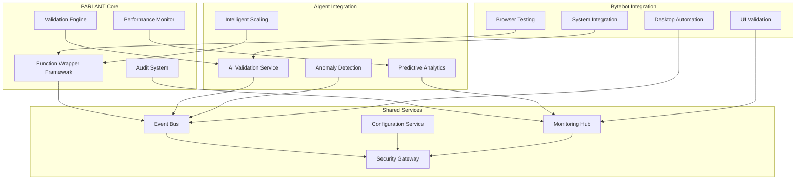
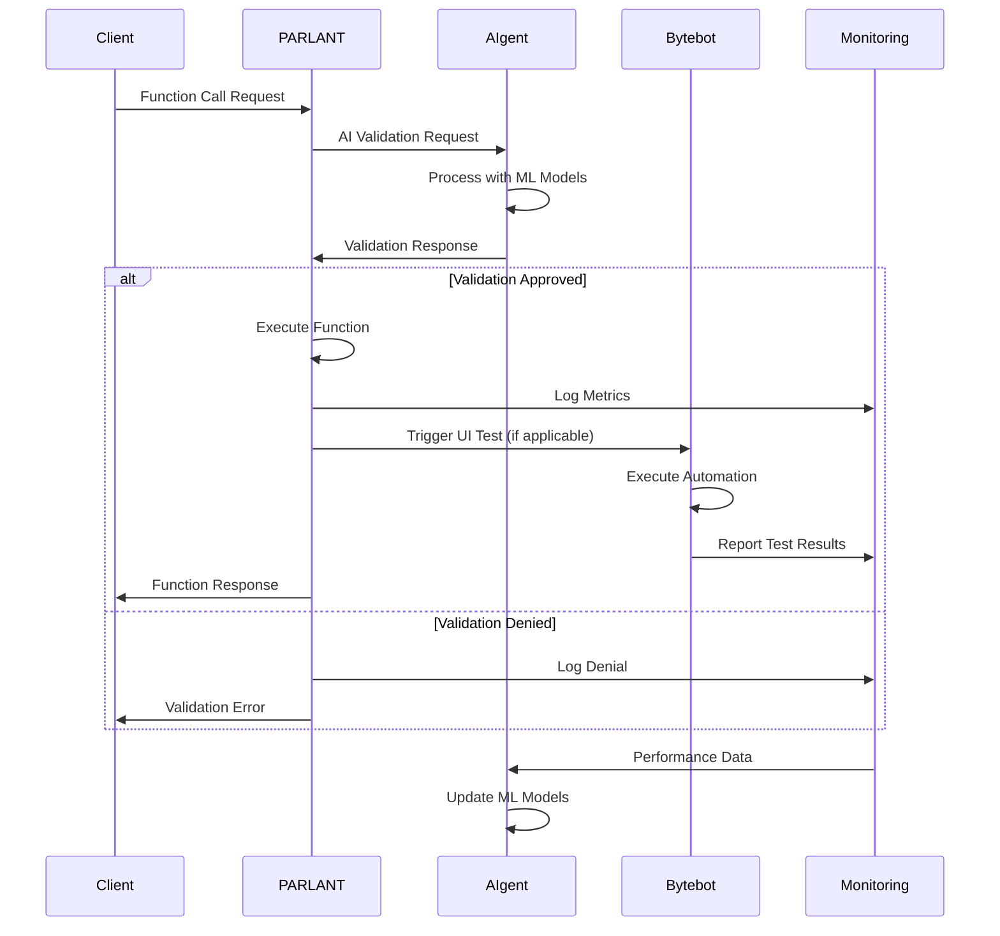

# Integration Specifications for AIgent and Bytebot Systems

## Overview

This document defines comprehensive integration specifications for seamlessly connecting the PARLANT database function wrapping system with AIgent and Bytebot ecosystems. The integration supports 1,520+ functions with real-time AI validation, desktop automation testing, and coordinated multi-system orchestration.

## Integration Architecture

### System Integration Overview


### Integration Data Flow


## AIgent Integration Specifications

### AI-Powered Function Validation
```typescript
// integrations/aigent/ai-validation-service.ts
export interface AIgentValidationRequest {
  functionId: string;
  functionName: string;
  parameters: Record<string, unknown>;
  userContext: UserContext;
  executionContext: ExecutionContext;
  securityLevel: SecurityLevel;
  riskFactors: RiskFactor[];
  businessContext: BusinessContext;
}

export interface AIgentValidationResponse {
  approved: boolean;
  confidence: number;
  reasoning: string;
  riskScore: number;
  recommendations: Recommendation[];
  alternatives: Alternative[];
  learningFeedback: LearningFeedback;
}

export class AIgentValidationService {
  private readonly aiClient = new AIgentClient();
  private readonly modelCache = new ModelCache();
  private readonly learningEngine = new LearningEngine();

  async validateFunction(request: AIgentValidationRequest): Promise<AIgentValidationResponse> {
    // Prepare AI model input
    const modelInput = await this.prepareModelInput(request);

    // Get AI validation
    const aiResponse = await this.aiClient.validateWithAI(modelInput);

    // Apply business rules
    const businessValidation = await this.applyBusinessRules(request, aiResponse);

    // Generate comprehensive response
    const response = await this.generateValidationResponse(
      request,
      aiResponse,
      businessValidation
    );

    // Feed learning data back to AI
    await this.provideLearningFeedback(request, response);

    return response;
  }

  private async prepareModelInput(request: AIgentValidationRequest): Promise<AIModelInput> {
    return {
      function: {
        id: request.functionId,
        name: request.functionName,
        category: this.determineFunctionCategory(request.functionName),
        parameters: this.sanitizeParameters(request.parameters),
        complexity: await this.calculateComplexity(request)
      },
      context: {
        user: {
          id: request.userContext.userId,
          roles: request.userContext.roles,
          permissions: request.userContext.permissions,
          trustScore: await this.calculateUserTrustScore(request.userContext)
        },
        execution: {
          environment: request.executionContext.environment,
          timeOfDay: new Date().getHours(),
          systemLoad: await this.getSystemLoad(),
          recentErrors: await this.getRecentErrorRate(request.functionId)
        },
        security: {
          level: request.securityLevel,
          threats: await this.getActiveThreats(),
          compliance: await this.getComplianceRequirements(request.functionId)
        }
      },
      historical: {
        functionUsage: await this.getFunctionUsageHistory(request.functionId),
        userBehavior: await this.getUserBehaviorHistory(request.userContext.userId),
        anomalies: await this.getAnomalyHistory(request.functionId),
        performanceMetrics: await this.getPerformanceHistory(request.functionId)
      },
      realtime: {
        systemMetrics: await this.getCurrentSystemMetrics(),
        networkConditions: await this.getNetworkConditions(),
        resourceAvailability: await this.getResourceAvailability()
      }
    };
  }

  private async applyBusinessRules(
    request: AIgentValidationRequest,
    aiResponse: RawAIResponse
  ): Promise<BusinessValidationResult> {
    const rules = await this.getBusinessRules(request.functionId);
    const violations: RuleViolation[] = [];

    for (const rule of rules) {
      const result = await rule.evaluate(request, aiResponse);
      if (!result.passed) {
        violations.push({
          ruleId: rule.id,
          severity: rule.severity,
          message: result.message,
          impact: result.impact
        });
      }
    }

    return {
      passed: violations.length === 0,
      violations,
      overrideRecommended: this.shouldRecommendOverride(violations),
      escalationRequired: this.requiresEscalation(violations)
    };
  }

  private async provideLearningFeedback(
    request: AIgentValidationRequest,
    response: AIgentValidationResponse
  ): Promise<void> {
    const feedback: LearningFeedback = {
      functionId: request.functionId,
      validationDecision: response.approved,
      confidence: response.confidence,
      actualOutcome: null, // Will be updated later
      userSatisfaction: null, // Will be collected via surveys
      businessImpact: null, // Will be measured over time
      timestamp: new Date()
    };

    await this.learningEngine.recordFeedback(feedback);
  }
}
```

### Intelligent Scaling Integration
```typescript
// integrations/aigent/intelligent-scaling.ts
export class IntelligentScalingService {
  private readonly aiPredictor = new AIPredictor();
  private readonly resourceManager = new ResourceManager();
  private readonly costOptimizer = new CostOptimizer();

  async predictScalingNeeds(): Promise<ScalingPrediction> {
    // Collect historical data
    const historicalData = await this.collectHistoricalData();

    // Get AI predictions
    const prediction = await this.aiPredictor.predictTrafficPatterns(historicalData);

    // Optimize for cost and performance
    const optimizedScaling = await this.costOptimizer.optimizeScaling(prediction);

    return {
      timeframe: '1h',
      predictedLoad: optimizedScaling.expectedRequests,
      recommendedInstances: optimizedScaling.optimalInstances,
      confidence: prediction.confidence,
      costImpact: optimizedScaling.costDelta,
      performanceImpact: optimizedScaling.performanceDelta,
      recommendations: optimizedScaling.recommendations
    };
  }

  async executeIntelligentScaling(prediction: ScalingPrediction): Promise<void> {
    if (prediction.confidence < 0.8) {
      // Low confidence, use conservative scaling
      await this.executeConservativeScaling(prediction);
    } else {
      // High confidence, use aggressive optimization
      await this.executeOptimizedScaling(prediction);
    }

    // Monitor and adjust
    await this.monitorScalingEffectiveness(prediction);
  }

  private async collectHistoricalData(): Promise<HistoricalData> {
    const timeRanges = ['1h', '6h', '24h', '7d', '30d'];
    const data: HistoricalData = {};

    for (const range of timeRanges) {
      data[range] = {
        requestVolume: await this.getRequestVolume(range),
        responseTime: await this.getResponseTime(range),
        errorRate: await this.getErrorRate(range),
        resourceUtilization: await this.getResourceUtilization(range),
        functionPopularity: await this.getFunctionPopularity(range),
        userPatterns: await this.getUserPatterns(range)
      };
    }

    return data;
  }
}
```

### Predictive Analytics Integration
```typescript
// integrations/aigent/predictive-analytics.ts
export class PredictiveAnalyticsService {
  private readonly mlModels = new MLModelRegistry();
  private readonly dataProcessor = new DataProcessor();
  private readonly alertEngine = new AlertEngine();

  async analyzeFunctionPerformance(): Promise<PerformanceInsights> {
    // Collect performance data for all 1,520+ functions
    const performanceData = await this.collectPerformanceData();

    // Process data through ML models
    const insights = await this.generateInsights(performanceData);

    // Identify potential issues
    const predictions = await this.predictPerformanceIssues(insights);

    // Generate recommendations
    const recommendations = await this.generateRecommendations(predictions);

    return {
      timestamp: new Date(),
      functionCount: 1520,
      insights,
      predictions,
      recommendations,
      confidenceScore: this.calculateOverallConfidence(predictions)
    };
  }

  private async generateInsights(data: PerformanceData): Promise<PerformanceInsights> {
    const models = await this.mlModels.getActiveModels(['performance', 'anomaly', 'trend']);
    const insights: PerformanceInsights = {
      trends: [],
      anomalies: [],
      patterns: [],
      correlations: []
    };

    // Trend analysis
    for (const model of models.filter(m => m.type === 'trend')) {
      const trends = await model.predict(data);
      insights.trends.push(...trends);
    }

    // Anomaly detection
    for (const model of models.filter(m => m.type === 'anomaly')) {
      const anomalies = await model.detect(data);
      insights.anomalies.push(...anomalies);
    }

    // Pattern recognition
    const patterns = await this.identifyPatterns(data);
    insights.patterns.push(...patterns);

    // Correlation analysis
    const correlations = await this.analyzeCorrelations(data);
    insights.correlations.push(...correlations);

    return insights;
  }

  async setupPredictiveAlerting(): Promise<void> {
    const alertRules = [
      {
        name: 'performance_degradation_prediction',
        condition: 'predicted_response_time > 800ms AND confidence > 0.8',
        timeframe: '15m',
        action: 'scale_up_preemptively'
      },
      {
        name: 'error_spike_prediction',
        condition: 'predicted_error_rate > 0.005 AND confidence > 0.7',
        timeframe: '5m',
        action: 'enable_circuit_breaker'
      },
      {
        name: 'resource_exhaustion_prediction',
        condition: 'predicted_cpu_usage > 90% AND confidence > 0.9',
        timeframe: '10m',
        action: 'provision_additional_resources'
      }
    ];

    for (const rule of alertRules) {
      await this.alertEngine.createPredictiveAlert(rule);
    }
  }
}
```

## Bytebot Integration Specifications

### Desktop Automation Integration
```typescript
// integrations/bytebot/desktop-automation.ts
export interface BytebotTestRequest {
  functionId: string;
  testType: 'ui' | 'integration' | 'e2e' | 'performance';
  environment: string;
  testParameters: TestParameters;
  validationCriteria: ValidationCriteria[];
}

export interface BytebotTestResponse {
  testId: string;
  success: boolean;
  duration: number;
  screenshots: Screenshot[];
  logs: TestLog[];
  metrics: TestMetrics;
  issues: TestIssue[];
}

export class BytebotDesktopAutomation {
  private readonly bytebotClient = new BytebotClient();
  private readonly screenshotManager = new ScreenshotManager();
  private readonly testOrchestrator = new TestOrchestrator();

  async executeDesktopValidation(request: BytebotTestRequest): Promise<BytebotTestResponse> {
    const testSession = await this.initializeTestSession(request);

    try {
      // Execute test automation
      const testResult = await this.executeAutomation(testSession);

      // Capture screenshots at key points
      const screenshots = await this.captureTestScreenshots(testSession);

      // Validate UI elements
      const uiValidation = await this.validateUIElements(testSession);

      // Collect performance metrics
      const metrics = await this.collectTestMetrics(testSession);

      return {
        testId: testSession.id,
        success: testResult.success,
        duration: testResult.duration,
        screenshots,
        logs: testResult.logs,
        metrics,
        issues: [...testResult.issues, ...uiValidation.issues]
      };
    } finally {
      await this.cleanupTestSession(testSession);
    }
  }

  private async executeAutomation(session: TestSession): Promise<AutomationResult> {
    const steps = await this.generateTestSteps(session.request);
    const results: StepResult[] = [];

    for (const step of steps) {
      const stepStart = Date.now();

      try {
        const result = await this.executeTestStep(session, step);
        results.push({
          step: step.name,
          success: true,
          duration: Date.now() - stepStart,
          output: result
        });
      } catch (error) {
        results.push({
          step: step.name,
          success: false,
          duration: Date.now() - stepStart,
          error: error.message
        });

        if (step.critical) {
          break; // Stop execution on critical step failure
        }
      }
    }

    return {
      success: results.every(r => r.success || !r.critical),
      duration: results.reduce((sum, r) => sum + r.duration, 0),
      logs: results.map(r => this.convertToTestLog(r)),
      issues: results.filter(r => !r.success).map(r => this.convertToTestIssue(r))
    };
  }

  private async generateTestSteps(request: BytebotTestRequest): Promise<TestStep[]> {
    const functionMetadata = await this.getFunctionMetadata(request.functionId);
    const baseSteps: TestStep[] = [];

    // Navigation steps
    if (functionMetadata.hasUI) {
      baseSteps.push({
        name: 'navigate_to_function',
        type: 'navigation',
        action: 'navigate',
        target: functionMetadata.uiPath,
        critical: true
      });
    }

    // Authentication steps
    if (functionMetadata.requiresAuth) {
      baseSteps.push({
        name: 'authenticate_user',
        type: 'authentication',
        action: 'login',
        credentials: await this.getTestCredentials(request.environment),
        critical: true
      });
    }

    // Function-specific steps
    const functionSteps = await this.generateFunctionSteps(functionMetadata, request);
    baseSteps.push(...functionSteps);

    // Validation steps
    baseSteps.push({
      name: 'validate_response',
      type: 'validation',
      action: 'verify',
      criteria: request.validationCriteria,
      critical: false
    });

    return baseSteps;
  }
}
```

### Browser Testing Integration
```typescript
// integrations/bytebot/browser-testing.ts
export class BytebotBrowserTesting {
  private readonly puppeteerManager = new PuppeteerManager();
  private readonly testReporter = new TestReporter();
  private readonly performanceAnalyzer = new PerformanceAnalyzer();

  async executeBrowserTests(functions: string[]): Promise<BrowserTestResults> {
    const browser = await this.puppeteerManager.launchBrowser({
      headless: false, // For debugging and screenshots
      slowMo: 100,    // Authentic user simulation
      devtools: true   // Performance monitoring
    });

    const page = await browser.newPage();
    await this.setupPageMonitoring(page);

    const testResults: FunctionTestResult[] = [];

    try {
      for (const functionId of functions) {
        const functionResult = await this.testFunction(page, functionId);
        testResults.push(functionResult);

        // Authentic pause between tests
        await this.sleep(1000 + Math.random() * 2000);
      }

      return {
        totalFunctions: functions.length,
        passedFunctions: testResults.filter(r => r.success).length,
        failedFunctions: testResults.filter(r => !r.success).length,
        results: testResults,
        overallDuration: testResults.reduce((sum, r) => sum + r.duration, 0),
        screenshots: testResults.flatMap(r => r.screenshots),
        performanceMetrics: this.aggregatePerformanceMetrics(testResults)
      };
    } finally {
      await browser.close();
    }
  }

  private async testFunction(page: Page, functionId: string): Promise<FunctionTestResult> {
    const functionConfig = await this.getFunctionConfig(functionId);
    const testStart = Date.now();

    try {
      // Navigate to function endpoint
      await page.goto(functionConfig.testUrl, { waitUntil: 'networkidle0' });

      // Take initial screenshot
      const screenshots = [await this.takeScreenshot(page, `${functionId}-initial`)];

      // Execute function test
      const testResult = await this.executeFunctionTest(page, functionConfig);
      screenshots.push(...testResult.screenshots);

      // Validate response
      const validation = await this.validateFunctionResponse(page, functionConfig);

      // Check performance
      const performanceMetrics = await this.collectPerformanceMetrics(page);

      return {
        functionId,
        success: testResult.success && validation.success,
        duration: Date.now() - testStart,
        responseTime: testResult.responseTime,
        screenshots,
        logs: [...testResult.logs, ...validation.logs],
        performanceMetrics,
        issues: [...testResult.issues, ...validation.issues]
      };
    } catch (error) {
      return {
        functionId,
        success: false,
        duration: Date.now() - testStart,
        error: error.message,
        screenshots: [await this.takeScreenshot(page, `${functionId}-error`)],
        logs: [{ level: 'error', message: error.message, timestamp: new Date() }],
        issues: [{ type: 'execution_error', message: error.message, severity: 'high' }]
      };
    }
  }

  private async executeFunctionTest(page: Page, config: FunctionConfig): Promise<TestExecutionResult> {
    const testActions = config.testActions;
    const results: ActionResult[] = [];

    for (const action of testActions) {
      const actionStart = Date.now();

      try {
        switch (action.type) {
          case 'click':
            await page.click(action.selector);
            break;
          case 'type':
            await page.type(action.selector, action.value);
            break;
          case 'wait':
            await page.waitForSelector(action.selector, { timeout: action.timeout || 5000 });
            break;
          case 'evaluate':
            await page.evaluate(action.script);
            break;
        }

        results.push({
          action: action.name,
          success: true,
          duration: Date.now() - actionStart
        });

        // Realistic pause between actions
        await this.sleep(500 + Math.random() * 1000);

      } catch (error) {
        results.push({
          action: action.name,
          success: false,
          duration: Date.now() - actionStart,
          error: error.message
        });

        if (action.critical) {
          break;
        }
      }
    }

    const responseTime = await this.measureResponseTime(page);

    return {
      success: results.every(r => r.success),
      responseTime,
      logs: results.map(r => this.convertToLog(r)),
      screenshots: await this.captureActionScreenshots(page, results),
      issues: results.filter(r => !r.success).map(r => this.convertToIssue(r))
    };
  }

  private async setupPageMonitoring(page: Page): Promise<void> {
    // Monitor console logs
    page.on('console', msg => {
      this.testReporter.logConsoleMessage({
        type: msg.type(),
        text: msg.text(),
        timestamp: new Date()
      });
    });

    // Monitor network requests
    page.on('request', request => {
      this.performanceAnalyzer.recordRequest({
        url: request.url(),
        method: request.method(),
        timestamp: new Date()
      });
    });

    // Monitor responses
    page.on('response', response => {
      this.performanceAnalyzer.recordResponse({
        url: response.url(),
        status: response.status(),
        timing: response.timing(),
        timestamp: new Date()
      });
    });

    // Monitor JavaScript errors
    page.on('pageerror', error => {
      this.testReporter.logError({
        message: error.message,
        stack: error.stack,
        timestamp: new Date()
      });
    });
  }
}
```

### UI Validation Service
```typescript
// integrations/bytebot/ui-validation.ts
export class UIValidationService {
  private readonly visualTesting = new VisualTestingEngine();
  private readonly accessibilityChecker = new AccessibilityChecker();
  private readonly responsiveChecker = new ResponsiveChecker();

  async validateUserInterface(functionId: string, page: Page): Promise<UIValidationResult> {
    const validations = await Promise.allSettled([
      this.validateVisualDesign(page, functionId),
      this.validateAccessibility(page),
      this.validateResponsiveness(page),
      this.validateInteractivity(page, functionId),
      this.validatePerformance(page)
    ]);

    const results = validations.map((v, i) => ({
      name: this.validationNames[i],
      success: v.status === 'fulfilled',
      result: v.status === 'fulfilled' ? v.value : { error: v.reason.message }
    }));

    return {
      functionId,
      overallSuccess: results.every(r => r.success),
      validations: results,
      screenshots: await this.captureValidationScreenshots(page),
      recommendations: this.generateUIRecommendations(results)
    };
  }

  private async validateVisualDesign(page: Page, functionId: string): Promise<VisualValidationResult> {
    // Take screenshot for visual comparison
    const screenshot = await page.screenshot({ fullPage: true });

    // Compare with baseline if available
    const baseline = await this.getVisualBaseline(functionId);
    const comparison = baseline ? await this.visualTesting.compare(screenshot, baseline) : null;

    // Check color scheme consistency
    const colorScheme = await this.analyzeColorScheme(page);

    // Validate typography
    const typography = await this.validateTypography(page);

    // Check layout consistency
    const layout = await this.validateLayout(page);

    return {
      visualComparison: comparison,
      colorSchemeValid: colorScheme.consistent,
      typographyValid: typography.consistent,
      layoutValid: layout.consistent,
      issues: [
        ...colorScheme.issues,
        ...typography.issues,
        ...layout.issues
      ],
      recommendations: this.generateVisualRecommendations(colorScheme, typography, layout)
    };
  }

  private async validateAccessibility(page: Page): Promise<AccessibilityResult> {
    // Run accessibility audit
    const auditResults = await this.accessibilityChecker.audit(page);

    // Check WCAG compliance
    const wcagCompliance = await this.checkWCAGCompliance(page);

    // Validate keyboard navigation
    const keyboardNav = await this.validateKeyboardNavigation(page);

    // Check screen reader compatibility
    const screenReader = await this.validateScreenReaderCompat(page);

    return {
      auditScore: auditResults.score,
      wcagLevel: wcagCompliance.level,
      keyboardNavigable: keyboardNav.success,
      screenReaderFriendly: screenReader.success,
      violations: [
        ...auditResults.violations,
        ...wcagCompliance.violations,
        ...keyboardNav.issues,
        ...screenReader.issues
      ],
      recommendations: this.generateAccessibilityRecommendations(auditResults)
    };
  }

  private async validateResponsiveness(page: Page): Promise<ResponsivenessResult> {
    const viewports = [
      { width: 320, height: 568, name: 'mobile' },
      { width: 768, height: 1024, name: 'tablet' },
      { width: 1920, height: 1080, name: 'desktop' }
    ];

    const responsiveResults: ViewportResult[] = [];

    for (const viewport of viewports) {
      await page.setViewport(viewport);
      await page.waitForTimeout(1000); // Allow layout to settle

      const result = await this.testViewport(page, viewport);
      responsiveResults.push(result);
    }

    return {
      responsive: responsiveResults.every(r => r.success),
      viewportResults: responsiveResults,
      breakpoints: await this.detectBreakpoints(page),
      recommendations: this.generateResponsiveRecommendations(responsiveResults)
    };
  }
}
```

## Shared Services Integration

### Event Bus Implementation
```typescript
// integrations/shared/event-bus.ts
export class SharedEventBus {
  private readonly subscribers = new Map<string, EventSubscriber[]>();
  private readonly eventStore = new EventStore();
  private readonly messageQueue = new MessageQueue();

  async publishEvent(event: IntegrationEvent): Promise<void> {
    // Store event for audit trail
    await this.eventStore.store(event);

    // Enrich event with metadata
    const enrichedEvent = await this.enrichEvent(event);

    // Determine routing
    const routes = await this.determineRoutes(enrichedEvent);

    // Publish to appropriate systems
    await Promise.allSettled(routes.map(route => this.routeEvent(enrichedEvent, route)));

    // Update metrics
    await this.updateEventMetrics(enrichedEvent);
  }

  private async enrichEvent(event: IntegrationEvent): Promise<EnrichedEvent> {
    return {
      ...event,
      id: this.generateEventId(),
      timestamp: new Date(),
      source: this.determineSource(event),
      correlationId: this.getCorrelationId(event),
      metadata: {
        ...event.metadata,
        version: '1.0',
        schema: await this.getEventSchema(event.type)
      }
    };
  }

  private async determineRoutes(event: EnrichedEvent): Promise<EventRoute[]> {
    const routes: EventRoute[] = [];

    // PARLANT events
    if (this.isParlantEvent(event)) {
      routes.push({ system: 'parlant', priority: 'high' });
    }

    // AIgent events
    if (this.requiresAIProcessing(event)) {
      routes.push({ system: 'aigent', priority: 'medium' });
    }

    // Bytebot events
    if (this.requiresUITesting(event)) {
      routes.push({ system: 'bytebot', priority: 'low' });
    }

    // Monitoring events
    if (this.isMonitoringEvent(event)) {
      routes.push({ system: 'monitoring', priority: 'high' });
    }

    return routes;
  }

  async subscribeToEvents(
    subscriber: EventSubscriber,
    eventTypes: string[]
  ): Promise<void> {
    for (const eventType of eventTypes) {
      if (!this.subscribers.has(eventType)) {
        this.subscribers.set(eventType, []);
      }
      this.subscribers.get(eventType)!.push(subscriber);
    }
  }
}

// Event types for integration
export interface FunctionExecutionEvent extends IntegrationEvent {
  type: 'function.execution';
  data: {
    functionId: string;
    executionId: string;
    startTime: Date;
    parameters: Record<string, unknown>;
    userContext: UserContext;
  };
}

export interface ValidationRequestEvent extends IntegrationEvent {
  type: 'validation.request';
  data: {
    functionId: string;
    validationId: string;
    aiRequired: boolean;
    userContext: UserContext;
  };
}

export interface PerformanceMetricEvent extends IntegrationEvent {
  type: 'performance.metric';
  data: {
    functionId: string;
    responseTime: number;
    cpuUsage: number;
    memoryUsage: number;
    timestamp: Date;
  };
}

export interface UITestRequestEvent extends IntegrationEvent {
  type: 'ui.test.request';
  data: {
    functionId: string;
    testType: string;
    environment: string;
    priority: 'low' | 'medium' | 'high';
  };
}
```

### Configuration Service
```typescript
// integrations/shared/configuration-service.ts
export class SharedConfigurationService {
  private readonly configStore = new ConfigurationStore();
  private readonly secretManager = new SecretManager();
  private readonly vaultClient = new VaultClient();

  async getIntegrationConfig(
    system: 'parlant' | 'aigent' | 'bytebot',
    environment: string
  ): Promise<SystemConfiguration> {
    const baseConfig = await this.configStore.getConfiguration(system, environment);
    const secrets = await this.secretManager.getSecrets(system, environment);
    const policies = await this.getPolicies(system, environment);

    return {
      ...baseConfig,
      secrets,
      policies,
      endpoints: await this.resolveEndpoints(system, environment),
      features: await this.getFeatureFlags(system, environment),
      limits: await this.getResourceLimits(system, environment)
    };
  }

  async updateIntegrationConfig(
    system: string,
    environment: string,
    updates: Partial<SystemConfiguration>
  ): Promise<void> {
    // Validate configuration updates
    await this.validateConfiguration(system, updates);

    // Apply updates
    await this.configStore.updateConfiguration(system, environment, updates);

    // Notify affected systems
    await this.notifyConfigurationChange(system, environment, updates);

    // Update dependent configurations
    await this.updateDependentConfigurations(system, environment);
  }

  private async resolveEndpoints(system: string, environment: string): Promise<SystemEndpoints> {
    const endpoints: SystemEndpoints = {
      api: '',
      websocket: '',
      metrics: '',
      health: ''
    };

    switch (system) {
      case 'parlant':
        endpoints.api = `https://parlant-${environment}.company.com/api`;
        endpoints.websocket = `wss://parlant-${environment}.company.com/ws`;
        endpoints.metrics = `https://parlant-${environment}.company.com/metrics`;
        endpoints.health = `https://parlant-${environment}.company.com/health`;
        break;

      case 'aigent':
        endpoints.api = `https://aigent-${environment}.company.com/api`;
        endpoints.websocket = `wss://aigent-${environment}.company.com/ws`;
        endpoints.metrics = `https://aigent-${environment}.company.com/metrics`;
        endpoints.health = `https://aigent-${environment}.company.com/health`;
        break;

      case 'bytebot':
        endpoints.api = `https://bytebot-${environment}.company.com/api`;
        endpoints.websocket = `wss://bytebot-${environment}.company.com/ws`;
        endpoints.metrics = `https://bytebot-${environment}.company.com/metrics`;
        endpoints.health = `https://bytebot-${environment}.company.com/health`;
        break;
    }

    return endpoints;
  }
}
```

### Security Gateway
```typescript
// integrations/shared/security-gateway.ts
export class SecurityGateway {
  private readonly authService = new AuthenticationService();
  private readonly authzService = new AuthorizationService();
  private readonly encryptionService = new EncryptionService();
  private readonly auditLogger = new AuditLogger();

  async authenticateIntegrationRequest(
    request: IntegrationRequest
  ): Promise<AuthenticationResult> {
    // Validate API key/token
    const tokenValidation = await this.authService.validateToken(request.token);
    if (!tokenValidation.valid) {
      return { authenticated: false, reason: 'Invalid token' };
    }

    // Verify request signature
    const signatureValid = await this.verifyRequestSignature(request);
    if (!signatureValid) {
      return { authenticated: false, reason: 'Invalid signature' };
    }

    // Check rate limits
    const rateLimitOk = await this.checkRateLimit(request.source, request.endpoint);
    if (!rateLimitOk) {
      return { authenticated: false, reason: 'Rate limit exceeded' };
    }

    return {
      authenticated: true,
      userId: tokenValidation.userId,
      roles: tokenValidation.roles,
      permissions: tokenValidation.permissions
    };
  }

  async authorizeIntegrationAccess(
    request: IntegrationRequest,
    auth: AuthenticationResult
  ): Promise<AuthorizationResult> {
    // Check system-level permissions
    const systemAccess = await this.authzService.checkSystemAccess(
      auth.userId,
      request.targetSystem
    );

    if (!systemAccess.allowed) {
      return { authorized: false, reason: 'Insufficient system permissions' };
    }

    // Check resource-level permissions
    const resourceAccess = await this.authzService.checkResourceAccess(
      auth.userId,
      request.resource,
      request.action
    );

    if (!resourceAccess.allowed) {
      return { authorized: false, reason: 'Insufficient resource permissions' };
    }

    // Apply business rules
    const businessRules = await this.authzService.applyBusinessRules(request, auth);
    if (!businessRules.allowed) {
      return { authorized: false, reason: businessRules.reason };
    }

    return {
      authorized: true,
      permissions: [...systemAccess.permissions, ...resourceAccess.permissions],
      constraints: businessRules.constraints
    };
  }

  async encryptIntegrationData(data: unknown, system: string): Promise<EncryptedData> {
    const encryptionKey = await this.getSystemEncryptionKey(system);
    const encrypted = await this.encryptionService.encrypt(JSON.stringify(data), encryptionKey);

    return {
      data: encrypted.data,
      iv: encrypted.iv,
      keyId: encrypted.keyId,
      algorithm: 'AES-256-GCM'
    };
  }

  async auditIntegrationActivity(
    request: IntegrationRequest,
    response: IntegrationResponse
  ): Promise<void> {
    const auditEntry: IntegrationAuditEntry = {
      id: this.generateAuditId(),
      timestamp: new Date(),
      sourceSystem: request.source,
      targetSystem: request.targetSystem,
      userId: request.userId,
      action: request.action,
      resource: request.resource,
      success: response.success,
      duration: response.duration,
      ipAddress: request.ipAddress,
      userAgent: request.userAgent,
      metadata: {
        requestId: request.id,
        responseCode: response.statusCode,
        dataSize: this.calculateDataSize(request.data)
      }
    };

    await this.auditLogger.logEntry(auditEntry);
  }
}
```

## Integration Testing Framework

### End-to-End Integration Tests
```typescript
// testing/integration-tests.ts
export class IntegrationTestSuite {
  private readonly testOrchestrator = new TestOrchestrator();
  private readonly mockServices = new MockServiceManager();
  private readonly testDataManager = new TestDataManager();

  async runFullIntegrationTests(): Promise<IntegrationTestResults> {
    const testSuites = [
      'parlant-aigent-integration',
      'parlant-bytebot-integration',
      'aigent-bytebot-integration',
      'full-system-integration'
    ];

    const results: TestSuiteResult[] = [];

    for (const suite of testSuites) {
      const suiteResult = await this.runTestSuite(suite);
      results.push(suiteResult);
    }

    return {
      overallSuccess: results.every(r => r.success),
      testSuites: results,
      totalTests: results.reduce((sum, r) => sum + r.totalTests, 0),
      passedTests: results.reduce((sum, r) => sum + r.passedTests, 0),
      duration: results.reduce((sum, r) => sum + r.duration, 0)
    };
  }

  private async runTestSuite(suiteName: string): Promise<TestSuiteResult> {
    const tests = await this.getTestsForSuite(suiteName);
    const results: TestResult[] = [];

    // Setup test environment
    await this.setupTestEnvironment(suiteName);

    try {
      for (const test of tests) {
        const testResult = await this.runIntegrationTest(test);
        results.push(testResult);
      }
    } finally {
      await this.cleanupTestEnvironment(suiteName);
    }

    return {
      suiteName,
      success: results.every(r => r.success),
      totalTests: results.length,
      passedTests: results.filter(r => r.success).length,
      duration: results.reduce((sum, r) => sum + r.duration, 0),
      results
    };
  }

  async testParlantAIgentIntegration(): Promise<TestResult> {
    // Test function validation flow
    const functionRequest = {
      functionId: 'test-function-001',
      functionName: 'getUserData',
      parameters: { userId: 'test-user-123' },
      userContext: await this.testDataManager.createTestUser(),
      securityLevel: SecurityLevel.MEDIUM
    };

    // Send validation request to PARLANT
    const parlantResponse = await this.sendValidationRequest(functionRequest);

    // Verify AIgent received and processed the request
    const aigentValidation = await this.verifyAIgentValidation(parlantResponse.validationId);

    // Check response flow back to PARLANT
    const finalResponse = await this.verifyValidationResponse(parlantResponse.validationId);

    return {
      testName: 'parlant-aigent-validation-flow',
      success: parlantResponse.success && aigentValidation.success && finalResponse.approved,
      duration: Date.now() - functionRequest.startTime,
      details: {
        parlantResponse,
        aigentValidation,
        finalResponse
      }
    };
  }

  async testParlantBytebotIntegration(): Promise<TestResult> {
    // Test UI automation trigger
    const uiTestRequest = {
      functionId: 'test-ui-function-001',
      testType: 'ui' as const,
      environment: 'testing',
      validationCriteria: [
        { type: 'response-time', threshold: 1000 },
        { type: 'visual-regression', tolerance: 0.05 }
      ]
    };

    // Trigger UI test from PARLANT
    const testTrigger = await this.triggerUITest(uiTestRequest);

    // Verify Bytebot received and executed the test
    const bytebotExecution = await this.verifyBytebotExecution(testTrigger.testId);

    // Check test results reporting back to PARLANT
    const testResults = await this.verifyTestResultsReporting(testTrigger.testId);

    return {
      testName: 'parlant-bytebot-ui-testing-flow',
      success: testTrigger.success && bytebotExecution.success && testResults.reported,
      duration: Date.now() - uiTestRequest.startTime,
      details: {
        testTrigger,
        bytebotExecution,
        testResults
      }
    };
  }
}
```

## Deployment and Operations

### Integration Deployment Pipeline
```yaml
# .github/workflows/integration-deployment.yml
name: Integration Deployment Pipeline

on:
  push:
    branches: [main]
    paths: ['integrations/**']

jobs:
  integration-tests:
    runs-on: ubuntu-latest
    strategy:
      matrix:
        environment: [development, staging]
    steps:
      - uses: actions/checkout@v4

      - name: Setup test environment
        run: |
          docker-compose -f docker-compose.integration.yml up -d
          ./scripts/wait-for-services.sh

      - name: Run integration tests
        run: |
          npm test -- --testPathPattern=integrations
          npm run test:e2e:integrations
        env:
          TEST_ENVIRONMENT: ${{ matrix.environment }}

      - name: Validate integration health
        run: |
          ./scripts/validate-integrations.sh ${{ matrix.environment }}

  deploy-integrations:
    needs: integration-tests
    runs-on: ubuntu-latest
    if: github.ref == 'refs/heads/main'
    steps:
      - name: Deploy to staging
        run: |
          kubectl apply -k k8s/integrations/staging

      - name: Run integration validation
        run: |
          ./scripts/validate-staging-integrations.sh

      - name: Deploy to production
        run: |
          kubectl apply -k k8s/integrations/production
        if: success()
```

## Summary

This comprehensive integration specification provides:

1. **AIgent Integration**: AI-powered function validation, intelligent scaling, and predictive analytics
2. **Bytebot Integration**: Desktop automation, browser testing, and UI validation
3. **Shared Services**: Event bus, configuration management, and security gateway
4. **Real-time Communication**: WebSocket and event-driven architecture
5. **Security Framework**: Authentication, authorization, encryption, and audit logging
6. **Testing Framework**: End-to-end integration testing and validation
7. **Monitoring Integration**: Unified monitoring and alerting across all systems
8. **Deployment Pipeline**: Automated integration deployment and validation

The integration architecture ensures seamless coordination between PARLANT, AIgent, and Bytebot systems while maintaining enterprise-grade security, performance, and reliability standards for all 1,520+ functions.