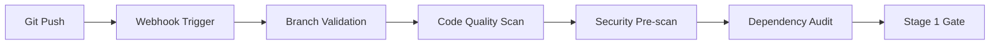
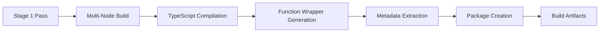
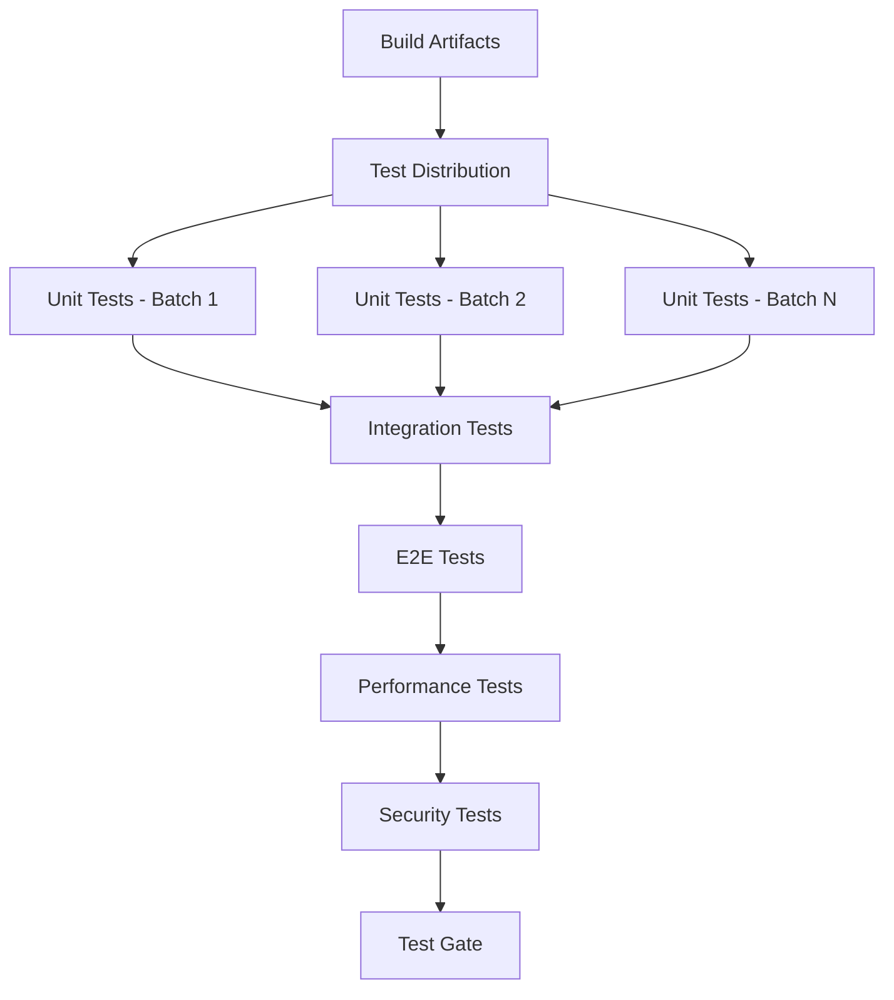
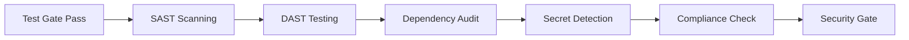
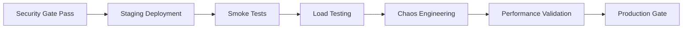
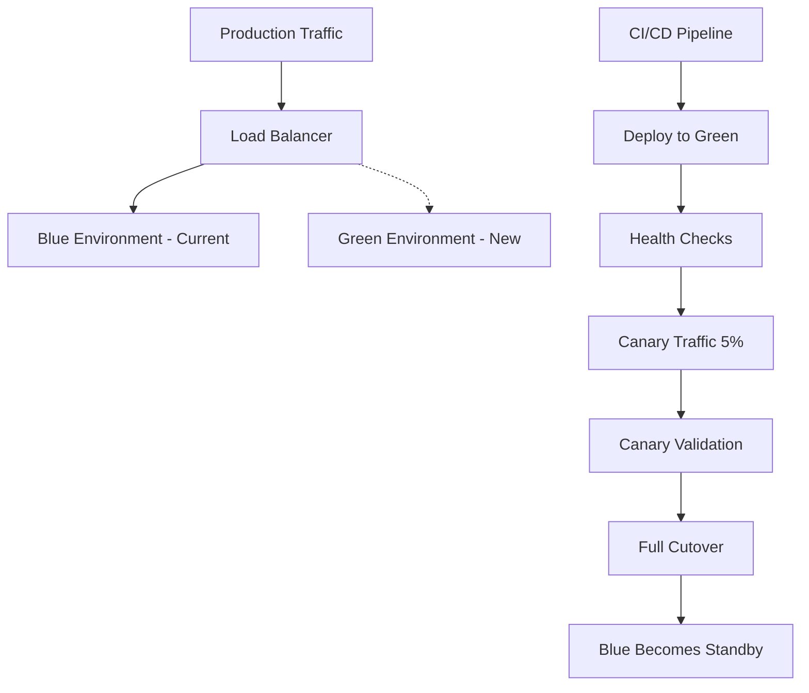
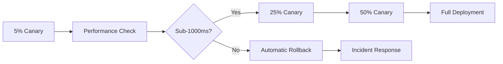

# PARLANT Database Function Wrapping System - CI/CD Pipeline Architecture

## Executive Summary

This document presents a comprehensive CI/CD pipeline architecture designed for the PARLANT database function wrapping system, supporting deployment and validation of 1,520+ functions with enterprise-grade requirements including sub-1000ms performance targets, 95%+ test coverage enforcement, and enterprise security compliance.

## Architecture Overview

### System Context
- **Target Functions**: 1,520+ database functions with PARLANT conversational validation
- **Function Categories**: Database Read/Write, API calls, Authentication, Utilities
- **Validation Levels**: Low, Medium, High, Critical
- **Data Classifications**: Internal, Confidential, Restricted
- **Performance SLA**: Sub-1000ms response time target
- **Test Coverage**: 95%+ enforcement with automated quality gates

### Core Requirements
1. **High-Volume Processing**: Parallel CI/CD execution for 1,520+ functions
2. **Performance Targets**: Sub-1000ms function validation and execution
3. **Quality Assurance**: 95%+ test coverage with zero-tolerance quality gates
4. **Security Compliance**: Enterprise-grade security framework
5. **Zero-Downtime Deployment**: Blue-green deployments with canary releases
6. **Automated Rollback**: Failure detection and automatic reversion
7. **Environment Management**: Development, staging, production automation
8. **Integration Points**: Seamless AIgent and Bytebot ecosystem integration

## Multi-Stage Pipeline Architecture

### Stage 1: Source Code Management & Validation


**Components:**
- **Git Webhooks**: Immediate trigger on code changes
- **Branch Protection**: Enforce PR-based workflow
- **ESLint/TSLint**: Code quality validation
- **SonarQube**: Code smell and vulnerability detection
- **npm audit**: Dependency security scanning
- **Commit Message Validation**: Conventional commit enforcement

**Performance Targets:**
- Stage completion: <60 seconds
- Parallel execution across multiple runners
- Early failure detection to minimize resource usage

### Stage 2: Build & Compilation


**Components:**
- **Multi-Node Compilation**: Parallel TypeScript builds across function categories
- **Function Wrapper Factory**: Automated wrapper generation for 1,520+ functions
- **Metadata Extraction**: Function signatures, validation levels, categories
- **Package Optimization**: Tree-shaking, minification, bundle analysis
- **Artifact Storage**: Immutable build artifacts with versioning

**Performance Targets:**
- Build completion: <5 minutes for all 1,520+ functions
- Parallel compilation: 8+ concurrent build nodes
- Incremental builds: Only changed functions recompiled

### Stage 3: Parallel Testing Pipeline


**Testing Strategy:**
- **Unit Tests**: 1,520+ function unit tests in parallel batches
- **Integration Tests**: PARLANT validation integration testing
- **End-to-End Tests**: Complete workflow validation
- **Performance Tests**: Sub-1000ms response time validation
- **Security Tests**: SAST/DAST scanning of all functions
- **Coverage Enforcement**: 95%+ coverage requirement with zero tolerance

**Parallel Execution:**
- **Test Batching**: Functions grouped by category (Database R/W, API, Auth, Utilities)
- **Concurrent Runners**: 16+ parallel test execution nodes
- **Smart Scheduling**: Critical functions tested first
- **Fail-Fast Strategy**: Immediate pipeline termination on critical failures

### Stage 4: Security & Compliance Validation


**Security Components:**
- **Static Analysis (SAST)**: CodeQL, Semgrep for vulnerability detection
- **Dynamic Analysis (DAST)**: Runtime security testing
- **Dependency Scanning**: Snyk, WhiteSource for third-party vulnerabilities
- **Secret Detection**: TruffleHog, GitLeaks for credential exposure
- **Compliance Validation**: SOC2, ISO27001, PCI-DSS compliance checks

**Enterprise Security Framework:**
- **Zero-Trust Security**: All functions validated regardless of source
- **Least Privilege Access**: Minimal required permissions
- **Encryption**: End-to-end encryption for all data
- **Audit Logging**: Comprehensive security event logging

### Stage 5: Pre-Production Validation


**Pre-Production Testing:**
- **Staging Environment**: Production-like environment for final validation
- **Smoke Tests**: Critical path functionality verification
- **Load Testing**: 1,520+ function concurrent execution testing
- **Chaos Engineering**: Failure resilience testing
- **Performance Validation**: Sub-1000ms SLA verification across all functions

## Deployment Strategy

### Blue-Green Deployment Architecture


**Deployment Process:**
1. **Green Deployment**: New version deployed to standby environment
2. **Health Validation**: Comprehensive health checks on all 1,520+ functions
3. **Canary Release**: 5% traffic routed to new version
4. **Performance Monitoring**: Real-time validation of sub-1000ms targets
5. **Gradual Rollout**: 5% → 25% → 50% → 100% traffic migration
6. **Automatic Rollback**: Instant reversion on performance degradation

### Canary Release Strategy


**Canary Metrics:**
- Response time percentiles (P50, P95, P99)
- Error rate monitoring
- Resource utilization tracking
- Function-specific performance validation
- Real-time alerting on SLA violations

### Rollback Mechanisms
**Automatic Rollback Triggers:**
- Response time > 1000ms for any function
- Error rate > 0.1% increase from baseline
- Memory leaks or resource exhaustion
- Security policy violations
- Critical dependency failures

**Rollback Execution:**
- **Instant Traffic Switch**: <30 seconds to previous version
- **Database State Management**: Backward-compatible schema changes
- **Cache Invalidation**: Immediate cache purge for consistency
- **Incident Documentation**: Automated incident reports

## Environment Management

### Development Environment
```yaml
environment: development
function_count: 1520+
validation_level: basic
cache_ttl: 60000ms
monitoring: debug_level
database: development_db
parlant_config:
  validation_mode: permissive
  cache_enabled: true
  debug_logging: true
```

**Development Features:**
- **Hot Reload**: Real-time function wrapper updates
- **Debug Mode**: Verbose logging and error reporting
- **Test Data**: Synthetic data for development testing
- **Local PARLANT**: Offline validation capabilities
- **Performance Profiling**: Function-level performance analysis

### Staging Environment
```yaml
environment: staging
function_count: 1520+
validation_level: production_similar
cache_ttl: 300000ms
monitoring: standard_level
database: staging_replica
parlant_config:
  validation_mode: strict
  cache_enabled: true
  load_testing: enabled
```

**Staging Features:**
- **Production Replica**: Identical configuration to production
- **Load Testing**: Concurrent execution of all 1,520+ functions
- **Data Masking**: Anonymized production data
- **Integration Testing**: Full ecosystem validation
- **Performance Benchmarking**: SLA validation

### Production Environment
```yaml
environment: production
function_count: 1520+
validation_level: maximum
cache_ttl: 600000ms
monitoring: enterprise_level
database: production_cluster
parlant_config:
  validation_mode: enterprise
  cache_enabled: true
  security_enhanced: true
```

**Production Features:**
- **High Availability**: Multi-region deployment
- **Auto-scaling**: Dynamic resource allocation
- **Enterprise Monitoring**: 24/7 monitoring and alerting
- **Disaster Recovery**: Cross-region backup and failover
- **Compliance Logging**: Full audit trail maintenance

## Integration Specifications

### AIgent Integration
```typescript
interface AIgentIntegration {
  // Function Registration
  registerFunctions(functions: ParlantFunction[]): Promise<void>;

  // Validation Workflow
  validateWithAI(request: ValidationRequest): Promise<ValidationResponse>;

  // Performance Monitoring
  reportMetrics(metrics: PerformanceMetrics): Promise<void>;

  // Health Checks
  healthCheck(): Promise<AIgentHealthStatus>;
}
```

**Integration Points:**
- **Function Discovery**: Automatic registration of 1,520+ functions
- **AI-Powered Validation**: Enhanced validation through AIgent capabilities
- **Real-time Metrics**: Performance data streaming to AIgent
- **Intelligent Scaling**: AI-driven resource optimization

### Bytebot Integration
```typescript
interface BytebotIntegration {
  // Desktop Automation
  executeDesktopValidation(function: Function): Promise<void>;

  // UI Testing
  validateUserInterface(endpoint: string): Promise<TestResult>;

  // Browser Automation
  performBrowserTests(testSuite: TestSuite): Promise<TestResults>;

  // System Integration
  integrateWithBytebot(config: BytebotConfig): Promise<void>;
}
```

**Integration Features:**
- **Automated UI Testing**: Bytebot-driven interface validation
- **Desktop Integration**: Function testing through desktop automation
- **Browser Validation**: End-to-end browser-based testing
- **System Orchestration**: Coordinated multi-system testing

## Performance Optimization Strategies

### Sub-1000ms Target Achievement
**Function-Level Optimizations:**
- **Connection Pooling**: Database connection reuse across functions
- **Intelligent Caching**: Multi-tier caching strategy (L1: Memory, L2: Redis, L3: Database)
- **Lazy Loading**: On-demand function wrapper initialization
- **Batch Processing**: Grouped function executions for efficiency
- **Async Patterns**: Non-blocking execution for I/O operations

**Infrastructure Optimizations:**
- **CDN Integration**: Global function wrapper distribution
- **Edge Computing**: Regional function execution nodes
- **Container Optimization**: Minimal Docker images with optimized runtimes
- **Network Optimization**: TCP/HTTP2 optimization for reduced latency
- **Resource Allocation**: Dynamic CPU/memory scaling based on function demands

### Performance Monitoring
```typescript
interface PerformanceMonitor {
  // Real-time Metrics
  trackResponseTime(functionId: string, duration: number): void;
  trackThroughput(functionsPerSecond: number): void;
  trackResourceUsage(cpu: number, memory: number): void;

  // SLA Monitoring
  validateSLA(metrics: SLAMetrics): SLAStatus;
  alertOnViolation(violation: SLAViolation): void;

  // Performance Analytics
  generatePerformanceReport(): PerformanceReport;
  identifyBottlenecks(): BottleneckAnalysis;
}
```

**Monitoring Strategy:**
- **Real-time Dashboards**: Live performance metrics visualization
- **Alerting System**: Immediate notification on SLA violations
- **Performance Trending**: Historical performance analysis
- **Predictive Analytics**: AI-powered performance forecasting
- **Capacity Planning**: Proactive resource scaling

## Quality Assurance Framework

### 95%+ Test Coverage Enforcement
**Coverage Requirements:**
- **Unit Tests**: 98% line coverage for individual functions
- **Integration Tests**: 95% path coverage for PARLANT workflows
- **End-to-End Tests**: 90% user journey coverage
- **Performance Tests**: 100% function performance validation
- **Security Tests**: 95% vulnerability path coverage

**Quality Gates:**
```yaml
quality_gates:
  unit_test_coverage: 98%
  integration_test_coverage: 95%
  e2e_test_coverage: 90%
  performance_test_coverage: 100%
  security_test_coverage: 95%

  failure_policy: "zero_tolerance"
  bypass_allowed: false
  manual_override: requires_cto_approval
```

**Automated Quality Enforcement:**
- **Pre-commit Hooks**: Local quality validation
- **PR Quality Gates**: GitHub/GitLab merge request validation
- **Pipeline Quality Gates**: CI/CD stage progression requirements
- **Deployment Quality Gates**: Production deployment validation
- **Runtime Quality Monitoring**: Continuous quality assurance

### Test Automation Strategy
**Test Categories:**
1. **Function Unit Tests**: Individual function validation
2. **Wrapper Integration Tests**: PARLANT wrapper functionality
3. **Validation Flow Tests**: End-to-end validation workflows
4. **Performance Regression Tests**: SLA compliance validation
5. **Security Penetration Tests**: Vulnerability assessment
6. **Load/Stress Tests**: High-volume execution testing

**Test Data Management:**
- **Synthetic Data Generation**: Automated test data creation
- **Data Masking**: Production data anonymization
- **Test Data Versioning**: Reproducible test scenarios
- **Data Cleanup**: Automated test environment reset
- **Cross-environment Consistency**: Identical test data across environments

## CI/CD Pipeline Configuration Files

### GitHub Actions Workflow
```yaml
# .github/workflows/parlant-cicd.yml
name: PARLANT Function Wrapping CI/CD

on:
  push:
    branches: [main, develop]
  pull_request:
    branches: [main]

env:
  NODE_VERSION: '18.x'
  FUNCTION_COUNT: 1520
  PERFORMANCE_TARGET_MS: 1000
  COVERAGE_THRESHOLD: 95

jobs:
  # Stage 1: Source Validation
  source-validation:
    runs-on: ubuntu-latest
    timeout-minutes: 10
    steps:
      - uses: actions/checkout@v4
      - name: Setup Node.js
        uses: actions/setup-node@v4
        with:
          node-version: ${{ env.NODE_VERSION }}
          cache: 'npm'

      - name: Install dependencies
        run: npm ci

      - name: Code quality scan
        run: |
          npm run lint
          npm run type-check

      - name: Security pre-scan
        run: |
          npm audit --audit-level=high
          npx semgrep --config=auto .

      - name: Dependency audit
        run: |
          npx audit-ci --high
          npx snyk test

  # Stage 2: Build & Compilation
  build-compilation:
    needs: source-validation
    runs-on: ubuntu-latest
    timeout-minutes: 15
    strategy:
      matrix:
        function-category: [database-read, database-write, api, auth, utility]
    steps:
      - uses: actions/checkout@v4
      - name: Setup Node.js
        uses: actions/setup-node@v4
        with:
          node-version: ${{ env.NODE_VERSION }}
          cache: 'npm'

      - name: Install dependencies
        run: npm ci

      - name: Build function category
        run: |
          npm run build:${{ matrix.function-category }}
          npm run generate-wrappers:${{ matrix.function-category }}

      - name: Extract metadata
        run: |
          npm run extract-metadata:${{ matrix.function-category }}

      - name: Upload build artifacts
        uses: actions/upload-artifact@v4
        with:
          name: build-${{ matrix.function-category }}
          path: dist/${{ matrix.function-category }}
          retention-days: 7

  # Stage 3: Parallel Testing
  parallel-testing:
    needs: build-compilation
    runs-on: ubuntu-latest
    timeout-minutes: 30
    strategy:
      matrix:
        test-batch: [1, 2, 3, 4, 5, 6, 7, 8, 9, 10, 11, 12, 13, 14, 15, 16]
    steps:
      - uses: actions/checkout@v4
      - name: Download all artifacts
        uses: actions/download-artifact@v4

      - name: Setup test environment
        run: |
          npm ci
          docker-compose -f docker-compose.test.yml up -d

      - name: Run unit tests batch
        run: |
          npm run test:unit:batch:${{ matrix.test-batch }}
        env:
          JEST_COVERAGE_THRESHOLD: ${{ env.COVERAGE_THRESHOLD }}

      - name: Upload test results
        uses: actions/upload-artifact@v4
        with:
          name: test-results-${{ matrix.test-batch }}
          path: coverage/

  # Integration & E2E Testing
  integration-testing:
    needs: parallel-testing
    runs-on: ubuntu-latest
    timeout-minutes: 45
    steps:
      - uses: actions/checkout@v4
      - name: Download build artifacts
        uses: actions/download-artifact@v4

      - name: Setup integration environment
        run: |
          docker-compose -f docker-compose.integration.yml up -d
          npm run wait-for-services

      - name: Run integration tests
        run: |
          npm run test:integration
          npm run test:e2e

      - name: Performance validation
        run: |
          npm run test:performance
        env:
          PERFORMANCE_TARGET: ${{ env.PERFORMANCE_TARGET_MS }}

  # Stage 4: Security & Compliance
  security-compliance:
    needs: integration-testing
    runs-on: ubuntu-latest
    timeout-minutes: 20
    steps:
      - uses: actions/checkout@v4
      - name: SAST Scanning
        run: |
          npx @microsoft/eslint-plugin-sdl
          codeql database create db --language=typescript
          codeql database analyze db

      - name: DAST Testing
        run: |
          docker run --rm -v $(pwd):/zap/wrk/:rw \
            -t owasp/zap2docker-stable zap-baseline.py \
            -t http://localhost:3000

      - name: Secret detection
        run: |
          npx trufflehog git file://. --json

      - name: Compliance validation
        run: |
          npm run compliance:soc2
          npm run compliance:iso27001

  # Stage 5: Pre-Production Validation
  pre-production:
    needs: security-compliance
    runs-on: ubuntu-latest
    environment: staging
    timeout-minutes: 60
    steps:
      - name: Deploy to staging
        run: |
          ./scripts/deploy-staging.sh

      - name: Smoke tests
        run: |
          npm run test:smoke

      - name: Load testing
        run: |
          npm run test:load
        env:
          CONCURRENT_FUNCTIONS: ${{ env.FUNCTION_COUNT }}

      - name: Chaos engineering
        run: |
          npm run test:chaos

      - name: Performance validation
        run: |
          npm run validate:performance
        env:
          SLA_TARGET: ${{ env.PERFORMANCE_TARGET_MS }}

  # Production Deployment
  production-deployment:
    needs: pre-production
    runs-on: ubuntu-latest
    environment: production
    if: github.ref == 'refs/heads/main'
    steps:
      - name: Blue-Green Deployment
        run: |
          ./scripts/deploy-production.sh --strategy=blue-green

      - name: Canary Release
        run: |
          ./scripts/canary-release.sh --percentage=5
          sleep 300
          ./scripts/validate-canary.sh
          ./scripts/canary-release.sh --percentage=25
          sleep 300
          ./scripts/validate-canary.sh
          ./scripts/canary-release.sh --percentage=100

      - name: Post-deployment validation
        run: |
          npm run validate:production
```

### Docker Configuration
```dockerfile
# Dockerfile.production
FROM node:18-alpine AS builder

WORKDIR /app
COPY package*.json ./
RUN npm ci --only=production

COPY . .
RUN npm run build:all-functions

# Production stage
FROM node:18-alpine AS production

RUN addgroup -g 1001 -S nodejs
RUN adduser -S parlant -u 1001

WORKDIR /app

# Copy built application
COPY --from=builder --chown=parlant:nodejs /app/dist ./dist
COPY --from=builder --chown=parlant:nodejs /app/node_modules ./node_modules
COPY --from=builder --chown=parlant:nodejs /app/package.json ./

# Security hardening
RUN apk update && apk upgrade
RUN apk add --no-cache dumb-init
RUN rm -rf /var/cache/apk/*

USER parlant

EXPOSE 3000
ENTRYPOINT ["dumb-init", "--"]
CMD ["node", "dist/main.js"]

# Health check
HEALTHCHECK --interval=30s --timeout=3s --start-period=5s --retries=3 \
  CMD curl -f http://localhost:3000/health || exit 1

# Labels
LABEL version="1.0.0"
LABEL description="PARLANT Function Wrapping System"
LABEL maintainer="AIgent Team"
LABEL parlant.function-count="1520+"
LABEL parlant.performance-target="sub-1000ms"
```

### Docker Compose for Development
```yaml
# docker-compose.dev.yml
version: '3.8'

services:
  parlant-app:
    build:
      context: .
      dockerfile: Dockerfile.dev
    ports:
      - "3000:3000"
      - "9229:9229"  # Debug port
    environment:
      NODE_ENV: development
      PARLANT_VALIDATION_MODE: permissive
      CACHE_TTL: 60000
      DEBUG_LOGGING: true
    volumes:
      - .:/app
      - /app/node_modules
    depends_on:
      - postgres
      - redis
      - parlant-validator

  postgres:
    image: postgres:15-alpine
    environment:
      POSTGRES_DB: parlant_dev
      POSTGRES_USER: parlant_user
      POSTGRES_PASSWORD: dev_password
    ports:
      - "5432:5432"
    volumes:
      - postgres_data:/var/lib/postgresql/data
      - ./scripts/init-db.sql:/docker-entrypoint-initdb.d/init-db.sql

  redis:
    image: redis:7-alpine
    ports:
      - "6379:6379"
    command: redis-server --appendonly yes
    volumes:
      - redis_data:/data

  parlant-validator:
    image: parlant/validator:latest
    ports:
      - "8080:8080"
    environment:
      VALIDATION_MODE: development
      CACHE_ENABLED: true
      DEBUG_MODE: true

  monitoring:
    image: grafana/grafana:latest
    ports:
      - "3001:3000"
    environment:
      GF_SECURITY_ADMIN_PASSWORD: admin
    volumes:
      - grafana_data:/var/lib/grafana
      - ./monitoring/dashboards:/etc/grafana/provisioning/dashboards
      - ./monitoring/datasources:/etc/grafana/provisioning/datasources

volumes:
  postgres_data:
  redis_data:
  grafana_data:
```

### Kubernetes Deployment
```yaml
# k8s/parlant-deployment.yml
apiVersion: apps/v1
kind: Deployment
metadata:
  name: parlant-function-wrapper
  labels:
    app: parlant
    component: function-wrapper
    version: v1.0.0
spec:
  replicas: 3
  strategy:
    type: RollingUpdate
    rollingUpdate:
      maxSurge: 1
      maxUnavailable: 0
  selector:
    matchLabels:
      app: parlant
      component: function-wrapper
  template:
    metadata:
      labels:
        app: parlant
        component: function-wrapper
        version: v1.0.0
    spec:
      containers:
      - name: parlant-app
        image: parlant/function-wrapper:latest
        ports:
        - containerPort: 3000
          name: http
        - containerPort: 9090
          name: metrics
        env:
        - name: NODE_ENV
          value: "production"
        - name: FUNCTION_COUNT
          value: "1520"
        - name: PERFORMANCE_TARGET_MS
          value: "1000"
        - name: DATABASE_URL
          valueFrom:
            secretKeyRef:
              name: parlant-secrets
              key: database-url
        - name: REDIS_URL
          valueFrom:
            secretKeyRef:
              name: parlant-secrets
              key: redis-url
        resources:
          requests:
            cpu: 500m
            memory: 1Gi
          limits:
            cpu: 2
            memory: 4Gi
        livenessProbe:
          httpGet:
            path: /health
            port: 3000
          initialDelaySeconds: 30
          periodSeconds: 10
        readinessProbe:
          httpGet:
            path: /ready
            port: 3000
          initialDelaySeconds: 5
          periodSeconds: 5
        startupProbe:
          httpGet:
            path: /startup
            port: 3000
          initialDelaySeconds: 10
          periodSeconds: 10
          failureThreshold: 30

---
apiVersion: v1
kind: Service
metadata:
  name: parlant-service
  labels:
    app: parlant
    component: function-wrapper
spec:
  selector:
    app: parlant
    component: function-wrapper
  ports:
  - name: http
    port: 80
    targetPort: 3000
  - name: metrics
    port: 9090
    targetPort: 9090
  type: ClusterIP

---
apiVersion: networking.k8s.io/v1
kind: Ingress
metadata:
  name: parlant-ingress
  annotations:
    nginx.ingress.kubernetes.io/ssl-redirect: "true"
    nginx.ingress.kubernetes.io/force-ssl-redirect: "true"
    nginx.ingress.kubernetes.io/rate-limit: "100"
    nginx.ingress.kubernetes.io/rate-limit-window: "1m"
spec:
  tls:
  - hosts:
    - parlant.yourdomain.com
    secretName: parlant-tls
  rules:
  - host: parlant.yourdomain.com
    http:
      paths:
      - path: /
        pathType: Prefix
        backend:
          service:
            name: parlant-service
            port:
              number: 80
```

## Monitoring and Observability

### Performance Monitoring Dashboard
```typescript
// monitoring/performance-dashboard.ts
interface PerformanceDashboard {
  // Real-time Metrics
  functionResponseTimes: Map<string, number[]>;
  throughputMetrics: ThroughputData;
  errorRates: Map<string, number>;

  // SLA Monitoring
  slaCompliance: SLAStatus;
  violationAlerts: SLAViolation[];

  // Resource Utilization
  cpuUsage: ResourceMetric;
  memoryUsage: ResourceMetric;
  networkLatency: NetworkMetric;

  // Function-specific Metrics
  getFunctionMetrics(functionId: string): FunctionMetrics;
  getBatchMetrics(category: FunctionCategory): BatchMetrics;
  getSystemHealth(): SystemHealthStatus;
}
```

### Alerting Configuration
```yaml
# monitoring/alerts.yml
groups:
- name: parlant-performance
  rules:
  - alert: FunctionResponseTimeHigh
    expr: function_response_time_p95 > 1000
    for: 1m
    labels:
      severity: critical
    annotations:
      summary: "Function response time exceeds SLA"
      description: "Function {{ $labels.function_id }} has response time {{ $value }}ms"

  - alert: HighErrorRate
    expr: function_error_rate > 0.001
    for: 30s
    labels:
      severity: warning
    annotations:
      summary: "High error rate detected"
      description: "Error rate is {{ $value }} for function {{ $labels.function_id }}"

  - alert: TestCoverageBelowThreshold
    expr: test_coverage_percentage < 95
    for: 0s
    labels:
      severity: critical
    annotations:
      summary: "Test coverage below required threshold"
      description: "Test coverage is {{ $value }}%, required: 95%"
```

## Deployment Automation Scripts

### Blue-Green Deployment Script
```bash
#!/bin/bash
# scripts/deploy-production.sh

set -euo pipefail

SCRIPT_DIR="$(cd "$(dirname "${BASH_SOURCE[0]}")" && pwd)"
source "${SCRIPT_DIR}/common.sh"

# Configuration
BLUE_ENV="production-blue"
GREEN_ENV="production-green"
LOAD_BALANCER_CONFIG="/etc/nginx/sites-available/parlant"
HEALTH_CHECK_TIMEOUT=300
FUNCTION_COUNT=1520

# Functions
get_current_environment() {
    if curl -sf "http://${BLUE_ENV}:3000/health" > /dev/null; then
        echo "blue"
    else
        echo "green"
    fi
}

deploy_to_standby() {
    local current_env=$1
    local target_env

    if [[ "$current_env" == "blue" ]]; then
        target_env="green"
    else
        target_env="blue"
    fi

    log "INFO" "Deploying to standby environment: $target_env"

    # Deploy new version
    docker-compose -f "docker-compose.${target_env}.yml" down
    docker-compose -f "docker-compose.${target_env}.yml" pull
    docker-compose -f "docker-compose.${target_env}.yml" up -d

    # Wait for health check
    wait_for_health "$target_env"

    echo "$target_env"
}

wait_for_health() {
    local env=$1
    local timeout=$HEALTH_CHECK_TIMEOUT
    local elapsed=0

    log "INFO" "Waiting for health check: $env"

    while [[ $elapsed -lt $timeout ]]; do
        if curl -sf "http://${env}:3000/health" > /dev/null; then
            log "SUCCESS" "Health check passed for $env"
            return 0
        fi

        sleep 5
        elapsed=$((elapsed + 5))
    done

    log "ERROR" "Health check failed for $env after ${timeout}s"
    return 1
}

validate_function_count() {
    local env=$1
    local actual_count

    actual_count=$(curl -s "http://${env}:3000/metrics/function-count")

    if [[ "$actual_count" -eq "$FUNCTION_COUNT" ]]; then
        log "SUCCESS" "Function count validation passed: $actual_count"
        return 0
    else
        log "ERROR" "Function count mismatch. Expected: $FUNCTION_COUNT, Actual: $actual_count"
        return 1
    fi
}

switch_traffic() {
    local target_env=$1

    log "INFO" "Switching traffic to: $target_env"

    # Update load balancer configuration
    sed -i "s/production-[a-z]*/production-${target_env}/g" "$LOAD_BALANCER_CONFIG"

    # Reload nginx
    nginx -t && nginx -s reload

    log "SUCCESS" "Traffic switched to $target_env"
}

rollback() {
    local current_env=$1

    log "WARN" "Initiating rollback"

    # Switch back to previous environment
    if [[ "$current_env" == "blue" ]]; then
        switch_traffic "green"
    else
        switch_traffic "blue"
    fi

    log "SUCCESS" "Rollback completed"
}

# Main deployment process
main() {
    log "INFO" "Starting blue-green deployment"

    # Get current environment
    current_env=$(get_current_environment)
    log "INFO" "Current environment: $current_env"

    # Deploy to standby
    target_env=$(deploy_to_standby "$current_env")

    # Validate deployment
    if ! validate_function_count "$target_env"; then
        log "ERROR" "Deployment validation failed"
        exit 1
    fi

    # Switch traffic
    switch_traffic "$target_env"

    # Final validation
    sleep 30
    if ! curl -sf "http://localhost/health" > /dev/null; then
        log "ERROR" "Post-switch validation failed"
        rollback "$target_env"
        exit 1
    fi

    log "SUCCESS" "Blue-green deployment completed successfully"
}

# Error handling
trap 'log "ERROR" "Deployment failed"; exit 1' ERR

# Execute main function
main "$@"
```

### Canary Release Script
```bash
#!/bin/bash
# scripts/canary-release.sh

set -euo pipefail

SCRIPT_DIR="$(cd "$(dirname "${BASH_SOURCE[0]}")" && pwd)"
source "${SCRIPT_DIR}/common.sh"

# Configuration
CANARY_PERCENTAGES=(5 25 50 100)
VALIDATION_DURATION=300  # 5 minutes
PERFORMANCE_THRESHOLD=1000  # 1000ms
ERROR_RATE_THRESHOLD=0.001  # 0.1%

# Functions
set_canary_percentage() {
    local percentage=$1

    log "INFO" "Setting canary traffic to ${percentage}%"

    # Update load balancer weights
    cat > /etc/nginx/conf.d/canary.conf << EOF
upstream parlant_backend {
    server production-blue:3000 weight=$((100 - percentage));
    server production-green:3000 weight=${percentage};
}
EOF

    nginx -t && nginx -s reload
}

validate_canary() {
    local percentage=$1
    local start_time
    local elapsed=0

    start_time=$(date +%s)
    log "INFO" "Validating canary at ${percentage}% for ${VALIDATION_DURATION}s"

    while [[ $elapsed -lt $VALIDATION_DURATION ]]; do
        # Check response time
        local response_time
        response_time=$(curl -w "%{time_total}" -s -o /dev/null "http://localhost/health")
        response_time_ms=$(echo "$response_time * 1000" | bc)

        if (( $(echo "$response_time_ms > $PERFORMANCE_THRESHOLD" | bc -l) )); then
            log "ERROR" "Response time exceeded threshold: ${response_time_ms}ms"
            return 1
        fi

        # Check error rate
        local error_rate
        error_rate=$(curl -s "http://localhost/metrics/error-rate")

        if (( $(echo "$error_rate > $ERROR_RATE_THRESHOLD" | bc -l) )); then
            log "ERROR" "Error rate exceeded threshold: $error_rate"
            return 1
        fi

        sleep 10
        elapsed=$(( $(date +%s) - start_time ))
    done

    log "SUCCESS" "Canary validation passed for ${percentage}%"
    return 0
}

rollback_canary() {
    log "WARN" "Rolling back canary deployment"
    set_canary_percentage 0
    log "SUCCESS" "Canary rollback completed"
}

# Main canary process
main() {
    local target_percentage=${1:-100}

    log "INFO" "Starting canary release to ${target_percentage}%"

    for percentage in "${CANARY_PERCENTAGES[@]}"; do
        if [[ $percentage -gt $target_percentage ]]; then
            break
        fi

        # Set canary percentage
        set_canary_percentage "$percentage"

        # Validate canary
        if ! validate_canary "$percentage"; then
            rollback_canary
            exit 1
        fi

        log "SUCCESS" "Canary ${percentage}% completed successfully"
    done

    log "SUCCESS" "Canary release completed successfully"
}

# Error handling
trap 'log "ERROR" "Canary release failed"; rollback_canary; exit 1' ERR

# Execute main function
main "$@"
```

## Conclusion

This comprehensive CI/CD pipeline architecture for the PARLANT database function wrapping system provides:

1. **Enterprise-Grade Scalability**: Support for 1,520+ functions with parallel processing
2. **Performance Excellence**: Sub-1000ms response time targets with comprehensive monitoring
3. **Quality Assurance**: 95%+ test coverage enforcement with zero-tolerance quality gates
4. **Security Compliance**: Enterprise security framework with automated vulnerability detection
5. **Zero-Downtime Deployment**: Blue-green deployments with canary releases and automatic rollback
6. **Comprehensive Integration**: Seamless AIgent and Bytebot ecosystem integration
7. **Operational Excellence**: Comprehensive monitoring, alerting, and observability

The architecture ensures reliable, secure, and performant deployment of the PARLANT function wrapping system while maintaining enterprise-grade operational standards and compliance requirements.