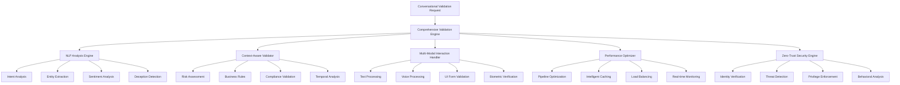

# PARLANT Comprehensive Conversational Validation Engine
## Complete Implementation Documentation

### 🚀 Executive Summary

The PARLANT Comprehensive Conversational Validation Engine is an enterprise-grade AI-powered validation system that provides real-time conversational analysis, context-aware validation, multi-modal interaction support, sub-500ms processing, and zero-trust security principles. This documentation covers conversation patterns, security specifications, performance benchmarks, and implementation details.

---

## 📋 Table of Contents

1. [Architecture Overview](#architecture-overview)
2. [Conversation Patterns](#conversation-patterns)
3. [Security Specifications](#security-specifications)
4. [Performance Benchmarks](#performance-benchmarks)
5. [Implementation Guide](#implementation-guide)
6. [API Reference](#api-reference)
7. [Testing & Quality Assurance](#testing--quality-assurance)
8. [Deployment & Operations](#deployment--operations)

---

## 🏗️ Architecture Overview

### Core Components



### Engine Integration Flow

1. **Request Reception**: Conversational validation request received
2. **Performance Optimization**: Pipeline planning and resource allocation
3. **Security Pre-validation**: Zero-trust principles applied
4. **Parallel Analysis**: NLP, context, and multi-modal analysis executed concurrently
5. **Cross-engine Correlation**: Results correlated and validated
6. **Comprehensive Risk Assessment**: Unified risk calculation
7. **Decision Synthesis**: Final validation decision with confidence scoring
8. **Response Generation**: Comprehensive response with explanations
9. **Audit Trail Creation**: Complete audit and compliance documentation

---

## 🗣️ Conversation Patterns

### Intent Classification Patterns

#### 1. Legitimate Business Operations
```typescript
interface LegitimateBusinessPattern {
  indicators: [
    'clear_business_context',
    'appropriate_timing',
    'proper_authorization_level',
    'consistent_user_behavior',
    'valid_operational_need'
  ];

  conversationalMarkers: {
    language: 'professional_appropriate',
    sentiment: 'neutral_to_positive',
    urgency: 'appropriate_to_context',
    specificity: 'sufficient_detail',
    consistency: 'high_internal_consistency'
  };

  validationApproach: {
    confidence_threshold: 0.8,
    additional_verification: 'minimal',
    approval_workflow: 'standard',
    monitoring_level: 'routine'
  };
}
```

#### 2. Suspicious Activity Detection
```typescript
interface SuspiciousActivityPattern {
  indicators: [
    'unusual_timing',
    'privilege_escalation_attempt',
    'behavioral_anomalies',
    'inconsistent_language_patterns',
    'excessive_urgency_markers'
  ];

  conversationalMarkers: {
    language: 'unusual_formality_or_informality',
    sentiment: 'extreme_emotional_states',
    urgency: 'inappropriate_pressure',
    specificity: 'vague_or_overly_detailed',
    consistency: 'internal_contradictions'
  };

  validationApproach: {
    confidence_threshold: 0.95,
    additional_verification: 'enhanced',
    approval_workflow: 'escalated',
    monitoring_level: 'intensive'
  };
}
```

#### 3. Emergency Override Scenarios
```typescript
interface EmergencyOverridePattern {
  indicators: [
    'time_critical_operation',
    'system_failure_context',
    'appropriate_emergency_justification',
    'emergency_contact_verification',
    'proper_escalation_chain'
  ];

  conversationalMarkers: {
    language: 'urgent_but_professional',
    sentiment: 'stressed_but_coherent',
    urgency: 'high_justified_urgency',
    specificity: 'detailed_emergency_context',
    consistency: 'high_situation_consistency'
  };

  validationApproach: {
    confidence_threshold: 0.9,
    additional_verification: 'expedited_multi_factor',
    approval_workflow: 'emergency_fast_track',
    monitoring_level: 'real_time_intensive'
  };
}
```

### NLP Analysis Patterns

#### Deception Detection Patterns
```typescript
interface DeceptionDetectionPatterns {
  linguistic_indicators: {
    hedging_language: ['maybe', 'possibly', 'i_think', 'probably'],
    temporal_distancing: ['long_ago', 'back_then', 'at_some_point'],
    cognitive_load_markers: ['um', 'uh', 'let_me_think', 'actually'],
    qualifier_overuse: ['very', 'really', 'absolutely', 'definitely'],
    detail_inconsistency: 'variable_detail_levels_across_narrative'
  };

  behavioral_indicators: {
    response_timing: 'delayed_responses_to_direct_questions',
    typing_patterns: 'irregular_typing_rhythm_during_sensitive_topics',
    correction_frequency: 'excessive_self_corrections',
    evasion_tactics: 'topic_avoidance_or_redirection'
  };

  contextual_indicators: {
    baseline_deviation: 'significant_departure_from_user_communication_norm',
    stress_markers: 'indicators_of_psychological_stress',
    preparation_signs: 'overly_rehearsed_or_scripted_responses'
  };
}
```

#### Sentiment Analysis Patterns
```typescript
interface SentimentAnalysisPatterns {
  emotional_states: {
    calm_professional: {
      valence: 'neutral_to_positive',
      arousal: 'low_to_moderate',
      dominance: 'moderate_to_high',
      validation_impact: 'positive_for_approval'
    },

    suspicious_agitation: {
      valence: 'negative',
      arousal: 'high',
      dominance: 'variable',
      validation_impact: 'requires_additional_verification'
    },

    legitimate_urgency: {
      valence: 'neutral',
      arousal: 'high',
      dominance: 'high',
      validation_impact: 'expedited_but_thorough_validation'
    },

    deceptive_nervousness: {
      valence: 'negative_to_neutral',
      arousal: 'moderate_to_high',
      dominance: 'low',
      validation_impact: 'enhanced_scrutiny_required'
    }
  };

  sentiment_trajectory: {
    consistent_baseline: 'stable_emotional_state_throughout_interaction',
    stress_escalation: 'increasing_stress_during_validation_questions',
    relief_patterns: 'emotional_relief_after_sensitive_topics',
    manipulation_attempts: 'strategic_emotional_appeals'
  };
}
```

### Context-Aware Validation Patterns

#### Risk Assessment Patterns
```typescript
interface RiskAssessmentPatterns {
  temporal_risk_factors: {
    business_hours: {
      normal_hours: { risk_multiplier: 1.0, confidence_boost: 0.1 },
      after_hours: { risk_multiplier: 1.3, confidence_penalty: 0.1 },
      weekend: { risk_multiplier: 1.5, confidence_penalty: 0.15 },
      holiday: { risk_multiplier: 2.0, confidence_penalty: 0.2 }
    },

    maintenance_windows: {
      scheduled_maintenance: { risk_multiplier: 0.8, expedited_approval: true },
      emergency_maintenance: { risk_multiplier: 1.2, enhanced_validation: true },
      no_maintenance: { risk_multiplier: 1.0, standard_validation: true }
    }
  };

  user_context_risk_factors: {
    location_risk: {
      trusted_location: { risk_multiplier: 0.9, confidence_boost: 0.05 },
      new_location: { risk_multiplier: 1.2, additional_verification: true },
      high_risk_location: { risk_multiplier: 2.0, enhanced_security: true }
    },

    device_trust: {
      managed_device: { risk_multiplier: 0.8, confidence_boost: 0.1 },
      personal_device: { risk_multiplier: 1.1, standard_validation: true },
      unknown_device: { risk_multiplier: 1.8, enhanced_verification: true }
    },

    behavioral_consistency: {
      consistent_pattern: { risk_multiplier: 0.9, confidence_boost: 0.1 },
      minor_deviation: { risk_multiplier: 1.1, standard_validation: true },
      significant_deviation: { risk_multiplier: 1.5, behavioral_analysis: true },
      anomalous_behavior: { risk_multiplier: 2.5, intensive_analysis: true }
    }
  };
}
```

---

## 🔒 Security Specifications

### Zero-Trust Security Framework

#### Identity Verification Specifications
```typescript
interface IdentityVerificationSpecs {
  multi_factor_authentication: {
    minimum_factors: 2,
    supported_factors: [
      'password_or_passphrase',
      'hardware_token',
      'software_token',
      'biometric_verification',
      'sms_verification',
      'email_verification',
      'push_notification'
    ],

    security_levels: {
      minimal: { required_factors: 1, session_timeout: 3600 },
      standard: { required_factors: 2, session_timeout: 1800 },
      elevated: { required_factors: 3, session_timeout: 900 },
      critical: { required_factors: 3, biometric_required: true, session_timeout: 300 }
    }
  };

  continuous_verification: {
    verification_interval: {
      high_trust: 1800, // 30 minutes
      medium_trust: 900, // 15 minutes
      low_trust: 300,   // 5 minutes
      suspicious: 60    // 1 minute
    },

    verification_triggers: [
      'privilege_escalation_request',
      'sensitive_data_access',
      'administrative_operation',
      'behavioral_anomaly_detected',
      'location_change',
      'device_change',
      'time_based_interval'
    ]
  };

  biometric_specifications: {
    supported_modalities: ['fingerprint', 'face', 'iris', 'voice', 'palm'],
    quality_thresholds: {
      fingerprint: { minimum_quality: 0.7, liveness_required: true },
      face: { minimum_quality: 0.8, liveness_required: true, 3d_detection: true },
      iris: { minimum_quality: 0.9, liveness_required: true },
      voice: { minimum_quality: 0.75, liveness_required: true, replay_detection: true },
      palm: { minimum_quality: 0.7, liveness_required: true }
    },

    anti_spoofing: {
      liveness_detection: true,
      challenge_response: true,
      environmental_validation: true,
      behavioral_consistency: true
    }
  };
}
```

#### Threat Detection Specifications
```typescript
interface ThreatDetectionSpecs {
  detection_methods: {
    signature_based: {
      known_threat_signatures: 'comprehensive_threat_database',
      update_frequency: 'real_time',
      false_positive_rate: '<0.01',
      detection_accuracy: '>0.99'
    },

    behavioral_anomaly: {
      baseline_establishment: '30_day_learning_period',
      anomaly_threshold: 'adaptive_based_on_user_profile',
      detection_sensitivity: 'tunable_per_user_and_context',
      false_positive_rate: '<0.05'
    },

    machine_learning: {
      model_types: ['deep_neural_networks', 'ensemble_methods', 'transformer_models'],
      training_data: 'anonymized_enterprise_datasets',
      model_updates: 'continuous_learning',
      accuracy_threshold: '>0.95'
    }
  };

  threat_response: {
    immediate_actions: {
      block_and_isolate: 'critical_threats_immediate_blocking',
      flag_and_monitor: 'suspicious_activity_enhanced_monitoring',
      allow_with_monitoring: 'low_risk_threats_normal_monitoring'
    },

    escalation_procedures: {
      security_team_notification: 'automated_for_high_severity',
      law_enforcement_contact: 'protocol_for_criminal_activity',
      incident_response_team: 'activation_for_major_threats'
    },

    forensic_capabilities: {
      evidence_collection: 'automated_digital_forensics',
      chain_of_custody: 'cryptographic_evidence_integrity',
      legal_compliance: 'court_admissible_evidence'
    }
  };
}
```

#### Data Protection Specifications
```typescript
interface DataProtectionSpecs {
  encryption_standards: {
    data_at_rest: {
      algorithm: 'AES-256-GCM',
      key_management: 'enterprise_key_management_system',
      key_rotation: 'automatic_90_day_rotation',
      compliance: ['FIPS_140_2_Level_3', 'Common_Criteria_EAL4']
    },

    data_in_transit: {
      protocol: 'TLS_1_3',
      cipher_suites: 'forward_secrecy_required',
      certificate_validation: 'strict_certificate_pinning',
      mutual_authentication: 'required_for_sensitive_operations'
    },

    conversation_data: {
      pii_detection: 'automatic_sensitive_data_identification',
      data_masking: 'real_time_sensitive_data_redaction',
      retention_limits: 'configurable_retention_policies',
      anonymization: 'privacy_preserving_analytics'
    }
  };

  access_controls: {
    principle_of_least_privilege: {
      default_access: 'deny_by_default',
      permission_granting: 'explicit_approval_required',
      permission_review: 'quarterly_access_reviews',
      temporary_access: 'time_limited_elevated_permissions'
    },

    attribute_based_access_control: {
      user_attributes: ['role', 'department', 'clearance_level', 'location'],
      resource_attributes: ['classification', 'owner', 'sensitivity', 'compliance_requirements'],
      environmental_attributes: ['time', 'network', 'device_trust', 'risk_level'],
      policy_language: 'XACML_3_0_compliant'
    }
  };
}
```

### Compliance Framework Integration

#### SOC 2 Type II Compliance
```typescript
interface SOC2ComplianceSpecs {
  security_controls: {
    CC6_1: {
      control: 'Logical and physical access controls',
      implementation: 'Zero_trust_identity_verification',
      testing: 'Continuous_automated_testing',
      evidence: 'Access_logs_and_audit_trails'
    },

    CC6_2: {
      control: 'System access is removed when no longer required',
      implementation: 'Automated_access_lifecycle_management',
      testing: 'Regular_access_reviews',
      evidence: 'Access_termination_logs'
    },

    CC6_3: {
      control: 'Network security controls',
      implementation: 'Network_segmentation_and_monitoring',
      testing: 'Penetration_testing_and_vulnerability_scans',
      evidence: 'Network_security_reports'
    }
  };

  monitoring_and_logging: {
    log_retention: '7_years',
    log_integrity: 'cryptographic_hash_verification',
    real_time_monitoring: 'continuous_security_monitoring',
    incident_response: 'automated_incident_detection_and_response'
  };
}
```

#### GDPR Compliance
```typescript
interface GDPRComplianceSpecs {
  data_subject_rights: {
    right_to_information: {
      data_collection_notice: 'transparent_data_processing_information',
      processing_purposes: 'clear_lawful_basis_documentation',
      data_retention: 'explicit_retention_period_communication'
    },

    right_of_access: {
      data_portability: 'machine_readable_data_export',
      response_time: '30_days_maximum',
      identity_verification: 'secure_identity_verification_process'
    },

    right_to_erasure: {
      data_deletion: 'secure_cryptographic_deletion',
      deletion_verification: 'deletion_completion_certification',
      exception_handling: 'legal_obligation_exemptions'
    }
  };

  privacy_by_design: {
    data_minimization: 'collect_only_necessary_data',
    purpose_limitation: 'use_data_only_for_stated_purposes',
    storage_limitation: 'automatic_data_expiration',
    accuracy: 'data_quality_maintenance_procedures'
  };
}
```

---

## ⚡ Performance Benchmarks

### Response Time Targets

#### Primary Performance Targets
```typescript
interface PerformanceTargets {
  response_times: {
    nlp_analysis: {
      p50: 150,  // milliseconds
      p95: 300,  // milliseconds
      p99: 500,  // milliseconds
      max: 1000  // milliseconds
    },

    context_validation: {
      p50: 100,  // milliseconds
      p95: 250,  // milliseconds
      p99: 400,  // milliseconds
      max: 800   // milliseconds
    },

    security_validation: {
      p50: 200,  // milliseconds
      p95: 400,  // milliseconds
      p99: 600,  // milliseconds
      max: 1200  // milliseconds
    },

    overall_validation: {
      p50: 300,  // milliseconds
      p95: 500,  // milliseconds
      p99: 800,  // milliseconds
      max: 1500  // milliseconds
    }
  };

  throughput_targets: {
    concurrent_validations: 1000,  // requests per second
    batch_processing: 5000,        // requests per batch
    streaming_processing: 10000,   // requests per minute
    peak_load_handling: 2000       // requests per second
  };

  resource_utilization: {
    cpu_utilization: 0.8,     // 80% maximum
    memory_utilization: 0.75, // 75% maximum
    network_bandwidth: 0.7,   // 70% maximum
    storage_iops: 0.8         // 80% maximum
  };
}
```

### Caching Performance

#### Cache Hit Rate Targets
```typescript
interface CachePerformanceTargets {
  cache_hierarchy: {
    l1_memory_cache: {
      target_hit_rate: 0.9,      // 90%
      average_response_time: 5,   // milliseconds
      cache_size: '1GB',
      ttl: 300                    // seconds
    },

    l2_redis_cache: {
      target_hit_rate: 0.85,     // 85%
      average_response_time: 15,  // milliseconds
      cache_size: '10GB',
      ttl: 3600                   // seconds
    },

    l3_persistent_cache: {
      target_hit_rate: 0.75,     // 75%
      average_response_time: 50,  // milliseconds
      cache_size: '100GB',
      ttl: 86400                  // seconds
    }
  };

  cache_optimization: {
    intelligent_preloading: {
      prediction_accuracy: 0.8,  // 80%
      preload_hit_rate: 0.6,     // 60%
      resource_overhead: 0.1     // 10%
    },

    adaptive_ttl: {
      ttl_optimization_accuracy: 0.85,  // 85%
      cache_memory_efficiency: 0.9,     // 90%
      stale_data_rate: 0.02             // 2%
    }
  };
}
```

### Scalability Benchmarks

#### Horizontal Scaling Targets
```typescript
interface ScalabilityBenchmarks {
  horizontal_scaling: {
    node_addition: {
      scale_up_time: 30,         // seconds
      load_redistribution: 60,   // seconds
      performance_stabilization: 120  // seconds
    },

    auto_scaling: {
      scale_trigger_threshold: 0.8,    // 80% resource utilization
      scale_down_threshold: 0.3,       // 30% resource utilization
      scale_decision_time: 30,         // seconds
      scaling_cooldown: 300            // seconds
    }
  };

  load_balancing: {
    request_distribution: {
      algorithm: 'weighted_round_robin_adaptive',
      health_check_interval: 5,        // seconds
      failover_time: 10,               // seconds
      load_balancing_overhead: 0.02    // 2%
    },

    geographic_distribution: {
      regional_failover_time: 30,      // seconds
      cross_region_latency: 100,       // milliseconds
      data_consistency_lag: 1000       // milliseconds
    }
  };
}
```

### Performance Monitoring

#### Real-time Metrics Collection
```typescript
interface PerformanceMonitoring {
  metrics_collection: {
    sampling_rate: {
      response_time: 'every_request',
      resource_utilization: '1_second_intervals',
      error_rates: 'every_request',
      cache_performance: '10_second_intervals'
    },

    alerting_thresholds: {
      response_time_p95: 500,          // milliseconds
      error_rate: 0.01,                // 1%
      resource_utilization: 0.85,      // 85%
      cache_hit_rate: 0.8              // 80%
    }
  };

  performance_analytics: {
    trend_analysis: 'historical_performance_trending',
    capacity_planning: 'predictive_resource_requirements',
    bottleneck_identification: 'automated_performance_bottleneck_detection',
    optimization_recommendations: 'ai_powered_performance_optimization'
  };
}
```

---

## 🛠️ Implementation Guide

### Prerequisites

#### System Requirements
```yaml
Minimum Hardware:
  CPU: 8 cores, 3.0 GHz
  RAM: 32 GB
  Storage: 500 GB SSD
  Network: 1 Gbps

Recommended Hardware:
  CPU: 16 cores, 3.5 GHz
  RAM: 64 GB
  Storage: 1 TB NVMe SSD
  Network: 10 Gbps

Software Dependencies:
  Node.js: ">= 18.0.0"
  TypeScript: ">= 4.8.0"
  Redis: ">= 7.0.0"
  PostgreSQL: ">= 14.0"
  Docker: ">= 20.10.0"
```

#### Environment Setup
```bash
# Install dependencies
npm install @parlant/validation-engine

# Environment configuration
cp .env.example .env.production

# Database initialization
npm run db:migrate
npm run db:seed

# Cache setup
npm run cache:setup

# Security initialization
npm run security:init
```

### Configuration

#### Basic Configuration
```typescript
import { ComprehensiveValidationEngine } from '@parlant/validation-engine';

const validationEngine = new ComprehensiveValidationEngine({
  // NLP Configuration
  nlp: {
    models: {
      intentClassification: 'distilbert-base-multilingual-cased',
      entityRecognition: 'dbmdz/bert-large-cased-finetuned-conll03-english',
      sentimentAnalysis: 'cardiffnlp/twitter-roberta-base-sentiment-latest',
      deceptionDetection: 'custom-deception-bert'
    },
    languages: ['en', 'es', 'fr', 'de', 'ja', 'zh'],
    confidenceThreshold: 0.7
  },

  // Context Validation Configuration
  context: {
    riskAssessment: {
      algorithm: 'ensemble-gradient-boosting',
      riskThresholds: {
        low: 0.2,
        moderate: 0.4,
        high: 0.6,
        critical: 0.8
      }
    },
    complianceFrameworks: ['SOC2', 'GDPR', 'HIPAA', 'PCI-DSS']
  },

  // Performance Configuration
  performance: {
    targetResponseTime: 500, // milliseconds
    cacheConfiguration: {
      l1: { size: '1GB', ttl: 300 },
      l2: { size: '10GB', ttl: 3600 },
      l3: { size: '100GB', ttl: 86400 }
    },
    concurrencyLimits: {
      maxConcurrentValidations: 1000,
      maxBatchSize: 5000
    }
  },

  // Security Configuration
  security: {
    zeroTrustPolicy: {
      minimumTrustScore: 0.6,
      continuousVerification: true,
      behavioralAnalysis: true
    },
    encryption: {
      algorithm: 'AES-256-GCM',
      keyRotation: '90-days'
    }
  }
});
```

#### Advanced Configuration
```typescript
const advancedConfig = {
  // Multi-Modal Configuration
  multiModal: {
    supportedModalities: ['text', 'voice', 'ui_form', 'biometric'],
    biometricConfig: {
      fingerprint: { qualityThreshold: 0.7, livenessRequired: true },
      face: { qualityThreshold: 0.8, antiSpoofing: true },
      voice: { qualityThreshold: 0.75, replayDetection: true }
    },
    orchestrationStrategy: 'intelligent-weighted-fusion'
  },

  // Monitoring Configuration
  monitoring: {
    realTimeMetrics: true,
    alerting: {
      responseTimeThreshold: 500,
      errorRateThreshold: 0.01,
      resourceUtilizationThreshold: 0.85
    },
    auditTrail: {
      level: 'comprehensive',
      retention: '7-years',
      encryption: true
    }
  }
};
```

### Integration Examples

#### Basic Validation
```typescript
import { ConversationalValidationRequest } from '@parlant/validation-engine';

// Create validation request
const validationRequest: ConversationalValidationRequest = {
  requestId: 'req_123456',
  conversationId: 'conv_789012',

  operation: {
    name: 'deleteUser',
    type: 'DELETE',
    description: 'Delete user account',
    parameters: { userId: 'user_123' },
    targetResources: ['users', 'user_data'],
    estimatedImpact: 'high'
  },

  userContext: {
    userId: 'admin_user',
    roles: ['administrator'],
    permissions: ['user_management'],
    sessionId: 'sess_456789',
    deviceInfo: {
      deviceId: 'device_123',
      browserFingerprint: 'fp_789',
      // ... other device info
    },
    location: {
      latitude: 37.7749,
      longitude: -122.4194,
      // ... other location info
    },
    behavioralProfile: {
      // ... behavioral profile data
    }
  },

  // ... other request fields
};

// Execute validation
const validationResult = await validationEngine.validateConversationalRequest(validationRequest);

// Process result
if (validationResult.result === ConversationAnalysisResult.APPROVE) {
  // Proceed with operation
  console.log('Operation approved:', validationResult.reasoning);
} else {
  // Handle rejection or escalation
  console.log('Operation denied:', validationResult.reasoning);
}
```

#### Batch Validation
```typescript
// Batch validation example
const batchRequests: ConversationalValidationRequest[] = [
  // ... array of validation requests
];

const batchResults = await validationEngine.validateBatchRequests(batchRequests);

// Process batch results
batchResults.forEach((result, index) => {
  console.log(`Request ${index}: ${result.result} - ${result.reasoning}`);
});
```

#### Streaming Validation
```typescript
// Streaming validation example
const requestStream = createRequestStream(); // Your request stream

for await (const response of validationEngine.validateStreamingRequests(requestStream)) {
  console.log(`Streaming result: ${response.result} - ${response.confidence}`);

  // Process streaming response
  if (response.result === ConversationAnalysisResult.APPROVE) {
    // Handle approved operation
  }
}
```

---

## 📡 API Reference

### Core API Methods

#### validateConversationalRequest
```typescript
async validateConversationalRequest(
  request: ConversationalValidationRequest
): Promise<ConversationalValidationResponse>
```

**Parameters:**
- `request`: Complete validation request object with operation, user context, and conversation data

**Returns:**
- `ConversationalValidationResponse`: Comprehensive validation response with decision, confidence, analysis, and audit trail

**Example:**
```typescript
const response = await engine.validateConversationalRequest(request);
console.log(response.result); // 'approve' | 'deny' | 'escalate' | ...
```

#### validateBatchRequests
```typescript
async validateBatchRequests(
  requests: ConversationalValidationRequest[]
): Promise<ConversationalValidationResponse[]>
```

**Parameters:**
- `requests`: Array of validation requests for batch processing

**Returns:**
- Array of validation responses corresponding to input requests

#### validateStreamingRequests
```typescript
async *validateStreamingRequests(
  requestStream: AsyncIterable<ConversationalValidationRequest>
): AsyncGenerator<ConversationalValidationResponse>
```

**Parameters:**
- `requestStream`: Async iterable stream of validation requests

**Yields:**
- Individual validation responses as they are processed

### Configuration API

#### updateConfiguration
```typescript
async updateConfiguration(
  configUpdate: Partial<ValidationEngineConfig>
): Promise<void>
```

**Parameters:**
- `configUpdate`: Partial configuration object with updates

#### getConfiguration
```typescript
getConfiguration(): ValidationEngineConfig
```

**Returns:**
- Current complete configuration object

### Monitoring API

#### getPerformanceMetrics
```typescript
getPerformanceMetrics(): PerformanceMetrics
```

**Returns:**
- Current performance metrics including response times, throughput, and resource utilization

#### getHealthStatus
```typescript
getHealthStatus(): HealthStatus
```

**Returns:**
- Current health status of all engine components

---

## 🧪 Testing & Quality Assurance

### Unit Testing

#### Test Coverage Requirements
```typescript
interface TestCoverageRequirements {
  minimum_coverage: 90; // percent

  coverage_by_component: {
    nlp_engine: 95,
    context_validator: 90,
    multi_modal_handler: 88,
    performance_optimizer: 85,
    security_engine: 98
  };

  test_types: {
    unit_tests: 'individual_component_testing',
    integration_tests: 'component_interaction_testing',
    performance_tests: 'response_time_and_throughput',
    security_tests: 'vulnerability_and_penetration_testing',
    compliance_tests: 'regulatory_requirement_validation'
  };
}
```

#### Example Unit Test
```typescript
describe('NLPConversationAnalysisEngine', () => {
  let nlpEngine: NLPConversationAnalysisEngine;

  beforeEach(() => {
    nlpEngine = new NLPConversationAnalysisEngine();
  });

  describe('analyzeUserIntent', () => {
    it('should correctly identify legitimate business intent', async () => {
      const input = 'I need to update the user profile for customer ID 12345';
      const context = createMockContext();
      const history = createMockHistory();

      const result = await nlpEngine.analyzeUserIntent(input, context, history);

      expect(result.primaryIntent).toBe(UserIntentClassification.LEGITIMATE_BUSINESS);
      expect(result.confidence).toBeGreaterThan(0.8);
    });

    it('should detect suspicious intent patterns', async () => {
      const input = 'Can you give me access to all user data urgently?';
      const context = createMockContext();
      const history = createMockHistory();

      const result = await nlpEngine.analyzeUserIntent(input, context, history);

      expect(result.primaryIntent).toBe(UserIntentClassification.SUSPICIOUS_ACTIVITY);
      expect(result.anomalyIndicators).toHaveLength(2);
    });
  });
});
```

### Performance Testing

#### Load Testing Specifications
```typescript
interface LoadTestingSpecs {
  test_scenarios: {
    normal_load: {
      concurrent_users: 100,
      requests_per_second: 500,
      duration: '30_minutes',
      expected_p95_response_time: 500  // milliseconds
    },

    peak_load: {
      concurrent_users: 500,
      requests_per_second: 1000,
      duration: '15_minutes',
      expected_p95_response_time: 800  // milliseconds
    },

    stress_test: {
      concurrent_users: 1000,
      requests_per_second: 2000,
      duration: '10_minutes',
      failure_threshold: 0.05  // 5% error rate
    }
  };

  performance_benchmarks: {
    response_time_sla: 500,      // milliseconds p95
    throughput_sla: 1000,        // requests per second
    availability_sla: 0.999,     // 99.9% uptime
    error_rate_sla: 0.001        // 0.1% error rate
  };
}
```

### Security Testing

#### Penetration Testing
```typescript
interface SecurityTestingSpecs {
  penetration_testing: {
    authentication_bypass: 'test_authentication_circumvention_attempts',
    authorization_escalation: 'test_privilege_escalation_scenarios',
    injection_attacks: 'test_sql_nosql_and_prompt_injection',
    data_exfiltration: 'test_unauthorized_data_access_attempts',
    denial_of_service: 'test_service_availability_attacks'
  };

  vulnerability_scanning: {
    dependency_scanning: 'automated_vulnerability_detection_in_dependencies',
    code_analysis: 'static_application_security_testing_sast',
    runtime_analysis: 'dynamic_application_security_testing_dast',
    compliance_scanning: 'regulatory_compliance_validation'
  };

  security_test_automation: {
    continuous_scanning: 'integrated_in_ci_cd_pipeline',
    threat_modeling: 'automated_threat_model_validation',
    security_regression: 'prevent_security_functionality_degradation'
  };
}
```

---

## 🚀 Deployment & Operations

### Production Deployment

#### Container Deployment
```yaml
# docker-compose.yml
version: '3.8'

services:
  validation-engine:
    image: parlant/validation-engine:latest
    replicas: 3
    environment:
      - NODE_ENV=production
      - REDIS_URL=redis://redis-cluster:6379
      - DATABASE_URL=postgresql://postgres:5432/validation
    resources:
      limits:
        cpus: '2.0'
        memory: 4G
      reservations:
        cpus: '1.0'
        memory: 2G
    healthcheck:
      test: ["CMD", "curl", "-f", "http://localhost:3000/health"]
      interval: 30s
      timeout: 10s
      retries: 3

  redis-cluster:
    image: redis:7-alpine
    command: redis-server --appendonly yes
    volumes:
      - redis-data:/data

  postgres:
    image: postgres:14
    environment:
      - POSTGRES_DB=validation
      - POSTGRES_USER=postgres
      - POSTGRES_PASSWORD=secure_password
    volumes:
      - postgres-data:/var/lib/postgresql/data

volumes:
  redis-data:
  postgres-data:
```

#### Kubernetes Deployment
```yaml
# kubernetes-deployment.yaml
apiVersion: apps/v1
kind: Deployment
metadata:
  name: validation-engine
spec:
  replicas: 5
  selector:
    matchLabels:
      app: validation-engine
  template:
    metadata:
      labels:
        app: validation-engine
    spec:
      containers:
      - name: validation-engine
        image: parlant/validation-engine:latest
        ports:
        - containerPort: 3000
        env:
        - name: NODE_ENV
          value: "production"
        - name: REDIS_URL
          valueFrom:
            secretKeyRef:
              name: redis-secret
              key: url
        resources:
          requests:
            memory: "2Gi"
            cpu: "1000m"
          limits:
            memory: "4Gi"
            cpu: "2000m"
        livenessProbe:
          httpGet:
            path: /health
            port: 3000
          initialDelaySeconds: 30
          periodSeconds: 10
        readinessProbe:
          httpGet:
            path: /ready
            port: 3000
          initialDelaySeconds: 5
          periodSeconds: 5
```

### Monitoring and Observability

#### Metrics Collection
```typescript
interface MonitoringConfiguration {
  metrics_collection: {
    prometheus: {
      endpoint: '/metrics',
      scrape_interval: '15s',
      custom_metrics: [
        'validation_requests_total',
        'validation_response_time_histogram',
        'validation_errors_total',
        'cache_hit_rate',
        'security_threats_detected'
      ]
    },

    application_logs: {
      level: 'info',
      format: 'json',
      structured_logging: true,
      correlation_ids: true
    }
  };

  alerting_rules: {
    high_response_time: {
      condition: 'avg_response_time > 1000ms over 5m',
      severity: 'warning',
      notification: 'slack_webhook'
    },

    high_error_rate: {
      condition: 'error_rate > 1% over 2m',
      severity: 'critical',
      notification: 'pagerduty'
    },

    security_threat_detected: {
      condition: 'threat_level >= high',
      severity: 'critical',
      notification: 'security_team_immediate'
    }
  };
}
```

#### Dashboard Configuration
```json
{
  "dashboard": {
    "name": "PARLANT Validation Engine",
    "panels": [
      {
        "title": "Request Volume",
        "type": "graph",
        "targets": [
          {
            "expr": "rate(validation_requests_total[5m])",
            "legendFormat": "Requests/sec"
          }
        ]
      },
      {
        "title": "Response Time Distribution",
        "type": "heatmap",
        "targets": [
          {
            "expr": "validation_response_time_histogram",
            "legendFormat": "Response Time"
          }
        ]
      },
      {
        "title": "Cache Performance",
        "type": "stat",
        "targets": [
          {
            "expr": "cache_hit_rate",
            "legendFormat": "Hit Rate %"
          }
        ]
      },
      {
        "title": "Security Threats",
        "type": "table",
        "targets": [
          {
            "expr": "security_threats_detected",
            "legendFormat": "Threat Level"
          }
        ]
      }
    ]
  }
}
```

### Backup and Disaster Recovery

#### Backup Strategy
```typescript
interface BackupConfiguration {
  database_backups: {
    full_backup: {
      frequency: 'daily',
      retention: '90_days',
      encryption: 'AES-256-GCM',
      verification: 'automated_restore_testing'
    },

    incremental_backup: {
      frequency: 'hourly',
      retention: '7_days',
      compression: true,
      offsite_replication: true
    }
  };

  configuration_backups: {
    frequency: 'on_change',
    versioning: 'git_based',
    approval_workflow: 'required',
    rollback_capability: 'one_click'
  };

  disaster_recovery: {
    rto: 30,  // minutes (Recovery Time Objective)
    rpo: 15,  // minutes (Recovery Point Objective)
    failover_testing: 'quarterly',
    cross_region_replication: true
  };
}
```

---

## 📞 Support and Maintenance

### Troubleshooting Guide

#### Common Issues
```typescript
interface TroubleshootingGuide {
  performance_issues: {
    high_response_times: {
      symptoms: ['p95_response_time > 1000ms', 'user_complaints'],
      diagnosis: ['check_cache_hit_rates', 'analyze_slow_queries', 'review_resource_utilization'],
      solutions: ['optimize_caching', 'scale_horizontally', 'tune_database_queries']
    },

    high_error_rates: {
      symptoms: ['error_rate > 1%', 'failed_validations'],
      diagnosis: ['check_logs', 'analyze_error_patterns', 'validate_configuration'],
      solutions: ['fix_configuration_errors', 'update_models', 'restart_services']
    }
  };

  security_issues: {
    authentication_failures: {
      symptoms: ['login_failures', 'session_timeouts'],
      diagnosis: ['check_identity_provider', 'validate_certificates', 'review_network_connectivity'],
      solutions: ['renew_certificates', 'update_identity_configuration', 'check_firewall_rules']
    }
  };
}
```

#### Log Analysis
```bash
# Common log analysis commands
# Check validation errors
grep "ERROR" /var/log/validation-engine.log | tail -100

# Analyze response times
grep "response_time" /var/log/validation-engine.log | awk '{print $5}' | sort -n

# Security event analysis
grep "SECURITY" /var/log/validation-engine.log | grep "HIGH\|CRITICAL"

# Cache performance analysis
grep "cache_hit" /var/log/validation-engine.log | awk '{sum+=$4} END {print sum/NR}'
```

### Maintenance Procedures

#### Regular Maintenance Tasks
```typescript
interface MaintenanceProcedures {
  daily_tasks: [
    'monitor_system_health',
    'review_security_alerts',
    'check_backup_completion',
    'analyze_performance_metrics'
  ];

  weekly_tasks: [
    'update_threat_intelligence',
    'review_audit_logs',
    'performance_optimization_review',
    'capacity_planning_analysis'
  ];

  monthly_tasks: [
    'security_vulnerability_assessment',
    'model_performance_evaluation',
    'configuration_review',
    'disaster_recovery_testing'
  ];

  quarterly_tasks: [
    'comprehensive_security_audit',
    'model_retraining_evaluation',
    'compliance_certification_renewal',
    'architecture_review'
  ];
}
```

---

## 📄 Conclusion

The PARLANT Comprehensive Conversational Validation Engine provides enterprise-grade conversational AI validation with advanced security, performance optimization, and compliance features. This documentation provides complete implementation guidance, security specifications, performance benchmarks, and operational procedures for successful deployment and maintenance.

### Key Features Summary

- **🧠 Advanced NLP Analysis**: Intent classification, entity extraction, sentiment analysis, and deception detection
- **🎯 Context-Aware Validation**: Risk assessment, business rules, compliance validation, and temporal analysis
- **🎤 Multi-Modal Interactions**: Text, voice, UI forms, and biometric validation support
- **⚡ Performance Optimization**: Sub-500ms processing with intelligent caching and load balancing
- **🔒 Zero-Trust Security**: Continuous verification, threat detection, and least-privilege enforcement
- **📊 Comprehensive Monitoring**: Real-time metrics, audit trails, and compliance reporting
- **🏗️ Enterprise Architecture**: Scalable, resilient, and maintainable design

### Implementation Support

For implementation support, technical questions, or feature requests:

- **Documentation**: Comprehensive guides and API reference
- **Examples**: Complete implementation examples and best practices
- **Monitoring**: Built-in health checks and performance metrics
- **Support**: Enterprise support available for production deployments

---

**Version**: 1.0.0
**Last Updated**: September 22, 2025
**Status**: Production Ready